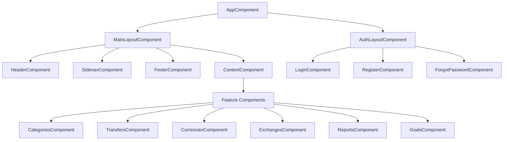

# Angular Component Design

This document outlines the component structure and design patterns for the Angular frontend that will replace the current Ruby on Rails application.

## Application Structure

### Module Organization

```
src/
├── app/
│   ├── core/                 # Core functionality, services, guards
│   │   ├── authentication/   # Authentication services
│   │   ├── http/             # HTTP interceptors
│   │   ├── services/         # Core services
│   │   └── guards/           # Route guards
│   ├── shared/               # Shared components, directives, pipes
│   │   ├── components/       # Reusable components
│   │   ├── directives/       # Custom directives
│   │   ├── pipes/            # Custom pipes
│   │   └── models/           # Shared data models/interfaces
│   ├── features/             # Feature modules
│   │   ├── auth/             # Authentication feature
│   │   ├── categories/       # Categories feature
│   │   ├── transfers/        # Transfers feature
│   │   ├── currencies/       # Currencies feature
│   │   ├── reports/          # Reports feature
│   │   ├── goals/            # Goals feature
│   │   └── import/           # Import feature
│   ├── layouts/              # Layout components
│   │   ├── main-layout/      # Main application layout
│   │   └── auth-layout/      # Authentication layout
│   └── app.module.ts         # Root module
```

## Component Hierarchy



## Shared Components

### Form Components

1. **FormFieldComponent**
   - Standardized form field with label, input, and error display
   - Supports various input types
   - Handles validation states

2. **AutocompleteFieldComponent**
   - Provides autocomplete functionality
   - Configurable for different data sources
   - Supports custom templates for suggestions

3. **DatePickerComponent**
   - Calendar date selection
   - Date range selection support
   - Localization support

4. **AmountInputComponent**
   - Specialized input for monetary amounts
   - Currency selection integrated
   - Handles decimal formatting

### Data Display Components

1. **DataTableComponent**
   - Configurable data table with sorting, filtering, and pagination
   - Column customization
   - Row selection and actions

2. **CategoryTreeComponent**
   - Tree view for hierarchical category display
   - Drag-and-drop for category reorganization
   - Expand/collapse functionality

3. **BalanceDisplayComponent**
   - Shows balance information with currency
   - Multiple currency support
   - Positive/negative styling

4. **ChartComponent**
   - Wrapper for chart library (Chart.js or similar)
   - Configurable for different report types
   - Interactive elements

### Navigation Components

1. **TabsComponent**
   - Tab-based navigation
   - Configurable tabs with badges and icons
   - Responsive design for mobile

2. **BreadcrumbsComponent**
   - Hierarchical navigation path
   - Links to parent/related pages
   - Context awareness

3. **PaginationComponent**
   - Page navigation for large datasets
   - Page size selection
   - Current page indicator

### UI Components

1. **DialogComponent**
   - Modal dialog for forms and confirmations
   - Configurable size and positioning
   - Standard actions (confirm/cancel)

2. **NotificationComponent**
   - Toast or snackbar notifications
   - Different severity levels (info, success, warning, error)
   - Auto-dismissal with configurable timeout

3. **LoaderComponent**
   - Loading indicator for async operations
   - Global and local loading states
   - Customizable appearance

## Feature Modules

### Auth Module

#### Components:
1. **LoginComponent**: User login form
2. **RegisterComponent**: User registration form
3. **ForgotPasswordComponent**: Password reset request
4. **ResetPasswordComponent**: New password setup
5. **UserProfileComponent**: View/edit user profile

#### Services:
1. **AuthService**: Authentication operations
2. **TokenService**: JWT token management
3. **UserService**: User data management

### Categories Module

#### Components:
1. **CategoryListComponent**: Display category hierarchy
2. **CategoryFormComponent**: Create/edit categories
3. **CategoryDetailsComponent**: View category details and transfers
4. **SubcategoriesComponent**: Manage subcategories
5. **CategoryBalanceComponent**: Display category balance with period selection

#### Services:
1. **CategoryService**: Category CRUD operations
2. **CategoryBalanceService**: Calculate category balances

### Transfers Module

#### Components:
1. **TransferListComponent**: List of transfers with filters
2. **TransferFormComponent**: Create/edit transfers
3. **QuickTransferComponent**: Simplified transfer creation
4. **TransferDetailsComponent**: View transfer details
5. **TransferItemComponent**: Individual transfer item
6. **TransferItemFormComponent**: Create/edit transfer items

#### Services:
1. **TransferService**: Transfer CRUD operations
2. **TransferValidationService**: Validate transfers and items

### Currencies Module

#### Components:
1. **CurrencyListComponent**: List of currencies
2. **CurrencyFormComponent**: Create/edit currencies
3. **ExchangeRateListComponent**: List of exchange rates
4. **ExchangeRateFormComponent**: Create/edit exchange rates
5. **CurrencyConverterComponent**: Convert between currencies

#### Services:
1. **CurrencyService**: Currency CRUD operations
2. **ExchangeService**: Exchange rate CRUD operations
3. **ConversionService**: Currency conversion calculations

### Reports Module

#### Components:
1. **ReportListComponent**: List of saved reports
2. **ReportFormComponent**: Create/edit reports
3. **ReportConfigurationComponent**: Configure report parameters
4. **ReportVisualizationComponent**: Display report results
5. **FlowReportComponent**: Flow report visualization
6. **ShareReportComponent**: Share report visualization
7. **ValueReportComponent**: Value report visualization

#### Services:
1. **ReportService**: Report CRUD operations
2. **ReportGenerationService**: Generate report data
3. **ChartConfigurationService**: Configure charts for reports

### Goals Module

#### Components:
1. **GoalListComponent**: List of financial goals
2. **GoalFormComponent**: Create/edit goals
3. **GoalDetailsComponent**: View goal details and progress
4. **GoalProgressComponent**: Visual goal progress display

#### Services:
1. **GoalService**: Goal CRUD operations
2. **GoalCalculationService**: Calculate goal progress

### Import Module

#### Components:
1. **ImportFormComponent**: File upload form
2. **ImportConfigurationComponent**: Configure import settings
3. **ImportPreviewComponent**: Preview parsed data
4. **ImportStatusComponent**: Display import status

#### Services:
1. **ImportService**: Handle file uploads and processing
2. **ParserService**: Parse imported files
3. **ImportMappingService**: Map imported data to system entities

## State Management

### NgRx Store Structure

```
Store/
├── auth/                # Authentication state
│   ├── actions.ts
│   ├── effects.ts
│   ├── reducers.ts
│   └── selectors.ts
├── categories/          # Categories state
│   ├── actions.ts
│   ├── effects.ts
│   ├── reducers.ts
│   └── selectors.ts
├── transfers/           # Transfers state
│   ├── actions.ts
│   ├── effects.ts
│   ├── reducers.ts
│   └── selectors.ts
...
```

### Core State Elements

1. **Auth State**:
   - Current user information
   - Authentication status
   - Permissions

2. **UI State**:
   - Loading indicators
   - Current theme
   - Sidebar state (expanded/collapsed)
   - Notifications

3. **Entity States**:
   - Categories
   - Transfers
   - Currencies
   - Exchanges
   - Reports
   - Goals

## Route Structure

```
/                           # Home/Dashboard
/login                      # Login page
/register                   # Registration page
/forgot-password            # Password recovery
/reset-password/:token      # Password reset
/profile                    # User profile

/categories                 # Category list
/categories/new             # Create category
/categories/:id             # View category
/categories/:id/edit        # Edit category

/transfers                  # Transfer list
/transfers/new              # Create transfer
/transfers/:id              # View transfer
/transfers/:id/edit         # Edit transfer

/currencies                 # Currency list
/currencies/new             # Create currency
/currencies/:id             # View currency
/currencies/:id/edit        # Edit currency

/exchanges                  # Exchange rates list
/exchanges/new              # Create exchange rate
/exchanges/:id              # View exchange rate
/exchanges/:id/edit         # Edit exchange rate

/reports                    # Reports list
/reports/new                # Create report
/reports/:id                # View report
/reports/:id/edit           # Edit report

/goals                      # Goals list
/goals/new                  # Create goal
/goals/:id                  # View goal
/goals/:id/edit             # Edit goal

/import                     # Import data
/debtors                    # Debtors list
/creditors                  # Creditors list
```

## Component Interaction Patterns

### Parent-Child Communication
- Input properties for data passing from parent to child
- Output events for child-to-parent communication
- ViewChild/ContentChild for direct access to child components

### Service-Based Communication
- Shared services for cross-component communication
- Observable streams for asynchronous data flow
- BehaviorSubject for maintaining current state

### NgRx State Management
- Actions for triggering state changes
- Selectors for accessing slices of state
- Effects for handling side effects and async operations

## Form Strategies

### Reactive Forms
- Use FormBuilder service to create form groups
- Custom validators for complex validation rules
- Form arrays for dynamic form elements (e.g., transfer items)

### Form Controls
- Custom form controls for specialized inputs
- ControlValueAccessor implementation for integration with Angular forms
- Error states and messages coordinated with validation

## Data Fetching Patterns

### Service Pattern
```typescript
@Injectable({
  providedIn: 'root'
})
export class CategoryService {
  private apiUrl = 'api/v1/categories';

  constructor(private http: HttpClient) {}

  getCategories(params?: any): Observable<Category[]> {
    return this.http.get<ApiResponse<Category[]>>(this.apiUrl, { params })
      .pipe(
        map(response => response.data),
        catchError(this.handleError)
      );
  }

  // Additional methods...
}
```

### Component Usage
```typescript
@Component({
  selector: 'app-category-list',
  templateUrl: './category-list.component.html'
})
export class CategoryListComponent implements OnInit {
  categories: Category[] = [];
  loading = false;
  error: string | null = null;

  constructor(private categoryService: CategoryService) {}

  ngOnInit(): void {
    this.loading = true;
    this.categoryService.getCategories()
      .pipe(finalize(() => this.loading = false))
      .subscribe({
        next: (categories) => this.categories = categories,
        error: (error) => this.error = error.message
      });
  }
}
```

## Responsive Design Strategy

1. **Breakpoint System**:
   - Extra small (xs): < 576px (mobile phones)
   - Small (sm): ≥ 576px (landscape phones)
   - Medium (md): ≥ 768px (tablets)
   - Large (lg): ≥ 992px (desktops)
   - Extra large (xl): ≥ 1200px (large desktops)

2. **Flex Layout**:
   - Use Angular Flex Layout for responsive layouts
   - Define different layouts for different breakpoints
   - Use responsive API for conditional rendering

3. **Mobile-First Approach**:
   - Design for mobile screens first
   - Enhance for larger screens
   - Test on various device sizes

## Styling Strategy

1. **Component Encapsulation**:
   - Use ViewEncapsulation.Emulated (default)
   - Component-specific styles in component files
   - Global styles for theme and shared elements

2. **CSS Architecture**:
   - Consider BEM methodology for naming
   - Shared variables for colors, spacing, etc.
   - Mixins for common patterns

3. **Theming**:
   - Light and dark theme support
   - Customizable primary/secondary colors
   - Consistent use of design tokens

## Performance Considerations

1. **Lazy Loading**:
   - Lazy load feature modules
   - Preload important modules strategically
   - Use route-level code splitting

2. **Change Detection**:
   - OnPush change detection strategy for performance
   - Immutable data patterns
   - Avoid expensive computations in templates

3. **Virtual Scrolling**:
   - Use for large lists (transactions, categories)
   - Implement with CDK virtual scroll
   - Optimize rendering for large datasets

## Accessibility Guidelines

1. **ARIA Attributes**:
   - Proper roles and labels
   - Accessible form controls
   - Screen reader support

2. **Keyboard Navigation**:
   - Ensure all interactive elements are keyboard accessible
   - Logical tab order
   - Focus indicators

3. **Color Contrast**:
   - Meet WCAG 2.1 AA standards for contrast
   - Avoid relying on color alone for information
   - Test with accessibility tools

## Testing Strategy

1. **Unit Tests**:
   - Test component logic and services
   - Use TestBed for Angular testing
   - Mock dependencies appropriately

2. **Integration Tests**:
   - Test component interactions
   - Test form validation and submission
   - Test state management flow

3. **End-to-End Tests**:
   - Test critical user flows
   - Use Protractor or Cypress
   - Automate important user scenarios

## Build and Deployment

1. **Build Configuration**:
   - Environment-specific configurations
   - Production optimization settings
   - Bundle analysis and optimization

2. **CI/CD Pipeline**:
   - Automated testing on commit
   - Staged deployments
   - Version management

3. **Feature Flags**:
   - Enable/disable features without deployment
   - A/B testing capability
   - Gradual feature rollout