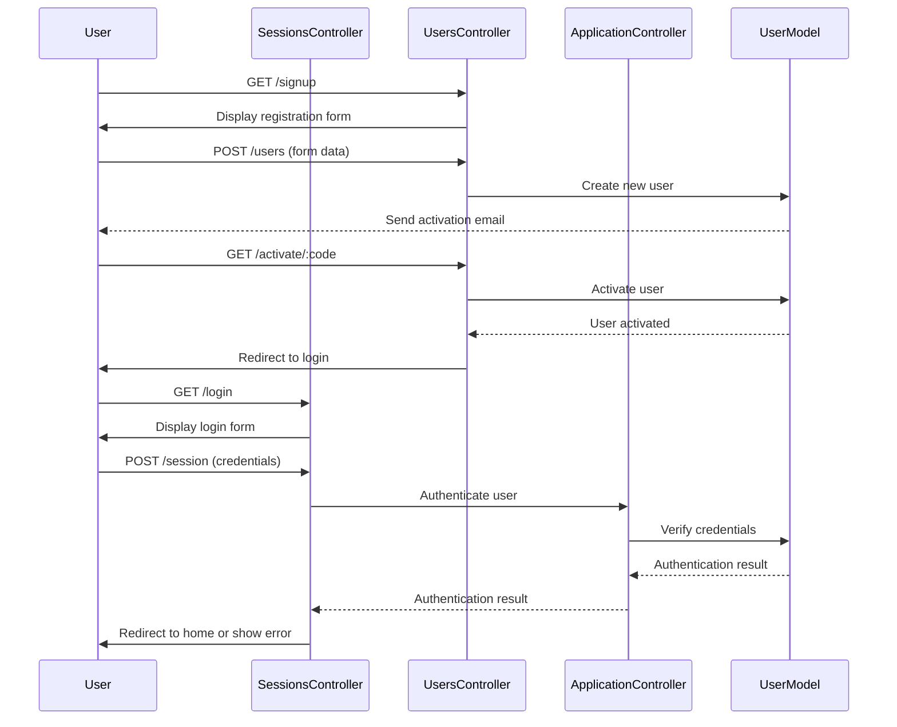
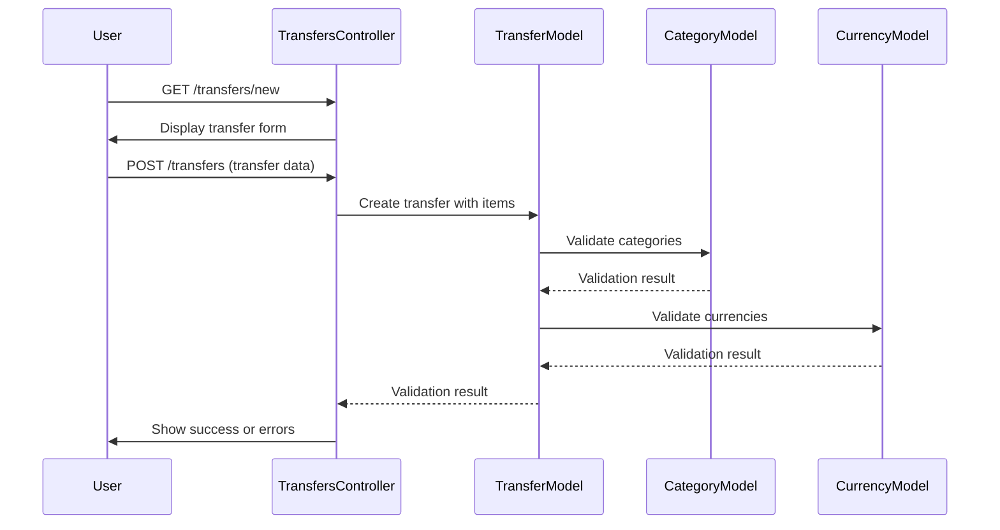
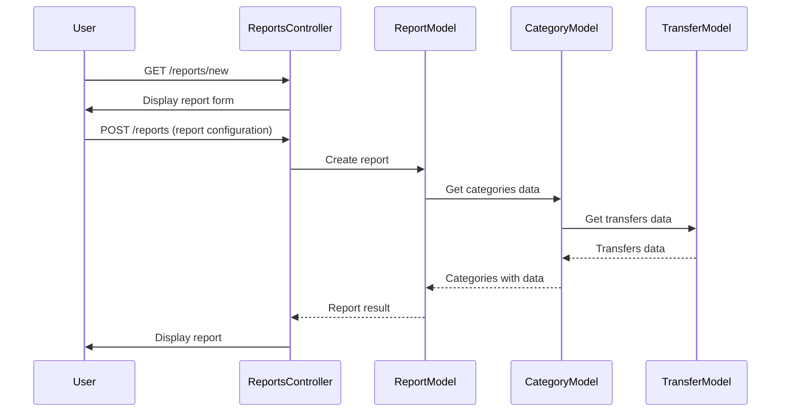

# Controller Documentation

This document outlines the key controllers in the application and their primary responsibilities.

## Application Controller

The base controller that all other controllers inherit from. It includes:

- Authentication functionality
- SSL requirement handling
- Parameter filtering for sensitive data
- Helper methods for date/period handling

Key methods:
- `extract_form_id`: Gets form identifier from parameters
- `get_period`, `get_period_range`: Helpers for date range processing

## Users Controller

Manages user accounts and authentication.

### Actions:
- `new`: Registration form
- `create`: Create new user account
- `edit`: Edit user profile
- `update`: Update user information
- `activate`: Activate new account via email link

## Sessions Controller

Handles user authentication sessions.

### Actions:
- `new`: Login form
- `create`: Create new session (login)
- `destroy`: End session (logout)
- `default`: Default landing page

## Categories Controller

Manages the category hierarchy.

### Actions:
- `index`: List categories
- `show`: Show category details
- `new`: Create new category form
- `create`: Create a new category
- `edit`: Edit category form
- `update`: Update category information
- `destroy`: Delete category

## Transfers Controller

Core controller for financial transactions.

### Actions:
- `index`: List transactions
- `search`: Search transactions by criteria
- `quick_transfer`: Create a simple transaction quickly
- `show`: Show transaction details
- `edit`: Edit transaction form
- `update`: Update transaction
- `create`: Create new transaction
- `destroy`: Delete transaction

## Currencies Controller

Manages currency definitions.

### Actions:
- `index`: List currencies
- `new`: Create currency form
- `create`: Create new currency
- `edit`: Edit currency form
- `update`: Update currency
- `show`: Show currency details
- `destroy`: Delete currency

## Exchanges Controller

Manages currency exchange rates.

### Actions:
- `index`: List exchanges
- `list`: List exchanges for specific currencies
- `new`: Create exchange form
- `create`: Create new exchange rate
- `edit`: Edit exchange form
- `update`: Update exchange rate
- `destroy`: Delete exchange rate

## Goals Controller

Manages financial goals and planning.

### Actions:
- `index`: List goals
- `history_index`: Show goals history
- `new`: Create goal form
- `create`: Create new goal
- `edit`: Edit goal form
- `update`: Update goal
- `destroy`: Delete goal

## Reports Controller

Handles report generation and management.

### Actions:
- `index`: List reports
- `new`: Create new report form
- `create`: Create new report
- `show_flow_report`: Display flow report
- `show_graph_report`: Display graphical report
- `edit`: Edit report form
- `update`: Update report
- `destroy`: Delete report

## Import Controller

Handles data import from external sources.

### Actions:
- `import`: Import form
- `parse`: Parse uploaded file
- `import_status`: Show import status

## Creditors/Debtors Controllers

Manage loans and debts.

### Actions:
- `index`: List creditors/debtors
- `remind`: Send reminder to debtor

## Autocomplete Controller

Provides autocomplete functionality.

### Actions:
- `complete_transfer`: Autocomplete for transfer fields
- `complete_transfer_item`: Autocomplete for transfer item fields

## Controller Flow Diagrams

### User Authentication Flow

### Transaction Creation Flow

### Reporting Flow

## Controller Security Considerations

1. **Authentication Checks:**
   - Most controllers use `before_filter :login_required` to ensure user authentication
   - Sensitive operations verify user ownership of resources

2. **Authorization:**
   - Controllers check for user ownership before accessing resources
   - Examples: `check_perm_for_transfer`, `find_category_for_user`

3. **Parameter Filtering:**
   - Sensitive parameters like passwords are filtered from logs
   - Input validation is performed on form submissions

4. **Cross-Site Request Forgery (CSRF) Protection:**
   - Forms include authenticity tokens
   - `protect_from_forgery` enabled in ApplicationController

## AJAX and JavaScript Integration

Many controllers support both standard HTML responses and JavaScript/AJAX for dynamic updates:

1. **Transfers Controller:**
   - Uses RJS templates for dynamic updates to transfer lists
   - Provides JavaScript responses for quick transfers

2. **Categories Controller:**
   - AJAX support for hierarchical category management
   - Dynamic updates for category balance display

3. **Autocomplete Controller:**
   - Provides AJAX endpoints for form field autocompletion

4. **Reports Controller:**
   - AJAX loading of report data
   - Dynamic chart updates