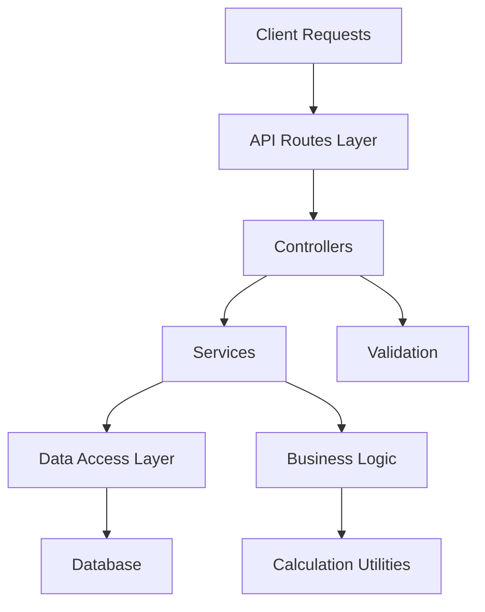
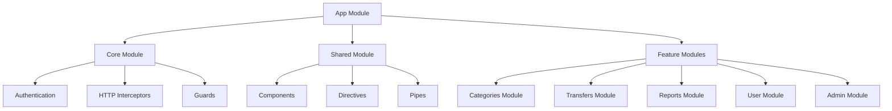

# Migration Strategy: Ruby on Rails to Angular and Node.js

This document outlines a strategic approach to reengineering the Ruby on Rails application to an Angular frontend with Node.js backend.

## Current Architecture

The current application is a monolithic Ruby on Rails application with:

- **Backend**: Ruby on Rails (MVC pattern)
- **Frontend**: ERB templates with JavaScript (primarily Prototype.js)
- **Database**: SQL database (likely MySQL or PostgreSQL)
- **Authentication**: Custom authentication system

## Target Architecture

The target architecture will be:

- **Frontend**: Angular single-page application (SPA)
- **Backend**: Node.js RESTful API services
- **Database**: Same database structure initially, with potential optimizations
- **Authentication**: JWT-based authentication

## Migration Approach

### Phase 1: Analysis and Planning

1. **Complete System Documentation** (Current phase)
   - Document all models, controllers, and views
   - Map out user flows and business rules
   - Identify integration points and external dependencies

2. **API Design**
   - Design RESTful API endpoints based on current controllers
   - Define request/response formats
   - Plan authentication mechanism

3. **UI Component Identification**
   - Break down current views into reusable Angular components
   - Create component hierarchy
   - Plan layouts and responsive design approach

4. **Technology Stack Selection**
   - Select specific Angular version and key libraries
   - Choose Node.js framework (Express.js, NestJS, etc.)
   - Determine build and deployment tools

### Phase 2: Backend Development (Node.js)

1. **Setup Node.js Project Structure**
   - Configure development environment
   - Set up project skeleton and dependencies
   - Implement code organization standards

2. **Database Integration**
   - Set up ORM (Sequelize, TypeORM, etc.)
   - Create models matching current data structure
   - Implement data access layer

3. **Authentication System**
   - Implement JWT-based authentication
   - User registration and login endpoints
   - Password reset functionality

4. **Core API Endpoints**
   - Implement RESTful endpoints for all major resources:
     - Users
     - Categories
     - Transfers and TransferItems
     - Currencies and Exchanges
     - Goals
     - Reports

5. **Business Logic Implementation**
   - Port complex calculations from Rails models
   - Implement validation rules
   - Create service layers for complex operations

6. **Testing**
   - Unit tests for services and utilities
   - Integration tests for API endpoints
   - Performance testing for critical operations

### Phase 3: Frontend Development (Angular)

1. **Setup Angular Project Structure**
   - Configure development environment
   - Set up project skeleton and module organization
   - Implement routing structure

2. **Core UI Components**
   - Create reusable components for common elements:
     - Navigation
     - Forms
     - Tables
     - Charts
     - Category hierarchy display

3. **Feature Implementation**
   - Develop feature modules matching current functionality:
     - User management
     - Category management
     - Transaction management
     - Currency and exchange management
     - Reporting
     - Financial planning

4. **State Management**
   - Implement state management solution (NgRx, NGXS, or similar)
   - Define actions, reducers, and effects
   - Handle caching and optimistic updates

5. **API Integration**
   - Create services to communicate with Node.js backend
   - Implement error handling and retry logic
   - Add request interceptors for authentication

6. **Testing**
   - Unit tests for components and services
   - End-to-end tests for key user flows
   - Accessibility testing

### Phase 4: Integration and Migration

1. **Integration Testing**
   - Test complete frontend-backend integration
   - Verify all features work as expected
   - Conduct user acceptance testing

2. **Data Migration**
   - Plan data migration strategy
   - Create migration scripts
   - Test migration with production-like data

3. **Progressive Rollout**
   - Consider a phased rollout approach
   - Possibly run both systems in parallel initially
   - Implement feature flags for gradual transition

4. **Performance Optimization**
   - Identify and address performance bottlenecks
   - Implement caching strategies
   - Optimize API calls and data loading

## Technical Considerations

### Backend (Node.js) Architecture

1. **Routes Layer**: Defines API endpoints and maps to controllers
2. **Controllers**: Handle HTTP requests and responses
3. **Services**: Contain business logic and orchestrate operations
4. **Data Access Layer**: Handles database operations
5. **Utilities**: Reusable calculation and helper functions

### Frontend (Angular) Architecture

1. **Core Module**: Services, authentication, and app-wide providers
2. **Shared Module**: Reusable components, directives, and pipes
3. **Feature Modules**: Functionality-specific modules
4. **State Management**: Centralized state management across modules

## Key Challenges and Strategies

### Challenge 1: Complex Business Logic Translation
**Strategy**: Create a comprehensive test suite for business logic in Rails, then port to TypeScript with TDD approach to ensure equivalent functionality.

### Challenge 2: Authentication System Migration
**Strategy**: Implement JWT-based authentication in Node.js with similar user experience, adding refresh token functionality for improved security.

### Challenge 3: Nested Data Structures (Categories)
**Strategy**: Use specialized tree management libraries for both frontend and backend to handle the hierarchical category structure.

### Challenge 4: Currency and Money Calculations
**Strategy**: Port calculation algorithms carefully, using decimal-handling libraries to avoid floating-point precision issues.

### Challenge 5: Report Generation
**Strategy**: Use modern charting libraries (e.g., Chart.js, D3.js) for visualizations, with calculation logic in the backend for consistency.

## Timeline Estimation

1. **Phase 1: Analysis and Planning** - 4 weeks
2. **Phase 2: Backend Development** - 12 weeks
3. **Phase 3: Frontend Development** - 14 weeks
4. **Phase 4: Integration and Migration** - 6 weeks

Total estimated timeline: 36 weeks (approximately 9 months)

*Note: Timeline assumes a team of 4-6 developers working concurrently on frontend and backend components.*

## Risk Management

1. **Data Migration Risks**:
   - **Mitigation**: Create comprehensive test cases and validation scripts for data integrity

2. **Feature Parity Risks**:
   - **Mitigation**: Create detailed feature inventory and prioritize critical functionality

3. **Performance Risks**:
   - **Mitigation**: Establish performance benchmarks early and test throughout development

4. **User Adoption Risks**:
   - **Mitigation**: Involve key users in testing and provide training materials for new interface

## Conclusion

The migration from Ruby on Rails to an Angular and Node.js architecture represents a significant undertaking but offers substantial benefits in terms of maintainability, scalability, and modern user experience. By following a structured approach with proper planning and testing at each stage, the migration can be accomplished with minimal disruption to users and business operations.