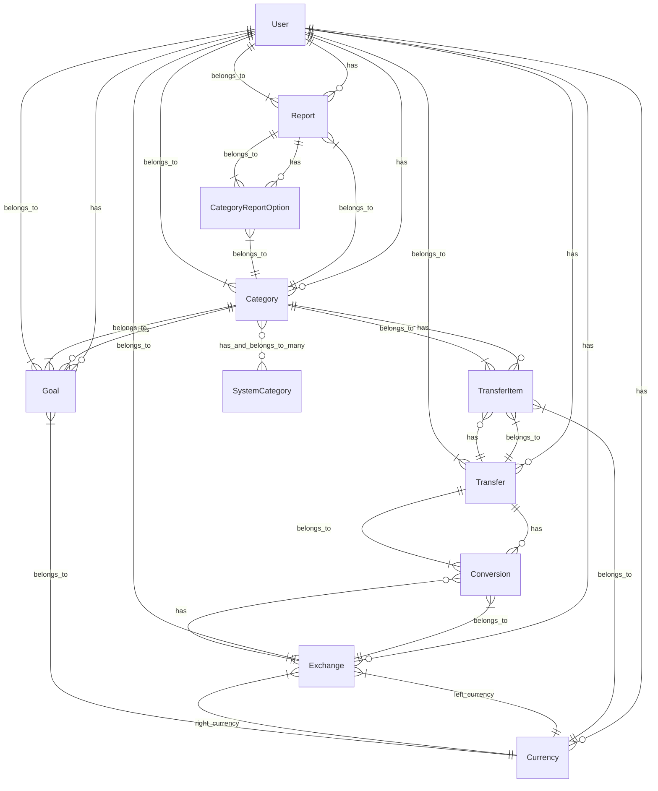

# Model Documentation

## Core Models and Relationships

This document outlines the key models in the application and their relationships with each other.

## User

The User model represents an application user account.

### Attributes:
- `login`: Username for login
- `name`: User's full name
- `email`: Email address
- `crypted_password`: Encrypted password
- `salt`: Password salt
- `transaction_amount_limit_type_int`: Setting for transaction history limits
- `transaction_amount_limit_value`: Value for transaction limit
- `include_transactions_from_subcategories`: Whether to include subcategories
- `multi_currency_balance_calculating_algorithm_int`: Algorithm for currency calculations
- `default_currency_id`: Default currency for the user
- `invert_saldo_for_income`: Whether to invert saldo calculations for income

### Associations:
- `has_many :categories`: User's categories
- `has_many :transfers`: User's financial transfers
- `has_many :transfer_items`, through: :transfers
- `has_many :conversions`, through: :transfers
- `has_many :currencies`: User-defined currencies
- `has_many :goals`
- `has_many :exchanges`: Currency exchange rates
- `has_many :reports`: Saved reports
- `belongs_to :default_currency`: Reference to default currency

### Key Methods:
- `create_top_categories`: Creates default top-level categories
- `remove_all_data`: Removes all user data
- `activate!`: Activates a new user account
- `authenticate`: Authenticates user credentials

## Category

The Category model represents an expense/income category hierarchy.

### Attributes:
- `name`: Category name
- `description`: Optional description
- `category_type_int`: Type of category (Asset, Income, Expense, Loan, Balance)
- `user_id`: Associated user
- `parent_id`: Parent category (nested set)
- `lft`, `rgt`: Nested set values
- `loan_category`: Whether it's a loan category
- `bank_account_number`: Associated bank account number
- `email`: Associated email (for loan categories)

### Associations:
- `belongs_to :user`
- `has_many :transfer_items`: Items belonging to category
- `has_many :transfers`, through: :transfer_items
- `has_many :goals`
- `has_many :category_report_options`
- `has_many :multiple_category_reports`, through: :category_report_options
- `has_and_belongs_to_many :system_categories`: System category templates

### Key Methods:
- `save_with_subcategories`: Creates category with subcategories
- `saldo`: Calculates category balance
- `saldo_for_period`: Balance for a specific period
- `transfers_with_saldo`: Retrieves transfers with running balance
- `calculate_share_values`: Used for report generation
- `calculate_flow_values`: Calculates cash flow

## Transfer

The Transfer model represents a financial transaction.

### Attributes:
- `description`: Transaction description
- `day`: Date of transaction
- `user_id`: Associated user
- `import_guid`: Import identifier

### Associations:
- `has_many :transfer_items`: Individual items in the transfer
- `belongs_to :user`
- `has_many :currencies`, through: :transfer_items
- `has_many :categories`, through: :transfer_items
- `has_many :conversions`
- `has_many :exchanges`, through: :conversions

### Key Methods:
- `different_income_outcome?`: Validates balanced transaction
- `contains_required_conversions?`: Checks for currency conversion requirements
- Named scope `newest`: Retrieves transactions based on type/timeframe

## TransferItem

The TransferItem model represents an individual item within a transfer transaction.

### Associations:
- `belongs_to :transfer`
- `belongs_to :category`
- `belongs_to :currency`

### Key Attributes:
- `value`: Monetary value (positive for income, negative for expense)
- `description`: Item description

## Currency

The Currency model represents a monetary currency.

### Attributes:
- `name`: Currency name
- `long_symbol`: Full currency symbol
- `short_symbol`: Abbreviated symbol

### Associations:
- `belongs_to :user`
- `has_many :transfer_items`
- `has_many :left_exchanges`, class_name: 'Exchange', foreign_key: 'left_currency_id'
- `has_many :right_exchanges`, class_name: 'Exchange', foreign_key: 'right_currency_id'

## Exchange

The Exchange model represents currency exchange rates.

### Attributes:
- `day`: Date of the exchange rate
- `left_to_right`: Conversion rate from left to right currency
- `right_to_left`: Conversion rate from right to left currency

### Associations:
- `belongs_to :user`
- `belongs_to :left_currency`, class_name: 'Currency'
- `belongs_to :right_currency`, class_name: 'Currency'
- `has_many :conversions`

### Key Methods:
- `exchange`: Converts an amount between currencies

## Goal

The Goal model represents financial planning goals.

### Attributes:
- `name`: Goal name
- `description`: Goal description
- `start_date`, `end_date`: Time period
- `value`: Target value
- `period_type`: Recurrence period type
- `cyclic`: Whether the goal repeats

### Associations:
- `belongs_to :category`
- `belongs_to :currency`
- `belongs_to :user`

## Report

The Report model represents saved reports.

### Types of Reports:
- `ShareReport`: Shows distribution of values across categories
- `ValueReport`: Shows absolute values
- `FlowReport`: Shows cash flow between categories

### Attributes:
- `name`: Report name
- `category_id`: Main category for the report
- `period_type`: Time period for the report
- `temporary`: Whether it's a temporary report

### Associations:
- `belongs_to :user`
- `belongs_to :category`
- `has_many :category_report_options` (for multiple category reports)

## System Category

The SystemCategory model provides templates for categories.

### Attributes:
- `name`: Category name
- `description`: Description
- `category_type_int`: Category type
- `level`: Hierarchical level

### Associations:
- `has_and_belongs_to_many :categories`

## Relationships Diagram

## Key Data Flows

### Transaction Creation
1. User creates a Transfer
2. Adds multiple TransferItems with Categories and Currency
3. If multiple currencies, adds necessary Conversions with Exchanges
4. System validates that income equals outcome (balanced transaction)
5. Transaction is saved to database

### Balance Calculation
1. User views Category balance
2. System calculates balance based on:
   - All TransferItems for that Category
   - Optional inclusion of subcategories
   - Currency conversion using selected algorithm
   - Time period constraints

### Report Generation
1. User creates a Report with specific parameters
2. System processes TransferItems based on report type
3. Results are calculated, grouped, and formatted
4. Visual representation is generated