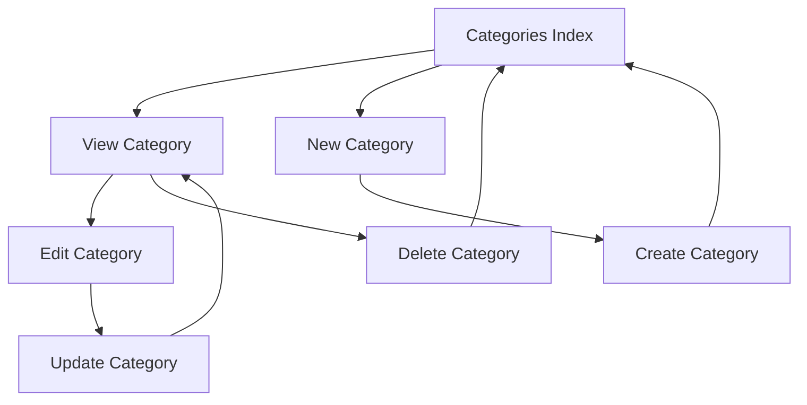
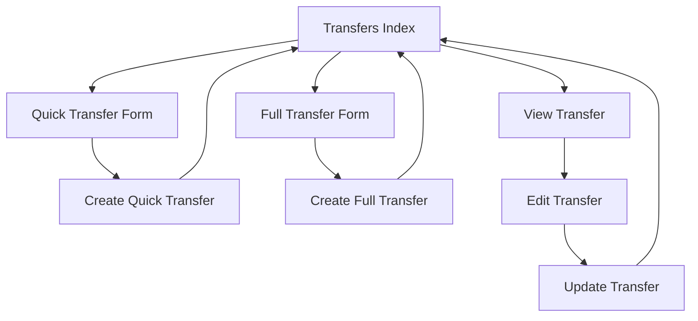
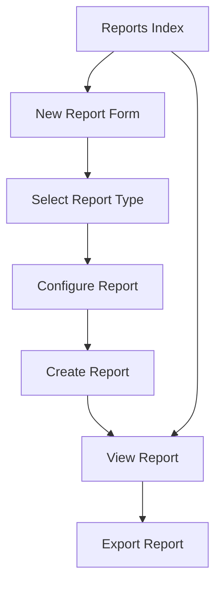

# View Documentation

This document outlines the view structure and UI components of the Ruby on Rails application.

## Layout Structure

The application uses a primary layout (`application.html.erb`) that provides the common page structure:

### Main Sections:
1. **Header**: Contains the application logo and navigation
2. **Flash Messages**: Displays notice/error messages
3. **Main Content Area**: Yields to specific view content 
4. **Right Menu Sidebar**: Contains navigation links and user information
5. **Footer**: Contains links to help, about, and terms

### CSS Structure:
- `scaffold_new.css`: Core styling
- `html.css`: Base HTML element styling
- `layout.css`: Page layout definitions
- `table.css`: Table styling
- `shadow.css`: Shadow effects
- `tab.css`: Tab navigation styling
- `form.css`: Form styling

## Key View Templates

### User Management Views
- **users/new.html.erb**: Registration form
- **users/edit.html.erb**: User profile editing
- **sessions/new.html.erb**: Login form

### Category Management Views
- **categories/index.html.erb**: List of categories
- **categories/show.html.erb**: Detail view for a category
- **categories/_category.html.erb**: Reusable category partial
- **categories/_new_subcategories.html.erb**: Interface for adding subcategories
- **categories/_transfer_table.html.erb**: Displays transfers for a category

### Transfer Management Views
- **transfers/index.html.erb**: List of transfers
- **transfers/_form.html.erb**: Transfer creation/editing form
- **transfers/_transfer.html.erb**: Individual transfer display
- **transfers/_transfer_details.html.erb**: Detailed transfer information
- **transfers/_transfer_item.html.erb**: Transfer item display
- **transfers/_quick_transfer.html.erb**: Quick transfer form

### Financial Management Views
- **currencies/index.html.erb**: List of currencies
- **exchanges/index.html.erb**: List of exchange rates
- **goals/index.html.erb**: List of financial goals
- **debtors/index.html.erb**: List of debtors
- **creditors/index.html.erb**: List of creditors

### Reporting Views
- **reports/index.html.erb**: List of reports
- **reports/show_flow_report.html.erb**: Flow report display
- **reports/show_graph_report.html.erb**: Graph report display
- **reports/_show_flow_category.html.erb**: Flow category display
- **reports/_show_share_category.html.erb**: Share category display
- **reports/_show_value_category.html.erb**: Value category display

### Import Views
- **import/import.html.erb**: Import form
- **import/parse.html.erb**: File parsing interface
- **import/import_status.html.erb**: Import status display

## UI Components and Patterns

### Navigation

1. **Main Menu**:
   - Located in the right sidebar
   - Contains links to main sections based on user authentication status
   - For logged-in users: Categories, Transfers, Currencies, Exchanges, Reports, Planning, etc.
   - For anonymous users: Login and Registration

2. **Tab Navigation**:
   - Used in several sections for sub-navigation
   - Implemented using the `tab_helper.rb` helper
   - Example usage in reports and category views

### Forms

1. **Standard Forms**:
   - Consistent styling across the application
   - Error reporting at the form top
   - Field validation with immediate feedback

2. **Dynamic Forms**:
   - JavaScript-enhanced forms for complex data entry
   - Add/remove capability for nested elements (e.g., transfer items)
   - Autocomplete functionality for frequently used fields

### Data Display

1. **Tables**:
   - Consistent table styling for data lists
   - Sortable columns in many tables
   - Pagination for large data sets

2. **Details Views**:
   - Structured display of individual object details
   - Consistent use of sections and labeling
   - Action buttons for related operations

3. **Charts and Visualizations**:
   - Uses Open Flash Chart for graphical reports
   - Various chart types for different report kinds
   - Interactive elements for data exploration

## View Helper Modules

The application includes numerous helper modules to encapsulate view logic:

1. **ApplicationHelper**: Core helpers used application-wide
2. **DynamicFormsHelper**: Helpers for dynamic form generation
3. **ExchangesHelper**: Currency exchange specific helpers
4. **GoalsHelper**: Financial goal rendering helpers
5. **ImageHelper**: Image-related helpers
6. **LayoutHelper**: Page layout helpers
7. **LinkActionHelper**: Action link generation
8. **MoneyHelper**: Money formatting and display
9. **RedirectHelper**: Redirection utilities
10. **ReportsHelper**: Report generation and display
11. **ShadowHelper**: UI shadow effects
12. **TabHelper**: Tab navigation generation
13. **UniqueFormElementsHelper**: Form element generation

## JavaScript Components

The application uses various JavaScript libraries and custom code:

1. **Core Libraries**:
   - Prototype.js: Core JavaScript framework
   - Effects.js: Visual effects library
   - Controls.js: UI control enhancements

2. **Custom JavaScript**:
   - `application.js`: Application-wide functionality
   - `delegate.js`: Event delegation
   - `user.js`: User-specific functionality

3. **Key JavaScript Features**:
   - Form validation
   - Dynamic form element addition/removal
   - AJAX-based data loading
   - Autocomplete functionality
   - Chart generation and interaction

## UI Workflow Diagrams

### Category Management Flow

### Transfer Creation Flow

### Report Generation Flow

## Mobile Responsiveness

The application was designed before mobile responsiveness was standard practice, and primarily targets desktop browsers. Key points:

- Fixed-width layout (750px main content area)
- No responsive design breakpoints
- Limited support for smaller screen sizes
- Would require significant updates for modern mobile support

## Accessibility Considerations

The original application has limited accessibility features:

- Some form elements lack proper labels
- Image alt text is inconsistent
- Color contrast may not meet modern standards
- Interactive elements may not be fully keyboard accessible

## Internationalization (i18n)

The application includes some internationalization support:

- Uses Rails i18n framework
- Has localization files for English (en.yml) and Polish (pl.yml)
- Text strings in views use i18n translation keys
- Date and currency formats follow localization settings