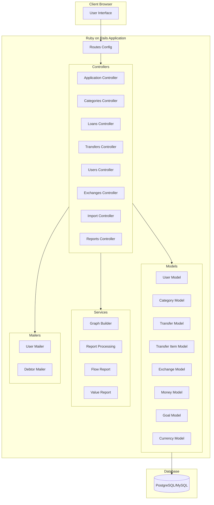

# Current State Architecture

## Overview

The current application is built using Ruby on Rails, following the Model-View-Controller (MVC) architecture pattern. It's a financial management system that handles loans, transfers, currencies, and reporting functionalities.

## Architecture Diagram

## Component Description

### 1. Controllers Layer
- **Application Controller**: Base controller providing common functionality
- **Categories Controller**: Manages financial categories
- **Loans Controller**: Handles loan management
- **Transfers Controller**: Manages money transfers
- **Users Controller**: Handles user management
- **Exchanges Controller**: Manages currency exchanges
- **Reports Controller**: Generates financial reports

### 2. Models Layer
- **User Model**: User authentication and profile
- **Category Model**: Financial categorization
- **Transfer Model**: Money transfer operations
- **Exchange Model**: Currency exchange operations
- **Money Model**: Money value handling
- **Goal Model**: Financial goals tracking

### 3. Services Layer
- **Graph Builder**: Visualization service
- **Report Processing**: Report generation
- **Flow Report**: Cash flow analysis
- **Value Report**: Value-based reporting

### 4. Supporting Components
- **Mailers**: Email notification system
- **Routes**: URL routing configuration
- **Database**: Relational database storage

## Key Features
1. User Authentication and Authorization
2. Financial Transaction Management
3. Multi-currency Support
4. Category-based Financial Organization
5. Reporting and Analytics
6. Goal Tracking
7. Email Notifications

## Technical Stack
- **Framework**: Ruby on Rails
- **Database**: PostgreSQL/MySQL
- **Authentication**: Built-in Rails authentication
- **Asset Pipeline**: Sprockets
- **Template Engine**: ERB
- **ORM**: Active Record

## Integration Points
1. Email Service Integration
2. Currency Exchange Rate Services
3. Import/Export Functionality
4. Report Generation Engine

This architecture represents a typical monolithic Ruby on Rails application where the presentation layer, business logic, and data access are tightly coupled within the same application.