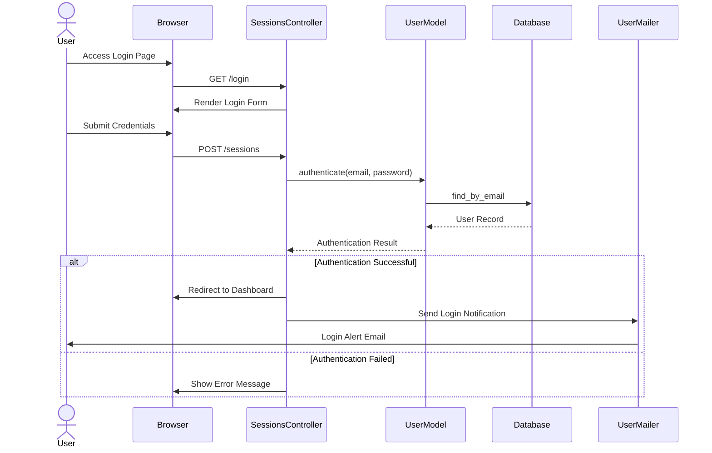
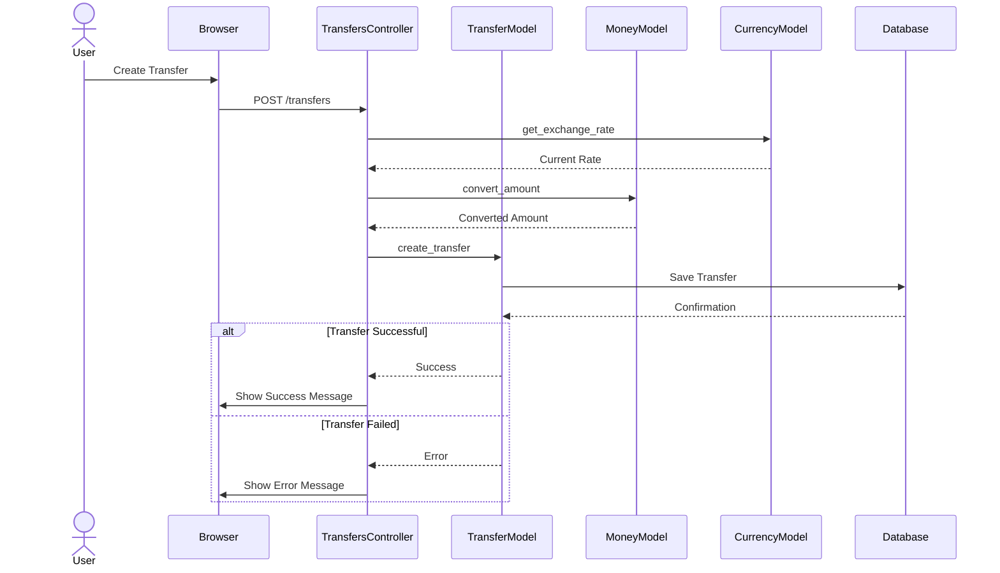
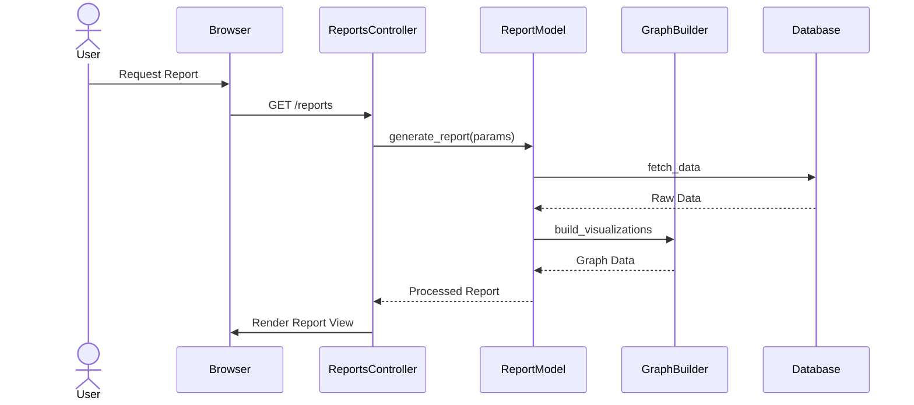
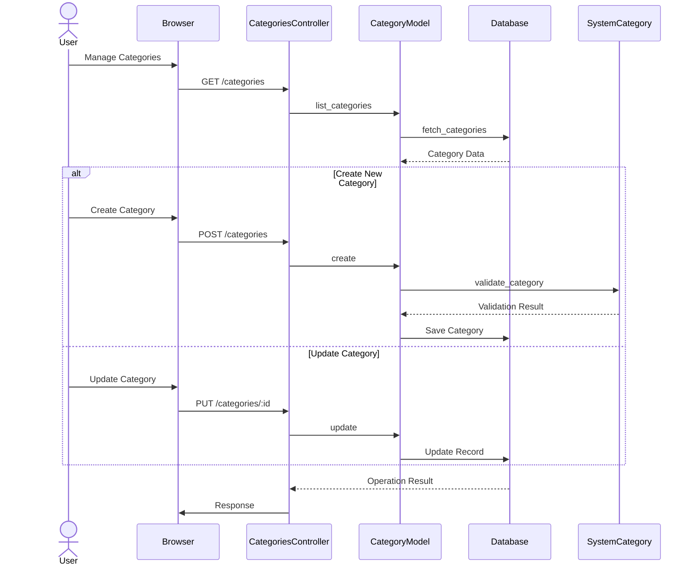
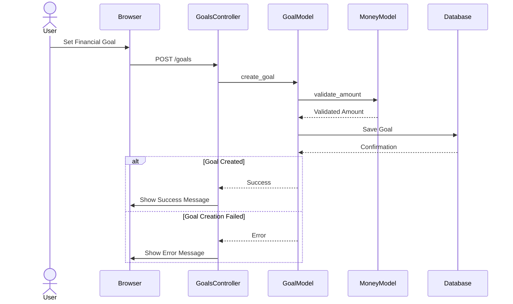

# Current State Sequence Diagrams

This document outlines the key interaction flows in the current Ruby on Rails application through sequence diagrams.

## 1. User Authentication Flow

## 2. Financial Transfer Flow

## 3. Report Generation Flow

## 4. Category Management Flow

## 5. Goal Tracking Flow

These sequence diagrams illustrate the main interaction flows in the current Ruby on Rails application. They show how different components interact with each other to handle user requests and process business logic. Understanding these flows is crucial for the migration to Angular and Spring Boot architecture.