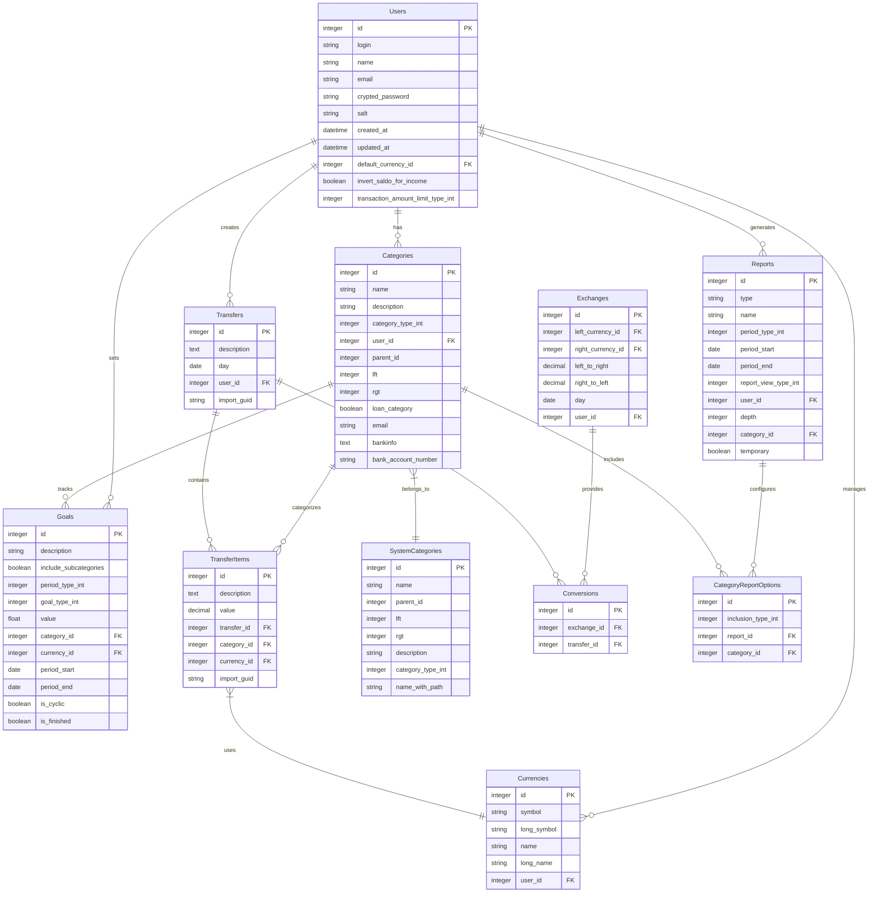

# Data Model Documentation

## Entity Relationship Diagram

## Table Descriptions

### Users
- Primary table for user management
- Stores authentication details and user preferences
- Controls currency and transaction settings

### Categories
- Hierarchical structure for financial categorization
- Supports nested categories (using lft/rgt for tree structure)
- Links to system categories for standardization
- Can be configured as loan categories

### Transfers
- Records financial transactions
- Links to transfer items for detailed breakdown
- Maintains user ownership and timing information

### TransferItems
- Detailed transaction entries
- Links to categories and currencies
- Stores individual monetary values

### Currencies
- Manages supported currencies
- Can be system-defined or user-defined
- Used in transfers and exchanges

### Goals
- Financial goal tracking
- Period-based targeting
- Supports cyclic and one-time goals
- Category-specific tracking

### Reports
- Customizable financial reporting
- Multiple report types supported
- Period-based analysis
- Category-specific reporting

### Exchanges
- Currency exchange rate management
- Bidirectional rate tracking
- Daily rate history
- User-specific rates possible

### SystemCategories
- Pre-defined category hierarchy
- Standardized categorization
- Supports type-based categorization

### CategoryReportOptions
- Report customization settings
- Controls category inclusion in reports
- Configures report parameters

### Conversions
- Links transfers to exchange rates
- Manages multi-currency transactions

## Key Relationships

1. **User-centric Design**
   - Users own their categories, transfers, and goals
   - User-specific currency preferences
   - Customizable reporting per user

2. **Hierarchical Categories**
   - Nested category structure
   - System and user-defined categories
   - Category-based goal tracking

3. **Financial Transactions**
   - Transfers contain multiple items
   - Category classification
   - Multi-currency support

4. **Reporting System**
   - Flexible report configuration
   - Category-based filtering
   - Period-based analysis

## Database Indexes

The schema includes optimized indexes for:
- User lookups
- Category tree traversal
- Transfer queries
- Currency operations
- Report generation

## Data Integrity

1. **Foreign Key Constraints**
   - Category relationships
   - Transfer item associations
   - Currency references

2. **Required Fields**
   - User authentication data
   - Transaction details
   - Category structure

3. **Default Values**
   - Currency settings
   - Report configurations
   - Goal parameters

This data model provides a robust foundation for financial tracking, reporting, and goal management while maintaining data integrity and supporting multi-currency operations.