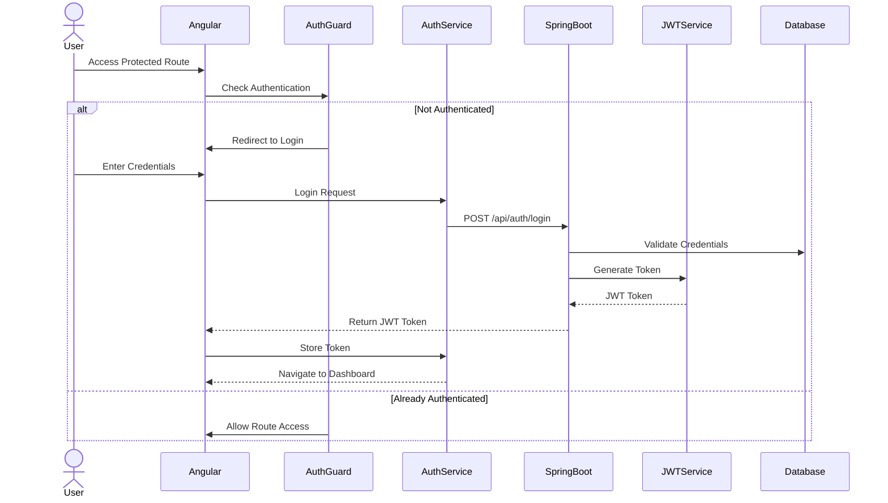
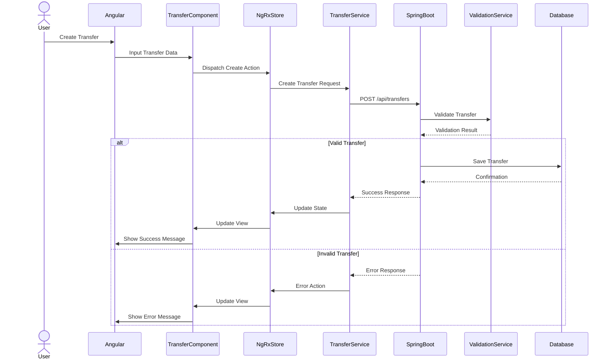
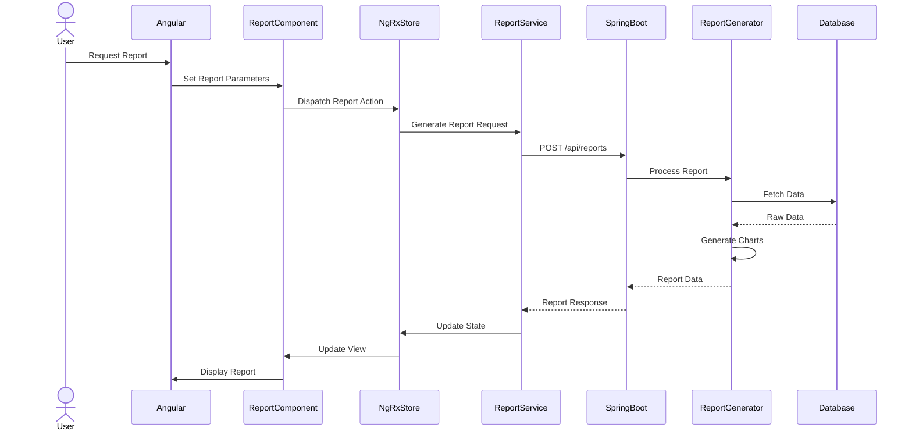
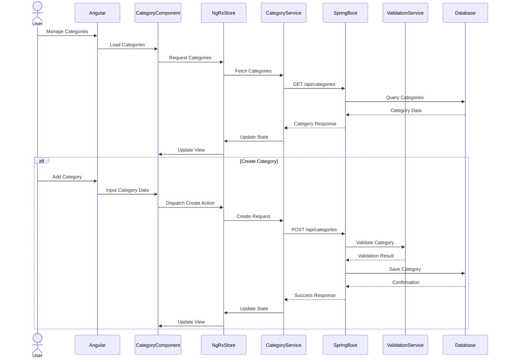
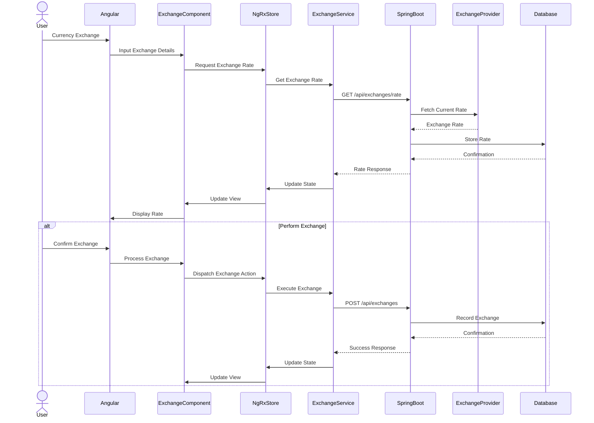

# Target State Sequence Diagrams

This document outlines the key interaction flows in the target Angular and Spring Boot architecture through sequence diagrams.

## 1. Authentication Flow

## 2. Transfer Management Flow

## 3. Report Generation Flow

## 4. Category Management Flow

## 5. Multi-Currency Exchange Flow

These sequence diagrams illustrate the main interaction flows in the target architecture, showing how the Angular frontend communicates with the Spring Boot backend through RESTful APIs, and how the system handles different business processes. They demonstrate:

1. Clean separation of concerns between frontend and backend
2. State management using NgRx in Angular
3. Proper validation and error handling
4. Asynchronous communication patterns
5. Database interactions
6. Service layer abstraction
7. Component-based architecture in Angular
8. RESTful API design in Spring Boot

The diagrams serve as a guide for implementing the modernized system while maintaining proper architectural patterns and best practices.