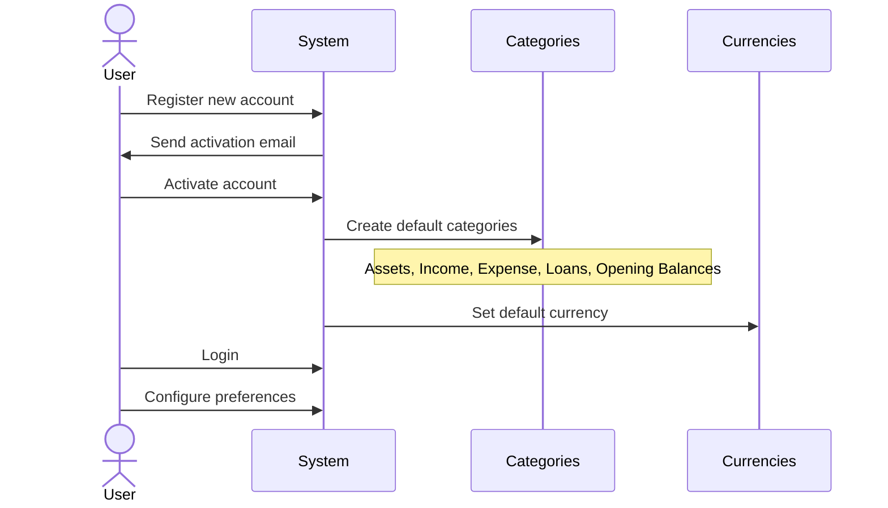
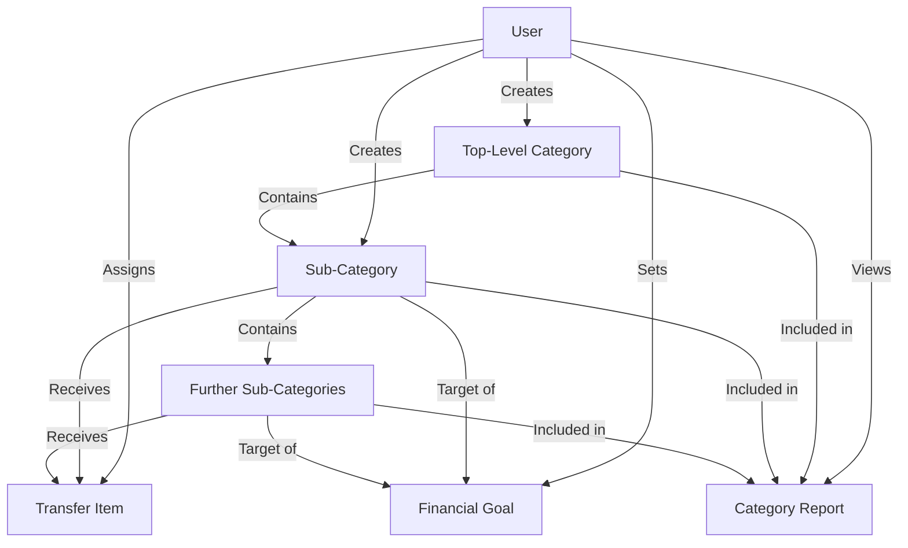
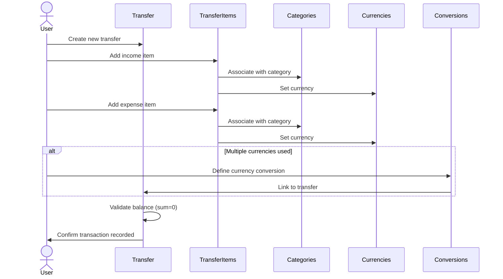
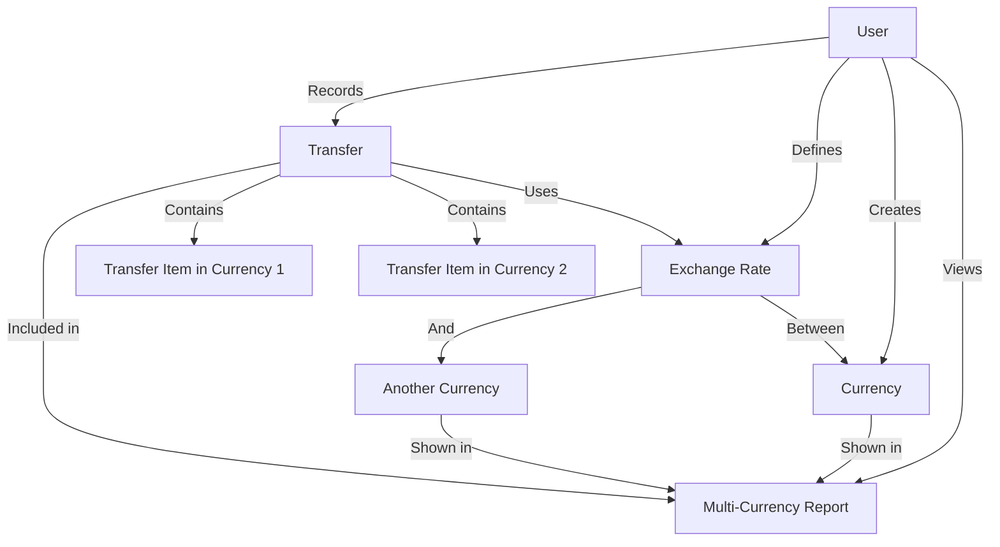
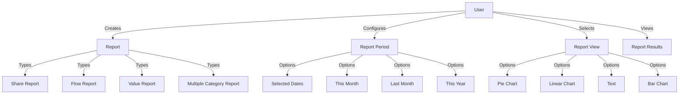
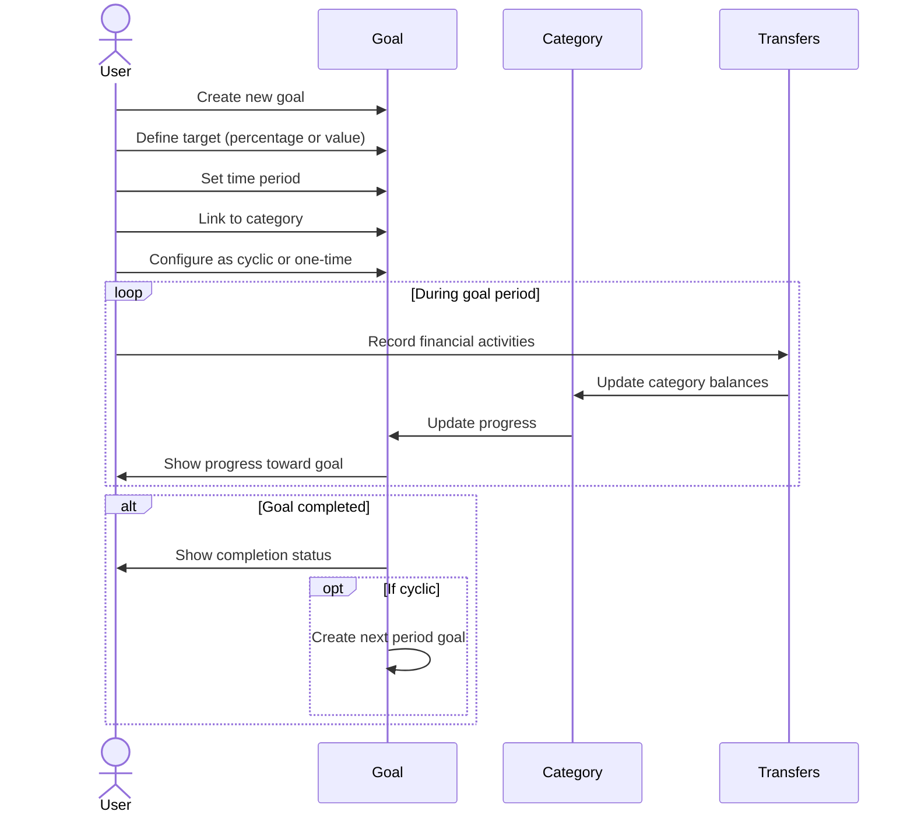
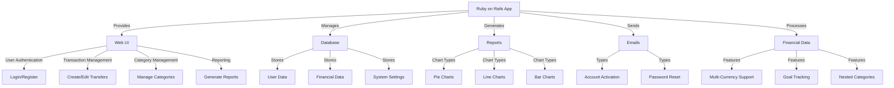

# Application Workflow Documentation

## Overview
This document describes the key workflows and interactions in the Ruby on Rails financial management application. It provides an understanding of how users interact with the system and how the different components work together.

## User Registration and Setup

## Managing Categories

## Recording Financial Transactions

## Multi-Currency Operations

## Financial Reporting

## Goal Tracking

## System Integration Points

This documentation provides a high-level understanding of the key workflows and interactions in the application. It shows how users interact with the system and how the different components work together to provide the application's functionality.