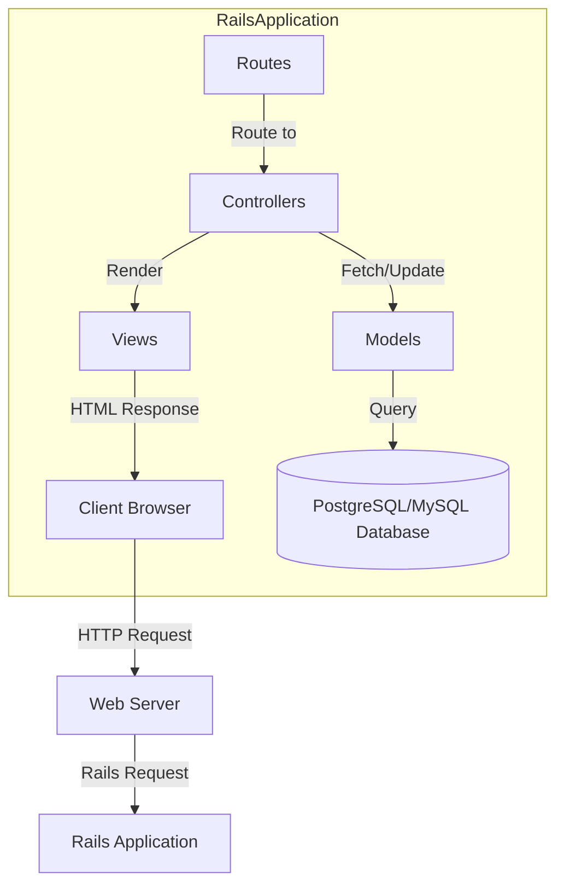
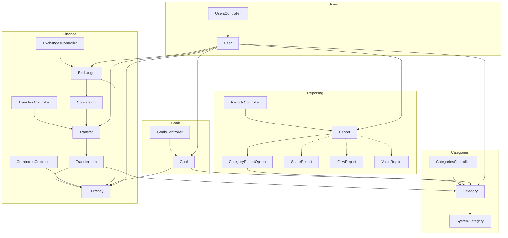

# Current State Architecture Documentation

This document describes the current state architecture of the Ruby on Rails application.

## System Architecture

The application follows a standard Ruby on Rails MVC (Model-View-Controller) architecture.

## Component Diagram

## Design Patterns Used

1. **MVC Pattern**: The application follows the standard Model-View-Controller pattern of Rails applications.

2. **Single Table Inheritance (STI)**: Used for the Report model, with subtypes ShareReport, FlowReport, and ValueReport.

3. **Nested Set Model**: Used for hierarchical Category structures via the Awesome Nested Set plugin.

4. **Decorator Pattern**: Used via the `Money` class that wraps currency value operations.

5. **Observer Pattern**: Rails' built-in callbacks and observers for model lifecycle events.

## Core Subsystems

### User Management

Handles user registration, authentication, activation, and session management. Uses the RESTful authentication plugin.

### Category System

Manages hierarchical categories with a nested set model. Categories have different types (ASSET, INCOME, EXPENSE, LOAN, BALANCE) and can be organized in a tree structure.

### Transfer System

Core financial transaction system allowing for complex multi-currency transfers with multiple transfer items that can belong to different categories.

### Currency and Exchange System

Handles multiple currencies and their exchange rates, allowing for currency conversions in transfers.

### Reporting System

Flexible reporting system with different report types:
- Share Reports: Show distribution of values across categories
- Flow Reports: Track cash flow
- Value Reports: Compare multiple categories

### Goal System

Tracks financial goals with support for cyclical goals and different goal types (percentage or absolute value).

## Technical Stack

- **Framework**: Ruby on Rails
- **Database**: Likely PostgreSQL or MySQL
- **Authentication**: Custom authentication via RESTful authentication plugin
- **JavaScript**: Likely jQuery (based on the age of the application)
- **CSS**: Custom stylesheets
- **Dependencies**: Various Rails plugins including Awesome Nested Set

## Development Environment

The application uses standard Rails development practices:
- Database migrations for schema management
- Model annotations for documentation
- Test fixtures for testing
- Background processing via BackgroundRb (indicated by bdrb_job_queues table)

## Database Strategy

The application uses ActiveRecord ORM with a focus on complex SQL queries for financial operations, utilizing:
- Named scopes for common queries
- Complex joins for multi-currency calculations
- Foreign key constraints for referential integrity
- Indexes on frequently queried fields