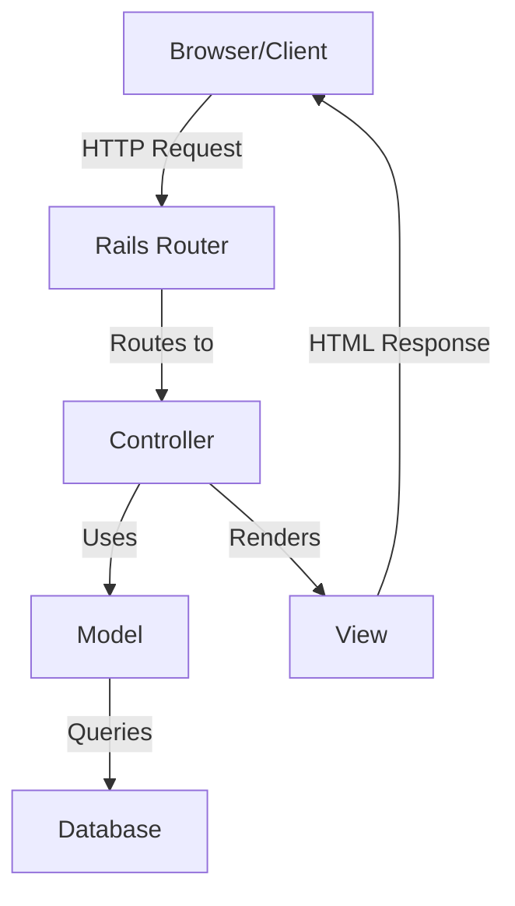
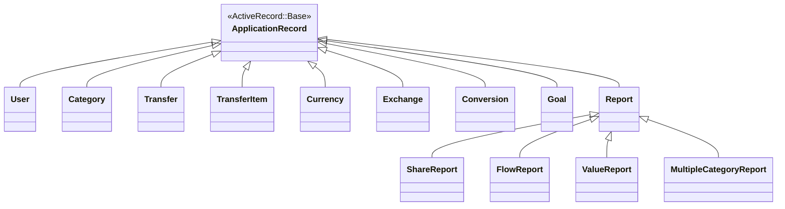
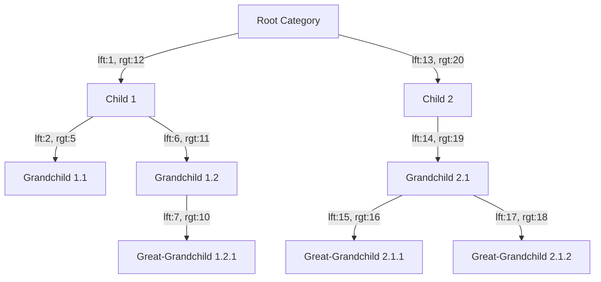
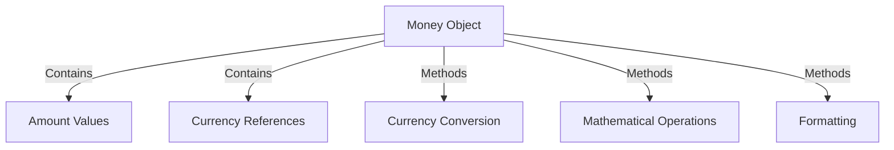
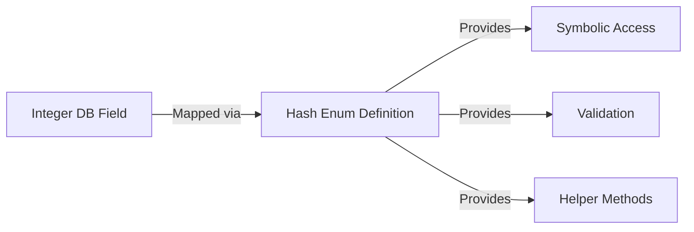
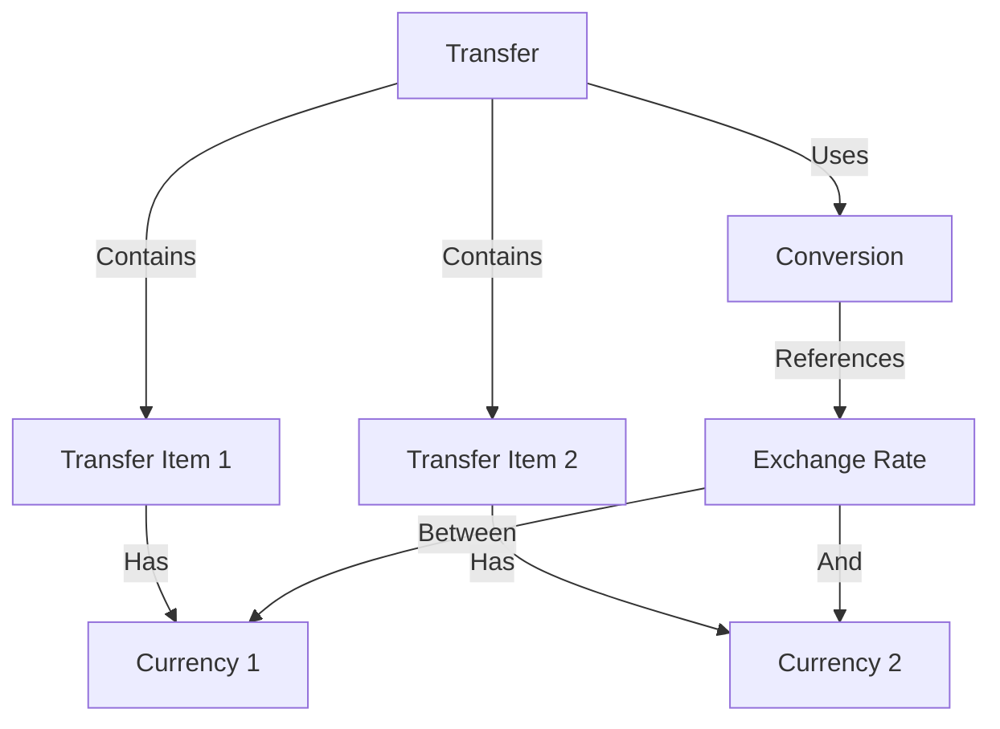
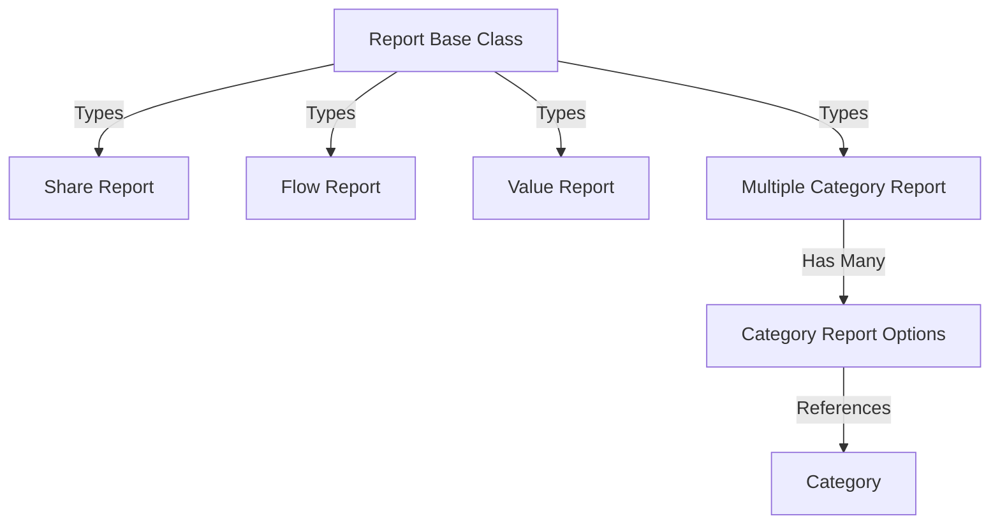

# Code Architecture Documentation

## Overview
This document describes the code architecture of the Ruby on Rails financial management application. It outlines the key components, patterns, and design principles used in the application.

## Application Structure

The application follows the standard Ruby on Rails Model-View-Controller (MVC) architecture:

## Models Layer

The models layer implements the business logic and data access. Key patterns used include:

1. **Active Record Pattern** - Models represent database tables and provide object-oriented access
2. **Nested Set Pattern** - Used for the hierarchical category structure
3. **Single Table Inheritance** - Used for report types
4. **Hash Enums** - Custom implementation for enumeration values
5. **Validations** - Extensive use of ActiveRecord validations for data integrity
6. **Callbacks** - Lifecycle hooks for data processing
7. **Named Scopes** - Reusable query definitions

## Key Design Patterns

### Nested Set Pattern (for Categories)
The application uses the nested set pattern for efficient tree operations on categories:

### Money Pattern
The application implements a money pattern to handle multi-currency operations:

### Hash Enums
The application uses a custom hash enum implementation for type fields:

## Controllers Layer

The controllers handle the HTTP request/response cycle and orchestrate application logic:

1. **RESTful Design** - Controllers follow RESTful principles
2. **Filters** - Authentication and authorization filters
3. **Thin Controllers** - Business logic delegated to models
4. **Flash Messages** - User feedback via flash messages

## Views Layer

The views layer renders the user interface:

1. **ERB Templates** - Ruby embedded in HTML
2. **Partials** - Reusable view components
3. **Helpers** - View helper methods for formatting and display logic
4. **Form Builders** - Custom form helpers

## Authentication and Authorization

User authentication and authorization are implemented using:

1. **Custom Authentication System** - Email/password authentication
2. **Account Activation** - Email verification flow
3. **Remember Me** - Persistent sessions
4. **User-based Data Isolation** - Data scoped to current user

## Data Validation

The application implements extensive data validation:

1. **Model Validations** - Field-level validations
2. **Custom Validators** - Complex business rule validation
3. **Transfer Balance Validation** - Ensures financial transfers balance
4. **Currency Conversion Validation** - Validates currency exchange operations

## Multi-Currency Support

The application has sophisticated multi-currency handling:

## Reporting System

The reporting system uses polymorphism and composition:

## Database Schema Management

The application uses Rails migrations for schema management:

1. **Versioned Migrations** - Incremental database changes
2. **Foreign Keys** - Referential integrity
3. **Indexes** - Performance optimization

## Testing Approach

The application includes various types of tests:

1. **Unit Tests** - Model validation and business logic
2. **Functional Tests** - Controller actions
3. **Integration Tests** - End-to-end workflows

## Technical Debt and Future Improvements

Several areas have been identified for potential improvement:

1. **Search Functionality** - Currently using a mix of SQL and Ruby code
2. **Delta Indexing** - Commented out, could be enabled for search
3. **Currency Handling** - Some methods marked with TODO comments
4. **Performance Optimization** - Some queries could be optimized

This document provides a high-level overview of the code architecture. It outlines the key patterns, components, and design decisions in the application, serving as a guide for understanding how the codebase is structured and why certain approaches were chosen.