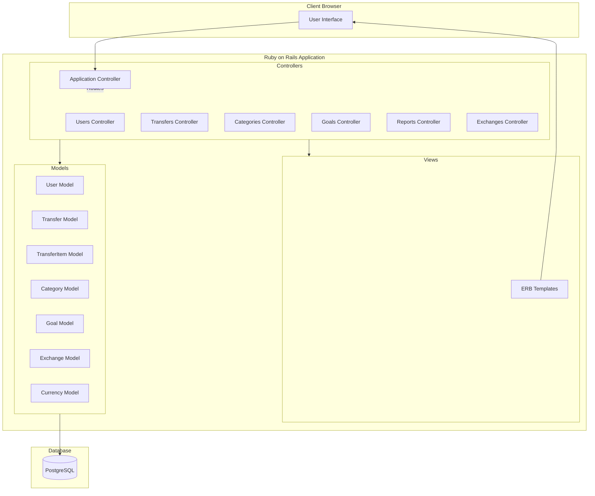

# Current State Architecture

## Overview
The current application is built using Ruby on Rails following the Model-View-Controller (MVC) pattern. It's a monolithic application that handles both the frontend and backend functionality within the same codebase.

## Architecture Diagram

## Key Components

### Controllers
- ApplicationController: Base controller providing common functionality
- UsersController: Handles user management and authentication
- TransfersController: Manages financial transfers
- CategoriesController: Handles expense/income categories
- GoalsController: Manages financial goals
- ReportsController: Generates financial reports
- ExchangesController: Handles currency exchange operations

### Models
- User: User account and authentication
- Transfer: Financial transfers
- TransferItem: Individual items within transfers
- Category: Expense/income categories
- Goal: Financial goals
- Exchange: Currency exchange records
- Currency: Currency management

### Views
- ERB templates for rendering HTML
- Layout templates for consistent UI structure

### Additional Components
- Authentication system (built-in)
- Database migrations for schema management
- Route configuration in config/routes.rb

## Technical Stack
- Ruby on Rails
- PostgreSQL Database
- ERB Templating
- Ruby Gems for additional functionality
- Asset Pipeline for JS/CSS management

## Key Features
1. User Authentication
2. Financial Transfer Management
3. Categorization of Expenses/Income
4. Financial Goal Setting
5. Multi-currency Support
6. Report Generation
7. Currency Exchange Tracking

## Integration Points
1. Database via ActiveRecord
2. Email Service for Notifications
3. Currency Exchange Rate Services
4. User Authentication System

## Security Considerations
1. Built-in Rails Security Features
2. CSRF Protection
3. SQL Injection Prevention
4. XSS Protection
5. Session Management

This architecture represents the current state of the application before modernization to Angular and Spring Boot.