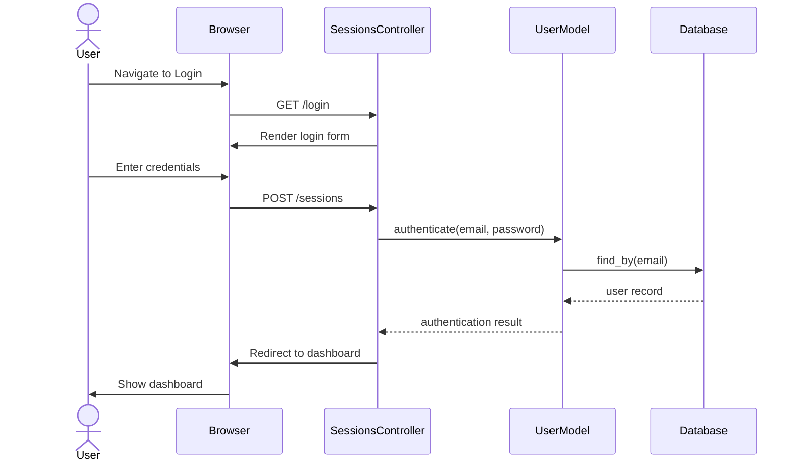
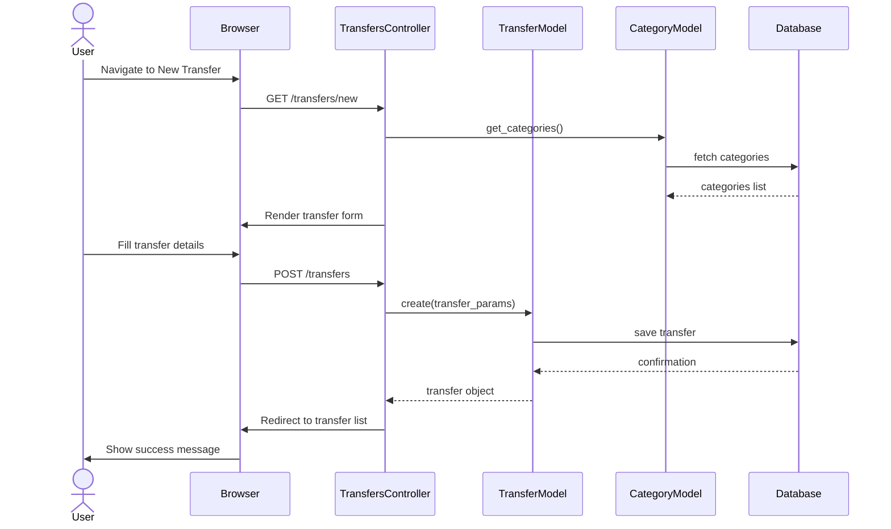
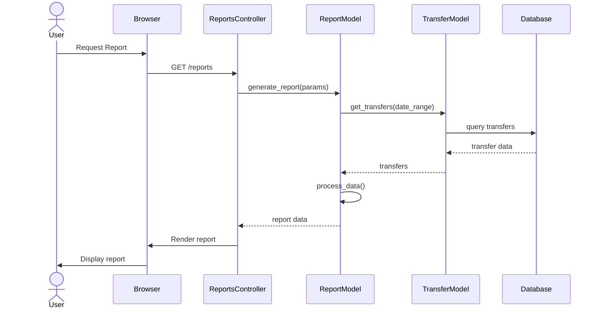
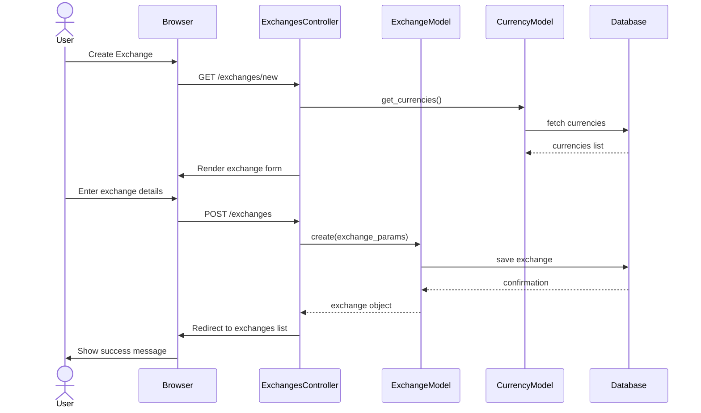
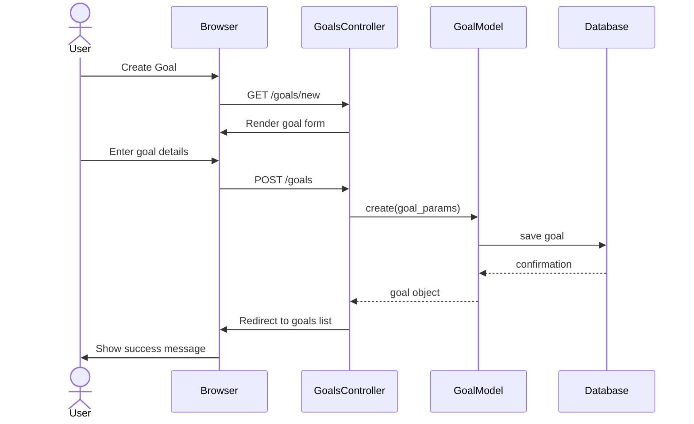

# Current State Sequence Diagram

This document outlines the key interactions in the current Ruby on Rails application.

## User Authentication Flow

## Transfer Creation Flow

## Report Generation Flow

## Currency Exchange Flow

## Goal Management Flow

These sequence diagrams represent the main interactions in the current Ruby on Rails application. They will serve as a reference for implementing similar functionality in the new Angular and Spring Boot architecture.