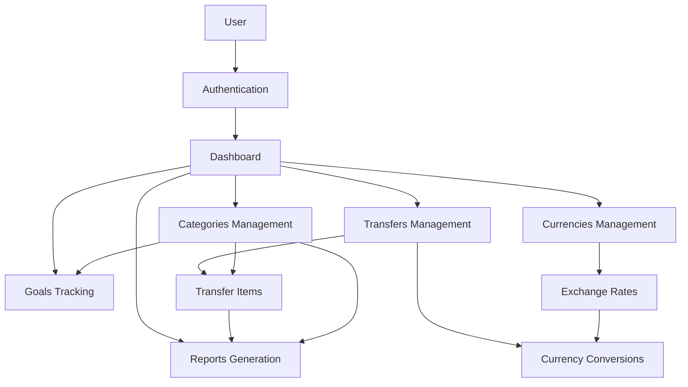
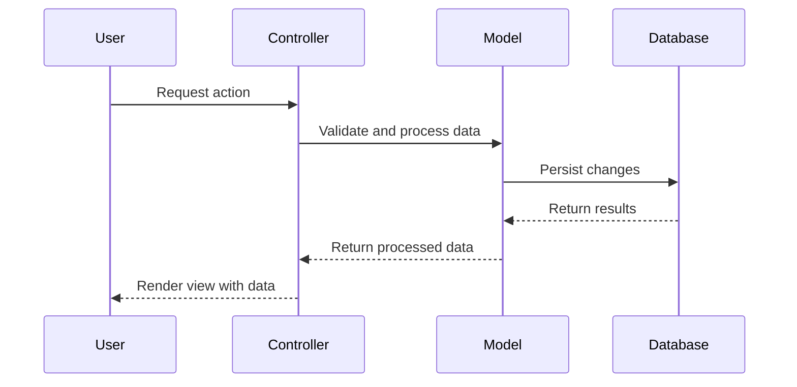
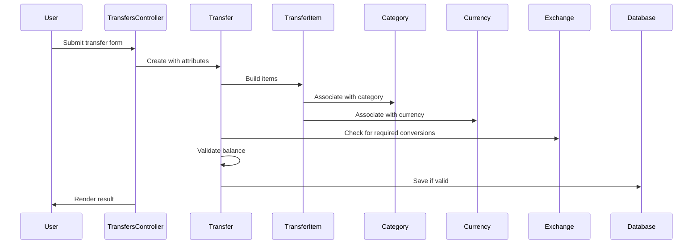
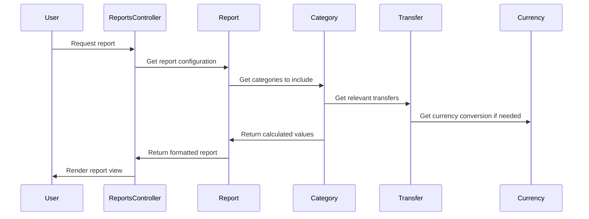

# Ruby on Rails Application - Current State Documentation

## Table of Contents
1. [Introduction](#introduction)
2. [System Overview](#system-overview)
3. [Core Models](#core-models)
4. [Controllers and User Flows](#controllers-and-user-flows)
5. [Application Features](#application-features)
6. [System Interactions](#system-interactions)
7. [Data Flow Diagrams](#data-flow-diagrams)

## Introduction
This document provides a comprehensive overview of the current Ruby on Rails application, detailing its models, controllers, and features. This documentation will serve as a foundation for reengineering the application to an Angular and Node.js stack.

## System Overview
The application appears to be a personal finance management system that allows users to track transfers (transactions), categorize them, manage different currencies with exchange rates, generate reports, and track financial goals. The system has capabilities for multi-currency support, loans tracking, and various types of financial reporting.

### Technology Stack
- **Framework**: Ruby on Rails
- **Authentication**: Custom implementation using restful-authentication plugin
- **Database**: Supports multiple databases through ActiveRecord
- **Plugins**:
  - restful-authentication for user authentication
  - thinking-sphinx for search functionality
  - open_flash_chart for report visualizations
  - backgroundrb for background processing
  - awesome_nested_set for tree structures (categories)

## Core Models

### User
The User model is central to the application, representing users of the system.

**Key Attributes**:
- login, name, email, crypted_password
- transaction_amount_limit_type and value (controls how many transactions are shown)
- multi_currency_balance_calculating_algorithm (determines how currency conversions are handled)
- default_currency_id
- invert_saldo_for_income (controls display of income values)

**Associations**:
- Has many categories (organized hierarchically)
- Has many transfers (financial transactions)
- Has many currencies
- Has many exchanges (currency exchange rates)
- Has many goals
- Has many reports

**Key Functionality**:
- Authentication (login/password)
- Account activation via email
- Creation of top-level categories upon user creation

### Category
Categories form a hierarchical structure for classifying financial transactions.

**Key Types**:
- ASSET (resources/possessions)
- INCOME (money coming in)
- EXPENSE (money going out)
- LOAN (money borrowed/lent)
- BALANCE (opening balances)

**Associations**:
- Belongs to a user
- Can have parent/child relationships (tree structure)
- Has many transfers (through transfer_items)
- Can have goals

**Key Functionality**:
- Tracking balances for different time periods
- Supporting nested categories for detailed classification
- Calculating saldos (balances) with or without subcategories

### Transfer
Represents a financial transaction with at least two sides (debit and credit).

**Key Attributes**:
- description
- day (date of transaction)
- user_id

**Associations**:
- Belongs to a user
- Has many transfer_items (individual entries that make up the transaction)
- Has many conversions (for multi-currency transactions)

**Key Functionality**:
- Maintains balance between income and outcome items
- Supports transactions in multiple currencies with appropriate conversion

### Currency
Represents monetary units used in the system.

**Key Attributes**:
- symbol (e.g., $)
- long_symbol (e.g., USD)
- name
- long_name

**Associations**:
- Belongs to a user (or can be system-wide if user_id is null)
- Has many left_exchanges and right_exchanges
- Has many transfer_items

### Report
Base model for various types of financial reports.

**Types**:
- ShareReport (pie charts showing distribution of resources)
- FlowReport (showing cash flow)
- ValueReport (comparing values over time)
- MultipleCategoryReport (comparing multiple categories)

**Key Attributes**:
- name
- period_type_int
- period_start and period_end
- report_view_type_int (pie, linear, text, bar)

**Associations**:
- Belongs to a user
- Can be associated with categories

### Goal
Represents financial targets users want to achieve.

**Associations**:
- Belongs to a category
- Belongs to a user
- Belongs to a currency

## Controllers and User Flows

### Authentication Flow
- New users sign up via `UsersController#new`
- Account activation via email
- Login via `SessionsController#new`
- Access control via before_filter :login_required

### Core User Flows

#### Transfers Management
- Users can view all transfers via `TransfersController#index`
- Create new transfers via `TransfersController#create`
- Quick transfer functionality for simple transactions
- Search transfers by date range
- Edit and delete transfers

#### Categories Management
- View category hierarchy through `CategoriesController#index`
- Create new categories and subcategories
- View transactions within a category
- Calculate category balances for different time periods

#### Reports Generation
- Create different types of reports (Share, Flow, Value)
- Configure report parameters (time period, categories to include)
- View reports in different formats (pie chart, linear graph, text, bar chart)

#### Goals Tracking
- Set financial goals tied to specific categories
- Track progress towards goals
- Configure cyclic goals for recurring targets

#### Multi-Currency Support
- Manage different currencies via `CurrenciesController`
- Set exchange rates via `ExchangesController`
- Perform transactions in different currencies with automatic conversion

## Application Features

### Financial Management
1. **Transaction Tracking**: Recording financial transactions with detailed categorization
2. **Category Hierarchy**: Organizing financial data in a tree structure
3. **Multi-Currency Support**: Managing transactions in different currencies with exchange rates
4. **Reporting**: Generating various financial reports and visualizations
5. **Goals**: Setting and tracking financial objectives

### Data Management
1. **Import/Export**: Importing transaction data from bank files
2. **Search**: Finding transactions and categories
3. **History**: Viewing transaction history with filtering options

## System Interactions

### Data Flow

### Component Interaction

## Data Flow Diagrams

### Transfer Creation Flow

### Reporting Flow

This documentation provides an overview of the current Ruby on Rails application's structure and functionality, serving as a foundation for the reengineering effort to convert it to an Angular and Node.js application.