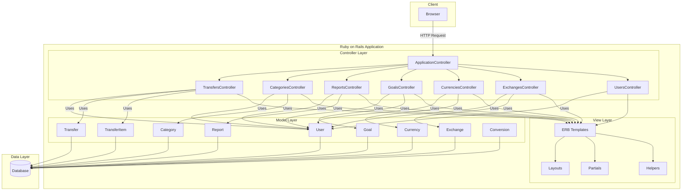

# Current State Architecture

## Overview

The current application is a financial management system built with Ruby on Rails. It allows users to manage their finances, track expenses and income, create reports, set financial goals, and handle multiple currencies.

## Architecture

The application follows the standard Ruby on Rails MVC (Model-View-Controller) architecture:

## Components

### Models
- **User**: Core model representing system users with authentication
- **Category**: Represents financial categories in a hierarchical structure (income, expense, asset, loan, balance)
- **Transfer**: Financial transactions
- **TransferItem**: Individual entries within a transfer, linked to categories and currencies
- **Currency**: Represents different currencies in the system
- **Exchange**: Currency exchange rates
- **Conversion**: Currency conversion records for transfers
- **Goal**: Financial goals linked to categories
- **Report**: Various financial reports (share, value, flow)

### Controllers
- **ApplicationController**: Base controller with shared functionality
- **TransfersController**: Manages financial transactions
- **CategoriesController**: Manages financial categories
- **ReportsController**: Handles report generation and display
- **GoalsController**: Manages financial goals
- **CurrenciesController**: Handles currency management
- **ExchangesController**: Manages exchange rates
- **UsersController**: User management
- **SessionsController**: Authentication

### Plugins and Libraries
The application uses several Ruby on Rails plugins:
- **restful-authentication**: Handles user authentication
- **awesome_nested_set**: Manages hierarchical structures for categories
- **backgroundrb**: Background job processing
- **open_flash_chart**: Generates charts for reports
- **thinking-sphinx**: Search functionality

## Technology Stack

- **Framework**: Ruby on Rails
- **Database**: SQL (based on configuration, likely PostgreSQL or MySQL)
- **Frontend**: 
  - ERB templates with embedded Ruby
  - JavaScript (Prototype framework)
  - CSS
- **Authentication**: Custom mechanism using the restful-authentication plugin
- **Background Processing**: BackgroundRB for report generation

## Key Features

1. User authentication and management
2. Hierarchical categorization of financial entries
3. Transaction management with multi-currency support
4. Currency exchange rate tracking
5. Financial goal setting and tracking
6. Report generation (share reports, value reports, flow reports)
7. Debtor and creditor tracking
8. Data import/export functionality