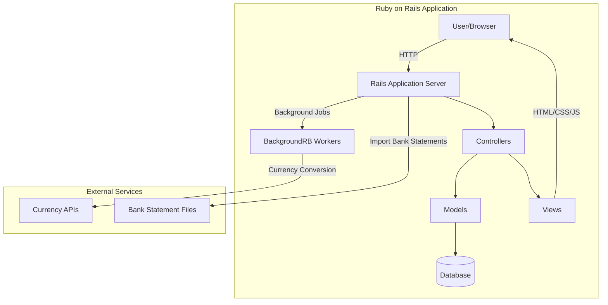

# Current State Architecture

## Overview

The current application is a Ruby on Rails monolithic application for personal finance management. It allows users to track expenses, income, and manage their budgets through categories, transfers, and reports. The application also supports currency conversion and loan tracking.

## Technology Stack

The existing application uses the following technologies:

- **Framework**: Ruby on Rails
- **Database**: SQL database (based on the schema and migration files)
- **Authentication**: Custom authentication (using Restful Authentication plugin)
- **Frontend**: ERB templates with JavaScript (Prototype.js)
- **CSS**: Custom CSS stylesheets
- **Charts/Graphs**: Open Flash Chart plugin
- **Background Processing**: BackgroundRB for background jobs

## Architecture Diagram

## Application Structure

The application follows the standard Rails MVC (Model-View-Controller) architecture:

### Models

The core models include:

- **User**: Manages user accounts and authentication
- **Category**: Hierarchical structure for organizing finances (income, expenses, assets, etc.)
- **Transfer**: Financial transactions with transfer items
- **TransferItem**: Individual line items in a transfer linked to categories
- **Currency**: Different currencies used in the system
- **Exchange**: Currency exchange rates
- **Goal**: Financial goals for planning
- **Report**: Various financial reports and visualizations

### Controllers

Key controllers include:

- **ApplicationController**: Base controller with common functionality
- **CategoriesController**: Manages financial categories
- **TransfersController**: Handles financial transactions
- **ReportsController**: Manages various reports
- **GoalsController**: Handles financial planning and goals
- **CurrenciesController**: Manages currency definitions
- **ExchangesController**: Handles currency exchange rates
- **UsersController**: User account management
- **SessionsController**: Authentication

### Views

Views are organized by controller with partial templates for reusable components. The application uses ERB templates with embedded Ruby code.

## System Components

### Authentication System

- Custom implementation using RESTful Authentication plugin
- User activation via email
- Session management with cookies

### Category Management

- Hierarchical category structure using nested set pattern
- Categories have types (income, expense, asset, loan, balance)
- Support for sub-categories

### Transfer Management

- Multi-item transfers with descriptions
- Transaction history
- Categorization of income/expenses
- Search and filtering

### Currency and Exchange Rates

- Support for multiple currencies
- Manual and automated exchange rate updates
- Currency conversion for financial reports

### Reporting System

- Various report types (flow, share, value)
- Time period selection
- Visual charts/graphs using Open Flash Chart

### Financial Planning

- Goal setting and tracking
- Cyclic goals

## Data Flow

1. User authenticates via login form
2. Authenticated user can:
   - View and manage categories
   - Create and view transfers
   - Generate financial reports
   - Set financial goals
   - Manage currencies and exchange rates
   - Import data from bank statements

## Technical Debt and Limitations

1. Legacy JavaScript libraries (Prototype.js)
2. Flash-based charts (Open Flash Chart)
3. Non-RESTful architecture in some areas
4. Limited mobile support
5. Tight coupling between layers
6. Limited test coverage

## Integration Points

- Bank statement import functionality
- Possible external currency rate APIs