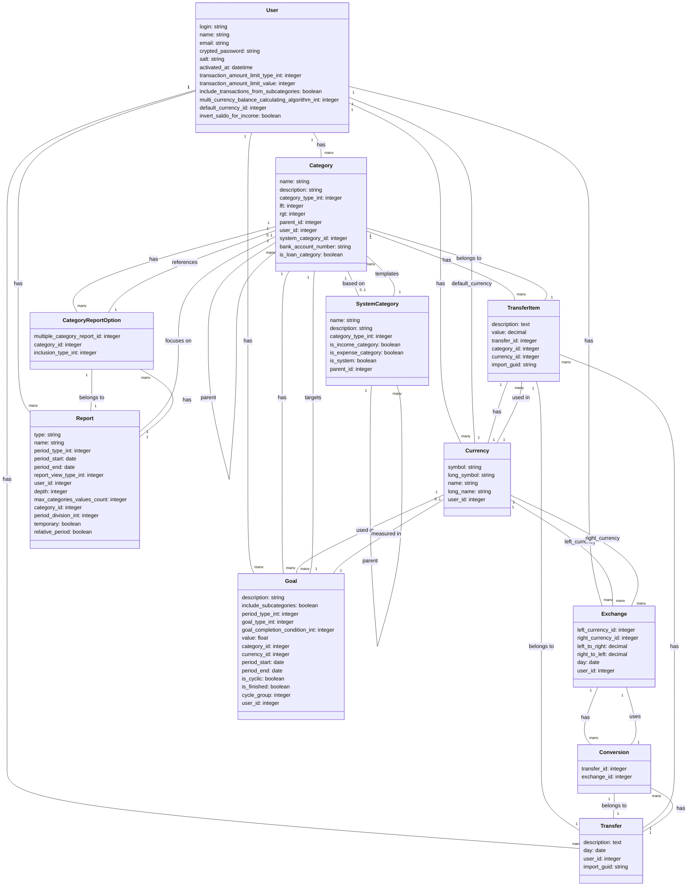

# Current State Data Model Documentation

## Overview
This document describes the current state data model of the Ruby on Rails financial management application. The application allows users to track their finances, including income, expenses, assets, and loans, with support for multiple currencies and exchange rates.

## Entity Relationship Diagram

## Entities Description

### User
This is the core entity representing a user of the application.
- Manages authentication and authorization
- Stores user preferences like default currency and transaction display settings
- Each user has their own categories, transfers, currencies, and reports
- Has various configuration options for transaction limits and calculation methods

### Category
Represents a financial category, organized in a hierarchical tree structure using the nested set pattern.
- Categories have types: ASSET, INCOME, EXPENSE, LOAN, BALANCE
- Categories can have subcategories (parent-child relationship)
- Categories can be system-defined or user-defined
- Associated with transfer items for financial tracking
- Uses left/right (lft/rgt) values for nested set implementation

### Transfer
Represents a financial transaction.
- Each transfer has a date and description
- Contains one or more transfer items
- Transfers must balance (sum of all items equals zero)
- May involve multiple currencies through conversions

### TransferItem
Represents an individual financial entry in a transfer.
- Has a value (positive for income, negative for expense)
- Associated with a category and currency
- Multiple items make up a complete transfer
- Values store the monetary amount related to the transaction

### Currency
Represents a monetary unit.
- Can be system-defined or user-defined
- Has symbols and names for display
- Used in transfer items and exchange rates
- System currencies are shared across all users

### Exchange
Represents currency exchange rates between two currencies.
- Stores conversion rates in both directions (left_to_right and right_to_left)
- May be tied to a specific date
- Used for multi-currency transfers
- Always maintains currencies in a consistent order (lower ID first)

### Conversion
Associates transfers with applicable exchange rates.
- Links a transfer to the exchange rate used
- Enables proper currency conversion in reports and calculations

### Goal
Represents financial goals and targets.
- Can be based on percentage or absolute value
- Associated with categories
- Has time periods and completion conditions
- Can be cyclic (repeating)
- Tracks progress toward financial targets

### Report
Base entity for various financial reports.
- Has different report types (ShareReport, FlowReport, ValueReport, MultipleCategoryReport)
- Configurable time periods and display options
- Can include specific categories through CategoryReportOption
- Supports various visualization types (pie, linear, text, bar)

### CategoryReportOption
Links categories to reports with specific inclusion options.
- Determines how a category is included in a report
- Sets inclusion type (category only, category and subcategories, etc.)
- Used primarily by multiple category reports

### SystemCategory
Template for predefined categories.
- Used to create default categories for new users
- Defines standard category types and hierarchies

## Key Business Rules and Constraints

1. Transfers must balance (sum of all transfer items equals zero)
2. Currency exchange rates must be defined for multi-currency transfers
3. Categories form a hierarchical tree structure using the nested set pattern
4. Each user has their own isolated financial data
5. Goals can be tracked against categories with different completion conditions
6. Reports can analyze financial data across different time periods and categories
7. Currency exchange rates maintain a consistent direction (lower currency ID as left)
8. Users can have personal currencies in addition to system currencies
9. New users get a default set of top-level categories (Assets, Income, Expense, Loans, Opening Balances)

## Multi-Currency Handling

The system supports sophisticated multi-currency operations:
- Each transfer item can have its own currency
- Exchange rates are defined between currency pairs
- Multiple calculation algorithms are available for balance display:
  - Show all currencies separately
  - Calculate with newest exchanges
  - Calculate with exchanges closest to transaction
  - Mixed approaches
- Conversions link transfers to the exchange rates used

## Reporting Capabilities

The application provides various report types:
- ShareReport: Shows distribution of values across categories (pie charts)
- FlowReport: Analyzes cash flow over time
- ValueReport: Compares values across categories over time periods
- MultipleCategoryReport: Combines data from multiple categories

## Temporal Data Tracking

The system implements several time-related features:
- Transfers and exchanges are dated
- Goals have start and end dates, with cyclic options
- Reports can be configured for different time periods
- Period calculations support relative or absolute date ranges