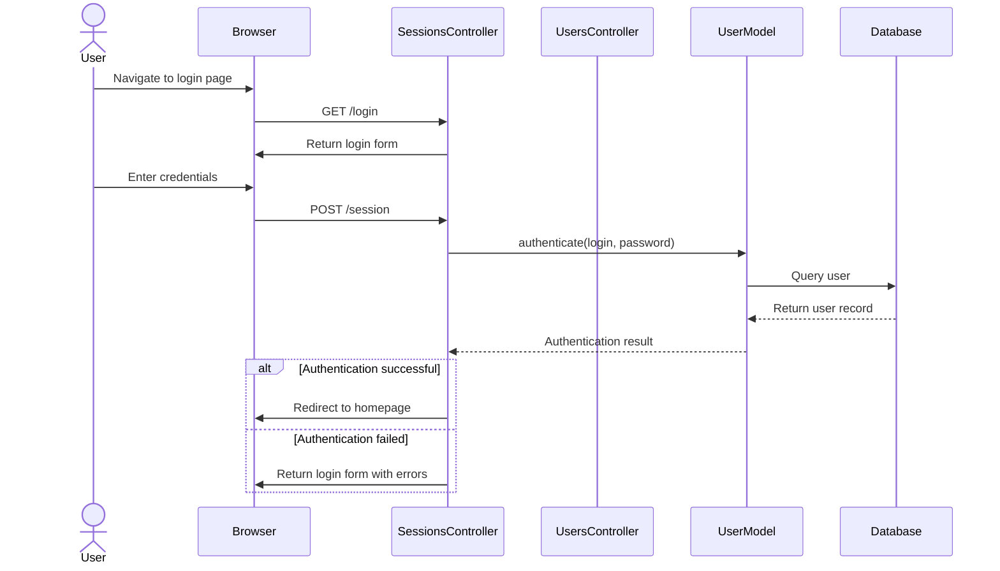
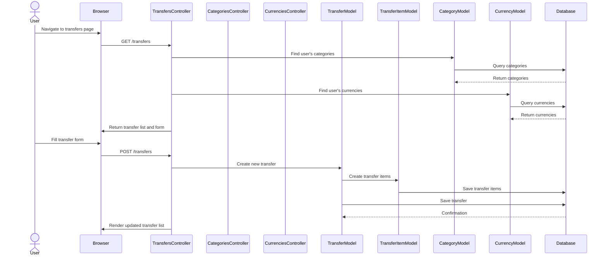
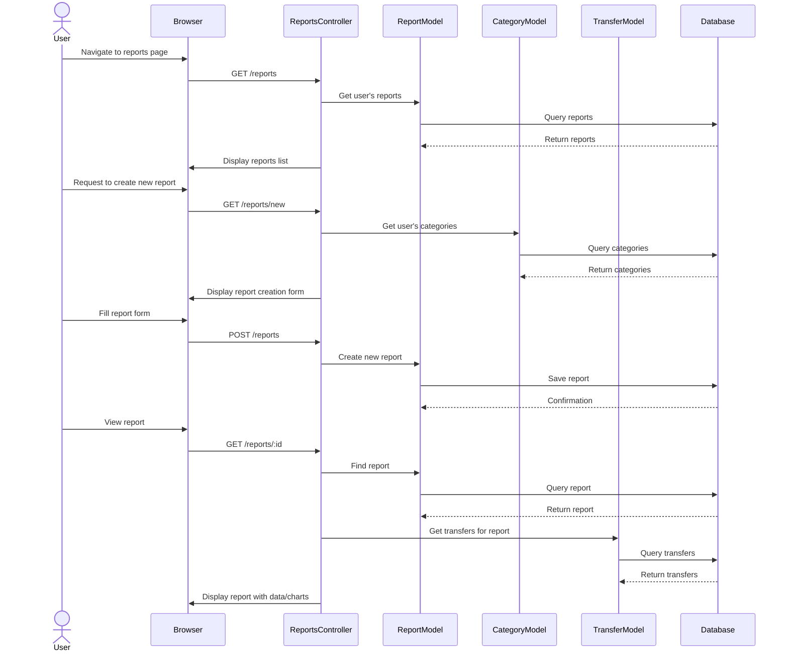
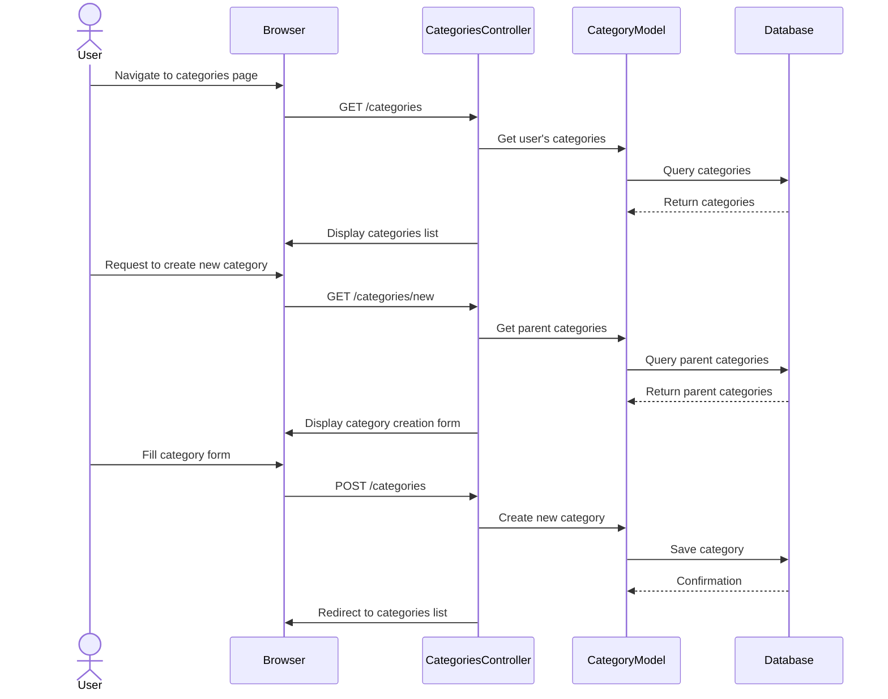
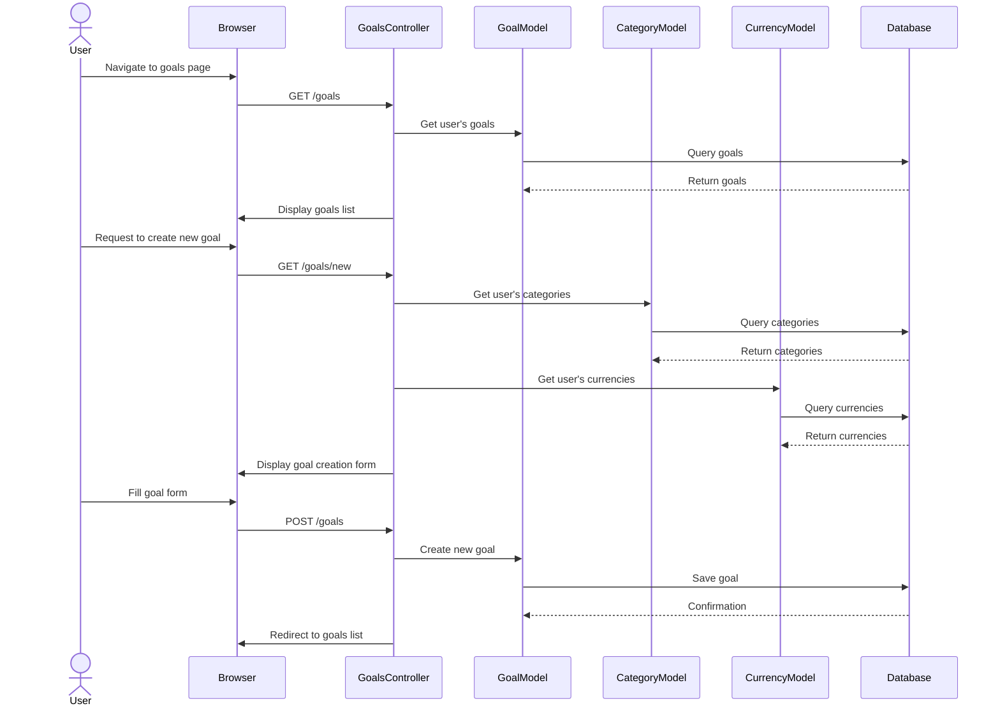

# Current State Sequence Diagram

## Key User Flows

This document illustrates the primary user interaction flows in the current Ruby on Rails application.

### 1. User Authentication Flow

### 2. Transfer Creation Flow

### 3. Report Generation Flow

### 4. Category Management Flow

### 5. Goal Setting Flow

These sequence diagrams illustrate the key user flows in the current Ruby on Rails application, showing the interactions between the user, browser, controllers, models, and database.