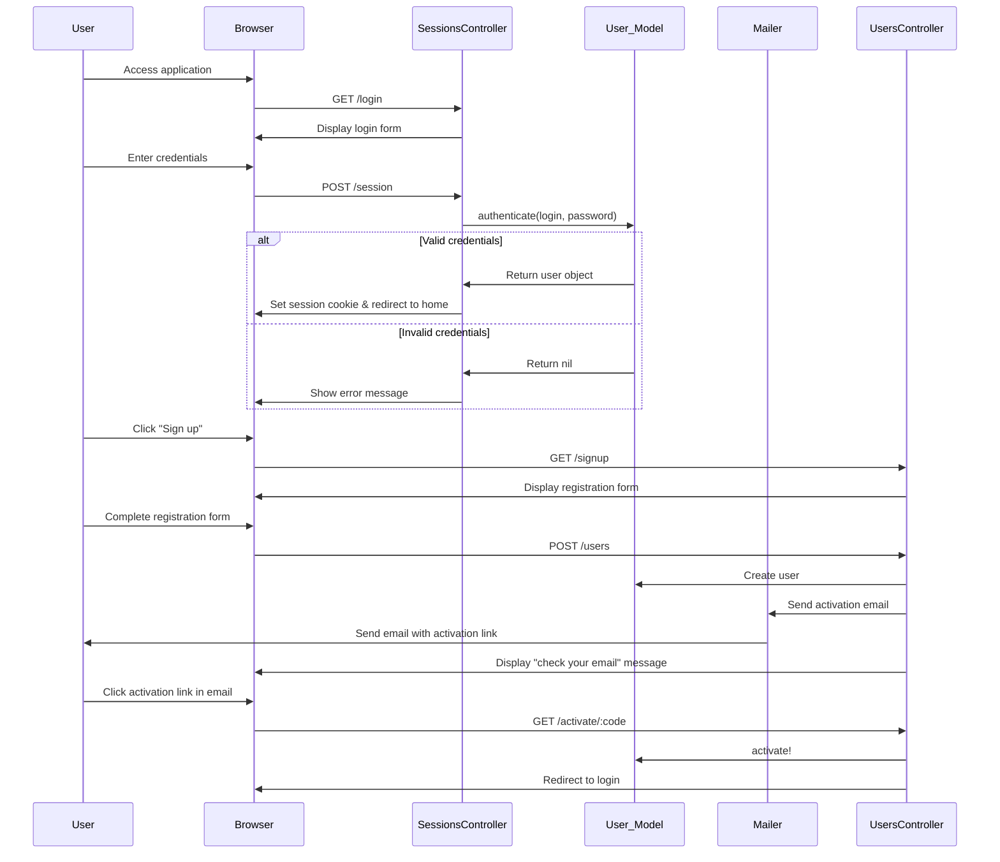
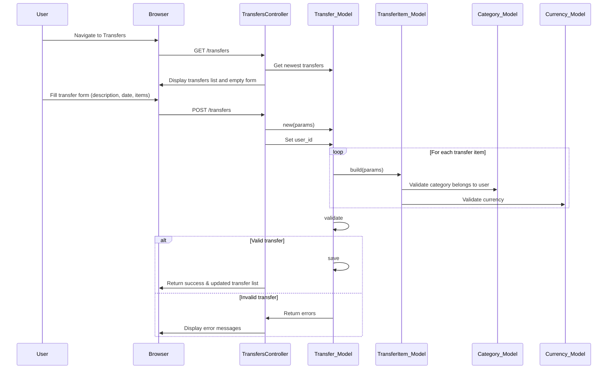
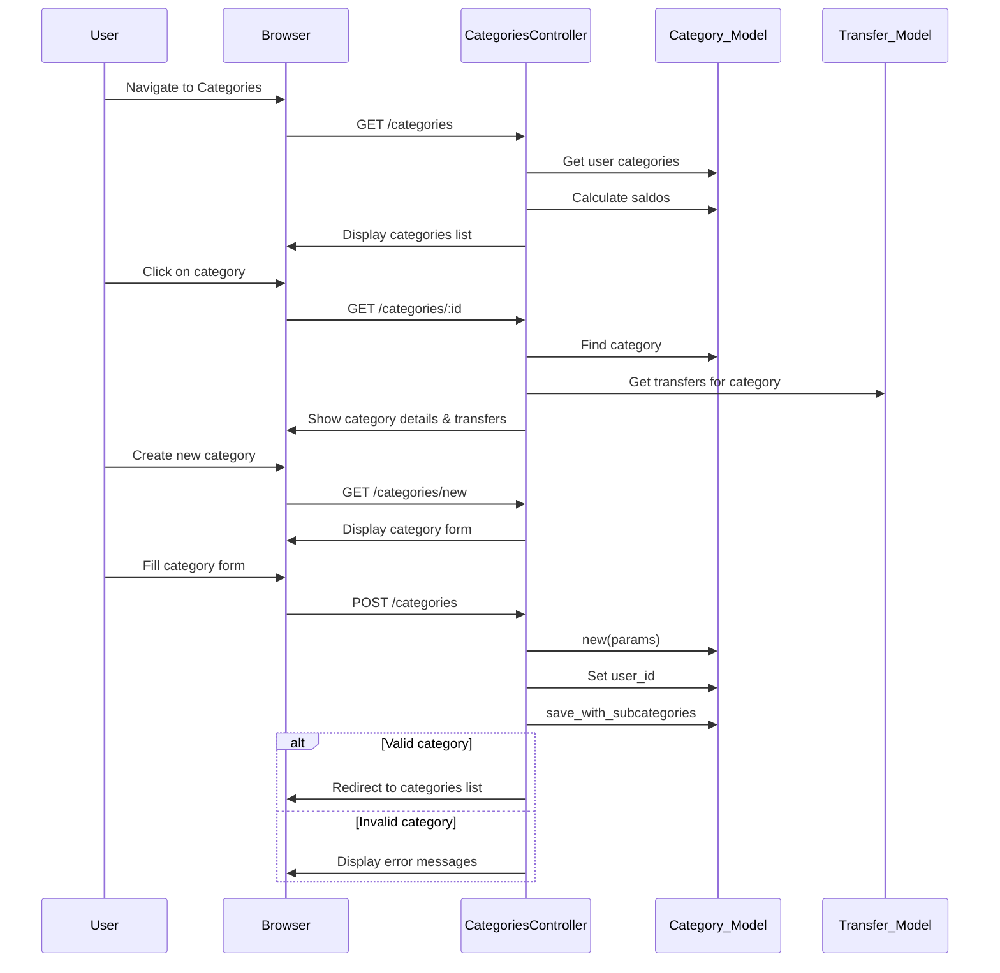
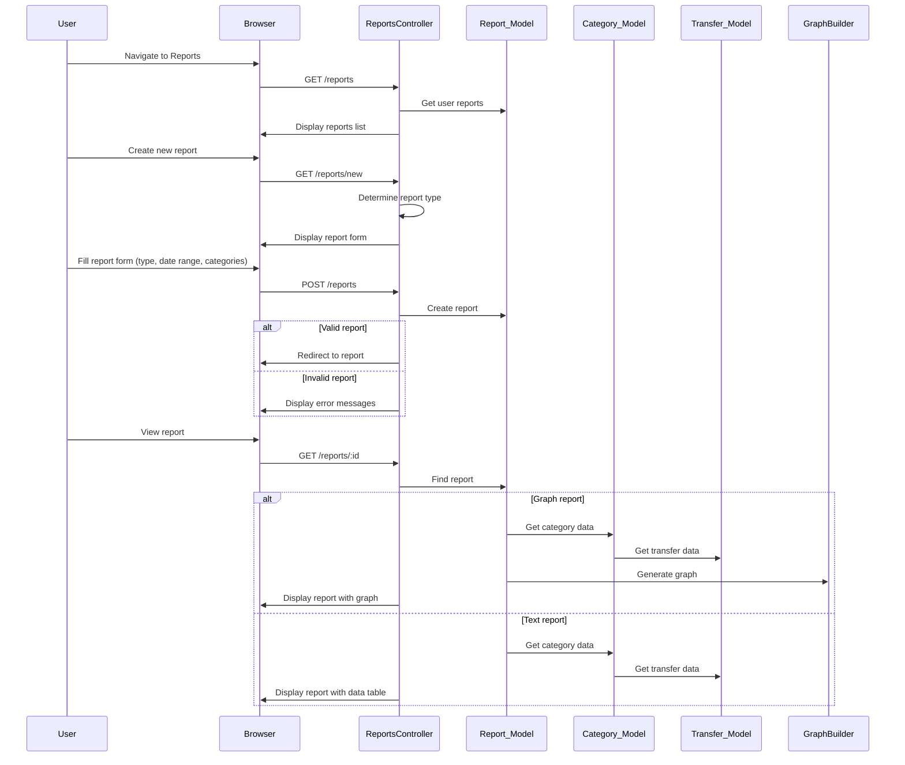
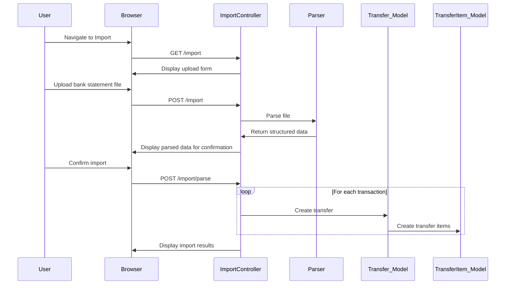
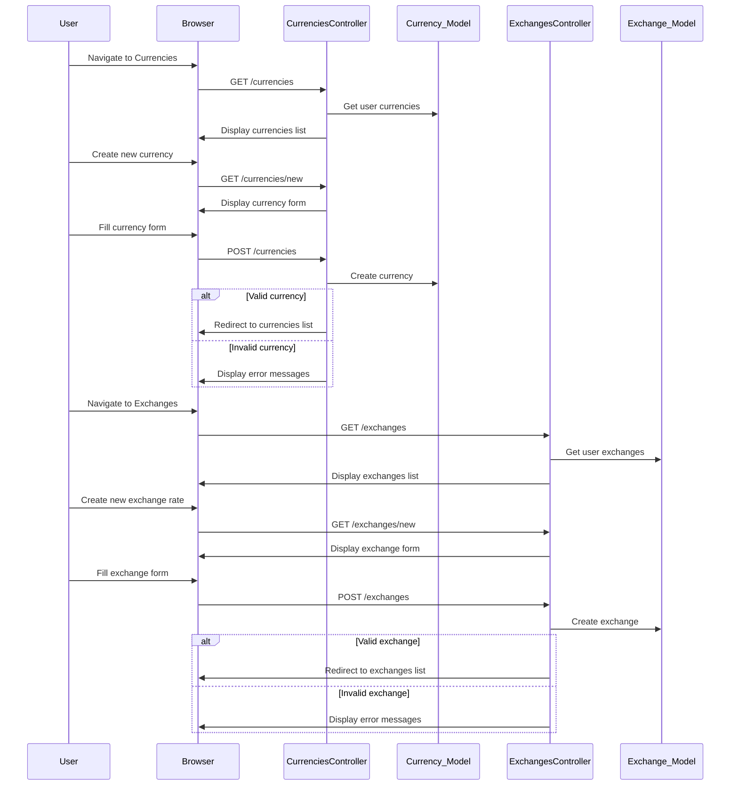

# Current State Sequence Diagram

This document illustrates the key sequences and flows in the current Ruby on Rails application.

## Authentication Flow

## Transfer Creation Flow

## Category Management Flow

## Report Generation Flow

## Import Flow

## Currency Management Flow

These sequence diagrams illustrate the primary flows in the current Ruby on Rails application, highlighting the interactions between the user interface, controllers, models, and other components of the system.