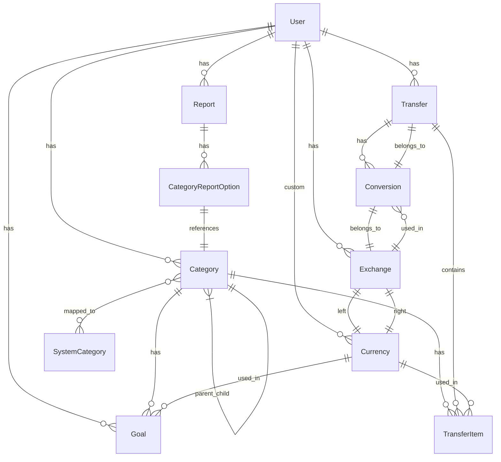

# Data Model Documentation

This document describes the current state of the Ruby on Rails application's data model.

## Entity Relationship Diagram

## Data Dictionary

### User
The core entity representing application users.

| Field | Type | Description |
|-------|------|-------------|
| id | integer | Primary key |
| login | string(40) | User login name |
| name | string(100) | User's full name |
| email | string(100) | User's email address |
| crypted_password | string(40) | Encrypted password |
| salt | string(40) | Password salt |
| created_at | datetime | Account creation timestamp |
| updated_at | datetime | Account update timestamp |
| remember_token | string(40) | Remember me token |
| remember_token_expires_at | datetime | Remember token expiration |
| activation_code | string(40) | Account activation code |
| activated_at | datetime | Account activation timestamp |
| transaction_amount_limit_type_int | integer | Type of transaction amount limit (enum) |
| transaction_amount_limit_value | integer | Value for transaction amount limit |
| include_transactions_from_subcategories | boolean | Whether to include subcategories in transactions |
| multi_currency_balance_calculating_algorithm_int | integer | Algorithm used for multi-currency balance calculation (enum) |
| default_currency_id | integer | Default currency ID reference |
| invert_saldo_for_income | boolean | Whether to invert saldo for income |

### Category
Categories for organizing transfers and financial data.

| Field | Type | Description |
|-------|------|-------------|
| id | integer | Primary key |
| name | string | Category name |
| description | string | Category description |
| category_type_int | integer | Category type (ASSET, INCOME, EXPENSE, LOAN, BALANCE) |
| user_id | integer | Reference to user |
| parent_id | integer | Parent category (for nested structure) |
| lft | integer | Left value for nested set model |
| rgt | integer | Right value for nested set model |
| import_guid | string | GUID for imported categories |
| imported | boolean | Whether category was imported |
| email | string | Associated email |
| bankinfo | text | Banking information |
| bank_account_number | string | Bank account number |
| created_at | datetime | Creation timestamp |
| updated_at | datetime | Update timestamp |
| loan_category | boolean | Whether category is a loan |

### Transfer
Represents a financial transaction with multiple items.

| Field | Type | Description |
|-------|------|-------------|
| id | integer | Primary key |
| description | text | Transfer description |
| day | date | Date of transfer |
| user_id | integer | Reference to user |
| import_guid | string | GUID for imported transfers |

### TransferItem
Individual items within a transfer.

| Field | Type | Description |
|-------|------|-------------|
| id | integer | Primary key |
| description | text | Item description |
| value | decimal(12,2) | Monetary value |
| transfer_id | integer | Reference to parent transfer |
| category_id | integer | Reference to category |
| currency_id | integer | Reference to currency |
| import_guid | string | GUID for imported items |

### Currency
Represents monetary currencies in the system.

| Field | Type | Description |
|-------|------|-------------|
| id | integer | Primary key |
| symbol | string | Currency symbol (e.g., $) |
| long_symbol | string | ISO code (e.g., USD) |
| name | string | Currency name |
| long_name | string | Full currency name |
| user_id | integer | Reference to user (NULL for system currencies) |

### Exchange
Currency exchange rates between two currencies.

| Field | Type | Description |
|-------|------|-------------|
| id | integer | Primary key |
| left_currency_id | integer | Reference to left currency |
| right_currency_id | integer | Reference to right currency |
| left_to_right | decimal(8,4) | Exchange rate from left to right |
| right_to_left | decimal(8,4) | Exchange rate from right to left |
| day | date | Date of exchange rate |
| user_id | integer | Reference to user |

### Conversion
Links transfers with exchange rates.

| Field | Type | Description |
|-------|------|-------------|
| id | integer | Primary key |
| exchange_id | integer | Reference to exchange rate |
| transfer_id | integer | Reference to transfer |
| created_at | datetime | Creation timestamp |
| updated_at | datetime | Update timestamp |

### Report
Financial reports for analysis.

| Field | Type | Description |
|-------|------|-------------|
| id | integer | Primary key |
| type | string | Report type (STI: ShareReport, FlowReport, ValueReport) |
| name | string | Report name |
| period_type_int | integer | Type of period (enum) |
| period_start | date | Start date of period |
| period_end | date | End date of period |
| report_view_type_int | integer | Report view type (pie, linear, text, bar) |
| user_id | integer | Reference to user |
| created_at | datetime | Creation timestamp |
| updated_at | datetime | Update timestamp |
| depth | integer | Depth for category hierarchy |
| max_categories_values_count | integer | Max categories to show |
| category_id | integer | Reference to category |
| period_division_int | integer | Period division type |
| temporary | boolean | Whether report is temporary |
| relative_period | boolean | Whether period is relative |

### Goal
Financial goals for tracking progress.

| Field | Type | Description |
|-------|------|-------------|
| id | integer | Primary key |
| description | string | Goal description |
| include_subcategories | boolean | Whether to include subcategories |
| period_type_int | integer | Type of period (enum) |
| goal_type_int | integer | Goal type (percent or value) |
| goal_completion_condition_int | integer | Completion condition (at_least, at_most) |
| value | float | Target value |
| category_id | integer | Reference to category |
| created_at | datetime | Creation timestamp |
| updated_at | datetime | Update timestamp |
| currency_id | integer | Reference to currency |
| period_start | date | Start date of period |
| period_end | date | End date of period |
| is_cyclic | boolean | Whether goal is cyclic |
| is_finished | boolean | Whether goal is finished |
| cycle_group | integer | Group ID for cyclic goals |
| user_id | integer | Reference to user |

### SystemCategory
System-defined categories as templates.

| Field | Type | Description |
|-------|------|-------------|
| id | integer | Primary key |
| name | string | Category name |
| parent_id | integer | Parent system category |
| lft | integer | Left value for nested set model |
| rgt | integer | Right value for nested set model |
| created_at | datetime | Creation timestamp |
| updated_at | datetime | Update timestamp |
| description | string | Category description |
| category_type_int | integer | Category type |
| cached_level | integer | Cached level in hierarchy |
| name_with_path | string | Full path name |

### CategoryReportOption
Options for categories in reports.

| Field | Type | Description |
|-------|------|-------------|
| id | integer | Primary key |
| inclusion_type_int | integer | Type of inclusion (enum) |
| report_id | integer | Reference to report |
| category_id | integer | Reference to category |
| created_at | datetime | Creation timestamp |
| updated_at | datetime | Update timestamp |