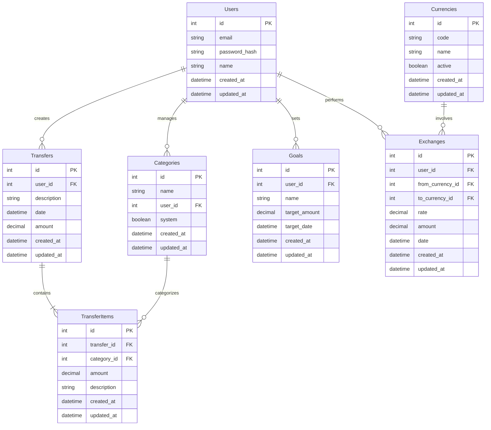

# Data Model Documentation

## Database Schema

The application uses a relational database with the following structure:

## Entity Descriptions

### Users
- Primary entity for user accounts
- Stores authentication and personal information
- Links to all user-specific data

### Categories
- Represents expense/income categories
- Can be system-defined or user-created
- Used to categorize transfer items

### Transfers
- Main financial transaction entity
- Contains header information for transactions
- Broken down into individual items

### TransferItems
- Represents individual entries within a transfer
- Links to specific categories
- Holds the actual amount and description

### Goals
- Financial goals set by users
- Includes target amounts and dates
- Used for financial planning

### Currencies
- Supported currencies in the system
- Contains currency codes and names
- Tracks active status

### Exchanges
- Records currency exchange transactions
- Stores exchange rates and amounts
- Links source and target currencies

## Key Relationships

1. Users to Transfers (1:Many)
   - Each user can have multiple transfers
   - Transfers belong to a single user

2. Transfers to TransferItems (1:Many)
   - Each transfer contains multiple items
   - Items belong to a single transfer

3. Categories to TransferItems (1:Many)
   - Categories can be used in multiple items
   - Each item has one category

4. Users to Goals (1:Many)
   - Users can set multiple goals
   - Goals belong to a single user

5. Currencies to Exchanges (1:Many)
   - Currencies can be involved in multiple exchanges
   - Each exchange involves two currencies

## Database Constraints

1. Foreign Key Constraints
   - Transfer Items → Transfers
   - Transfer Items → Categories
   - Transfers → Users
   - Categories → Users
   - Goals → Users
   - Exchanges → Currencies
   - Exchanges → Users

2. Not Null Constraints
   - User email and password_hash
   - Category name
   - Transfer amount and date
   - TransferItem amount
   - Currency code
   - Exchange rate and amount

3. Unique Constraints
   - User email
   - Currency code
   - System category names

## Indexes

1. Primary Keys
   - All tables have auto-incrementing ID primary keys

2. Foreign Keys
   - user_id in dependent tables
   - transfer_id in transfer_items
   - category_id in transfer_items
   - currency_id in exchanges

3. Additional Indexes
   - Users(email)
   - Transfers(date)
   - Categories(name)
   - Currencies(code)

## Data Types

1. Numeric
   - ID fields: INTEGER
   - Amounts: DECIMAL(10,2)
   - Exchange rates: DECIMAL(10,6)

2. Text
   - Names: VARCHAR(255)
   - Descriptions: TEXT
   - Email: VARCHAR(255)
   - Currency codes: CHAR(3)

3. Dates
   - created_at: TIMESTAMP
   - updated_at: TIMESTAMP
   - date fields: DATE

4. Boolean
   - system flag in categories
   - active flag in currencies

This data model serves as the foundation for both the current Ruby on Rails application and will be migrated to the new Spring Boot backend.