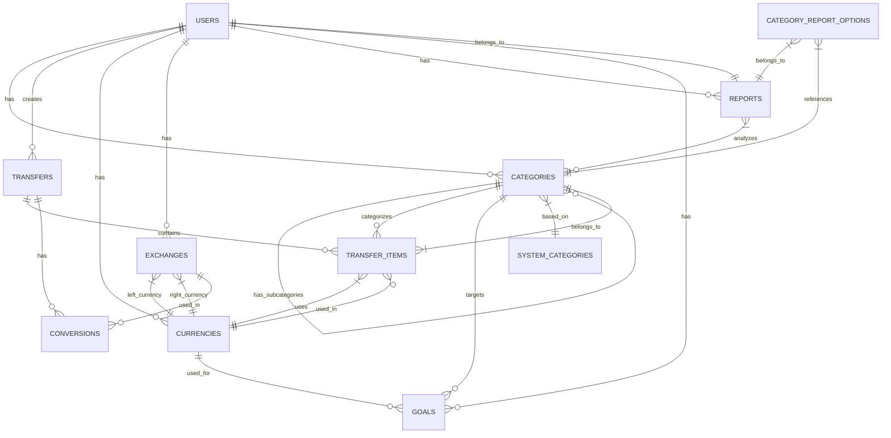

# Data Model / Database Schema

This document describes the database schema and entity relationships in the current Ruby on Rails application.

## Entity Relationship Diagram



## Database Schema

### Users Table

```
users
├── id (PK)
├── login (string, 40 chars)
├── name (string, 100 chars)
├── email (string, 100 chars)
├── crypted_password (string, 40 chars)
├── salt (string, 40 chars)
├── created_at (datetime)
├── updated_at (datetime)
├── remember_token (string, 40 chars)
├── remember_token_expires_at (datetime)
├── activation_code (string, 40 chars)
├── activated_at (datetime)
├── transaction_amount_limit_type_int (integer)
├── transaction_amount_limit_value (integer)
├── include_transactions_from_subcategories (boolean)
├── multi_currency_balance_calculating_algorithm_int (integer)
├── default_currency_id (integer, FK -> currencies.id)
└── invert_saldo_for_income (boolean)
```

### Categories Table

```
categories
├── id (PK)
├── name (string, not null)
├── description (string)
├── category_type_int (integer)
├── user_id (integer, FK -> users.id)
├── parent_id (integer, self-referential FK)
├── lft (integer, for nested set)
├── rgt (integer, for nested set)
├── bank_account_number (string)
├── system_category_id (integer, FK -> system_categories.id)
├── created_at (datetime)
└── updated_at (datetime)
```

### System Categories Table

```
system_categories
├── id (PK)
├── name (string, not null)
├── description (string)
├── category_type_int (integer)
├── parent_id (integer, self-referential FK)
├── lft (integer, for nested set)
├── rgt (integer, for nested set)
└── level (integer)
```

### Transfers Table

```
transfers
├── id (PK)
├── description (text, not null)
├── day (date, not null)
├── user_id (integer, FK -> users.id, not null)
└── import_guid (string)
```

### Transfer Items Table

```
transfer_items
├── id (PK)
├── description (text, not null)
├── value (decimal(12,2), not null)
├── transfer_id (integer, FK -> transfers.id, not null)
├── category_id (integer, FK -> categories.id, not null)
├── currency_id (integer, FK -> currencies.id, default 3)
└── import_guid (string)
```

### Currencies Table

```
currencies
├── id (PK)
├── symbol (string, not null)
├── long_symbol (string, not null)
├── name (string, not null)
├── long_name (string, not null)
└── user_id (integer, FK -> users.id, null for system currencies)
```

### Exchanges Table

```
exchanges
├── id (PK)
├── left_currency_id (integer, FK -> currencies.id)
├── right_currency_id (integer, FK -> currencies.id)
├── left_to_right (float, not null)
├── right_to_left (float, not null)
├── day (date)
└── user_id (integer, FK -> users.id)
```

### Conversions Table

```
conversions
├── id (PK)
├── exchange_id (integer, FK -> exchanges.id)
└── transfer_id (integer, FK -> transfers.id)
```

### Goals Table

```
goals
├── id (PK)
├── name (string)
├── description (text)
├── category_id (integer, FK -> categories.id)
├── start_value (decimal)
├── goal_value (decimal)
├── currency_id (integer, FK -> currencies.id)
├── start_day (date)
├── end_day (date)
├── is_cyclic (boolean)
├── period_type (integer)
├── period_count (integer)
└── achieved (boolean)
```

### Reports Table

```
reports
├── id (PK)
├── name (string)
├── description (text)
├── report_type (integer)
├── period_type (integer)
├── relative_period (boolean)
├── start_day (date)
├── end_day (date)
├── user_id (integer, FK -> users.id)
└── temporary (boolean)
```

### Category Report Options Table

```
category_report_options
├── id (PK)
├── category_id (integer, FK -> categories.id)
├── report_id (integer, FK -> reports.id)
└── without_subcategories (boolean)
```

## Entity Definitions

### User
- Represents system users
- Stores authentication details
- Contains preferences for display and calculations

### Category
- Hierarchical structure for organizing finances
- Types include assets, income, expenses, loans, balance
- Uses nested set pattern (lft, rgt) for hierarchy management
- Can belong to a user or be a system category

### System Category
- Template categories that can be used by users
- Also hierarchical with nested set pattern

### Transfer
- Represents a financial transaction
- Contains multiple transfer items
- Belongs to a user
- Has a date and description

### Transfer Item
- Individual line in a transfer
- Has a value (positive for income, negative for expense)
- Belongs to a category
- Uses a specific currency

### Currency
- Represents a monetary unit
- Can be system-defined or user-defined
- Used in transfer items and goals

### Exchange
- Represents exchange rates between two currencies
- Contains conversion rates in both directions
- Has a date for historical tracking

### Conversion
- Links an exchange rate to a specific transfer
- Used for multi-currency transfers

### Goal
- Financial planning entity
- Associated with a category
- Has start value, target value, and timeframe
- Can be recurring (cyclic)

### Report
- Customizable financial analysis
- Different types: share, value, flow
- Can analyze specific time periods
- Associated with selected categories

### Category Report Option
- Links categories to reports
- Specifies whether to include subcategories in the report

## Key Relationships

1. **User to Categories**: One-to-many. Users own multiple categories.

2. **Categories to Subcategories**: Self-referencing one-to-many relationship using parent_id and nested set pattern.

3. **Category to Transfer Items**: One-to-many. A category can be used for many transfer items.

4. **Transfer to Transfer Items**: One-to-many. A transfer contains multiple items that must balance (sum to zero).

5. **Currency to Transfer Items**: One-to-many. A currency can be used in many transfer items.

6. **Exchanges to Currencies**: Many-to-many through two foreign keys (left_currency_id and right_currency_id).

7. **Reports to Categories**: Many-to-many through category_report_options table.

## Database Constraints and Rules

1. Transfer items within a transfer should balance to zero (checked in application logic)

2. Categories form a hierarchical tree structure using nested set pattern

3. System categories serve as templates and cannot be modified by users

4. Currencies can be system-defined (shared) or user-defined

5. Exchange rates are directional and include both conversion ratios

6. Goals are linked to categories and track progress toward financial targets

7. Reports provide flexible analysis of financial data across categories and time periods