# Data Model / Database Schema

## Overview

The application's data model centers around financial transactions (transfers) categorized in a hierarchical structure, with support for multiple currencies and various types of financial reports.

## Entity Relationship Diagram

```mermaid
erDiagram
    USERS {
        id INTEGER PK
        login VARCHAR
        name VARCHAR
        email VARCHAR
        crypted_password VARCHAR
        salt VARCHAR
        activation_code VARCHAR
        transaction_amount_limit_type_int INTEGER
        transaction_amount_limit_value INTEGER
        include_transactions_from_subcategories BOOLEAN
        multi_currency_balance_calculating_algorithm_int INTEGER
        default_currency_id INTEGER FK
        invert_saldo_for_income BOOLEAN
    }
    
    CATEGORIES {
        id INTEGER PK
        name VARCHAR
        description VARCHAR
        category_type_int INTEGER
        user_id INTEGER FK
        parent_id INTEGER FK
        lft INTEGER
        rgt INTEGER
        import_guid VARCHAR
        imported BOOLEAN
        email VARCHAR
        bankinfo TEXT
        bank_account_number VARCHAR
        loan_category BOOLEAN
    }
    
    SYSTEM_CATEGORIES {
        id INTEGER PK
        name VARCHAR
        description VARCHAR
        category_type_int INTEGER
        parent_id INTEGER FK
        lft INTEGER
        rgt INTEGER
        cached_level INTEGER
        name_with_path VARCHAR
    }
    
    TRANSFERS {
        id INTEGER PK
        description TEXT
        day DATE
        user_id INTEGER FK
        import_guid VARCHAR
    }
    
    TRANSFER_ITEMS {
        id INTEGER PK
        description TEXT
        value DECIMAL
        transfer_id INTEGER FK
        category_id INTEGER FK
        currency_id INTEGER FK
        import_guid VARCHAR
    }
    
    CURRENCIES {
        id INTEGER PK
        symbol VARCHAR
        long_symbol VARCHAR
        name VARCHAR
        long_name VARCHAR
        user_id INTEGER FK
    }
    
    EXCHANGES {
        id INTEGER PK
        left_currency_id INTEGER FK
        right_currency_id INTEGER FK
        left_to_right DECIMAL
        right_to_left DECIMAL
        day DATE
        user_id INTEGER FK
    }
    
    CONVERSIONS {
        id INTEGER PK
        exchange_id INTEGER FK
        transfer_id INTEGER FK
    }
    
    GOALS {
        id INTEGER PK
        description VARCHAR
        include_subcategories BOOLEAN
        period_type_int INTEGER
        goal_type_int INTEGER
        goal_completion_condition_int INTEGER
        value FLOAT
        category_id INTEGER FK
        currency_id INTEGER FK
        period_start DATE
        period_end DATE
        is_cyclic BOOLEAN
        is_finished BOOLEAN
        cycle_group INTEGER
        user_id INTEGER FK
    }
    
    REPORTS {
        id INTEGER PK
        type VARCHAR
        name VARCHAR
        period_type_int INTEGER
        period_start DATE
        period_end DATE
        report_view_type_int INTEGER
        user_id INTEGER FK
        depth INTEGER
        max_categories_values_count INTEGER
        category_id INTEGER FK
        period_division_int INTEGER
        temporary BOOLEAN
        relative_period BOOLEAN
    }
    
    CATEGORY_REPORT_OPTIONS {
        id INTEGER PK
        inclusion_type_int INTEGER
        report_id INTEGER FK
        category_id INTEGER FK
    }
    
    USERS ||--o{ CATEGORIES : has
    USERS ||--o{ CURRENCIES : has
    USERS ||--o{ EXCHANGES : has
    USERS ||--o{ TRANSFERS : has
    USERS ||--o{ GOALS : has
    USERS ||--o{ REPORTS : has
    USERS ||--o{ CATEGORIES : "default_currency"
    
    CATEGORIES ||--o{ CATEGORIES : "parent/child"
    CATEGORIES ||--o{ TRANSFER_ITEMS : has
    CATEGORIES ||--o{ GOALS : has
    CATEGORIES ||--o{ CATEGORY_REPORT_OPTIONS : has
    CATEGORIES }o--o{ SYSTEM_CATEGORIES : has
    
    SYSTEM_CATEGORIES ||--o{ SYSTEM_CATEGORIES : "parent/child"
    
    TRANSFERS ||--o{ TRANSFER_ITEMS : has
    TRANSFERS ||--o{ CONVERSIONS : has
    
    TRANSFER_ITEMS }o--|| CATEGORIES : belongs_to
    TRANSFER_ITEMS }o--|| CURRENCIES : belongs_to
    
    EXCHANGES }o--|| CURRENCIES : "left_currency"
    EXCHANGES }o--|| CURRENCIES : "right_currency"
    EXCHANGES ||--o{ CONVERSIONS : has
    
    CONVERSIONS }o--|| TRANSFERS : belongs_to
    
    GOALS }o--|| CATEGORIES : belongs_to
    GOALS }o--|| CURRENCIES : belongs_to
    
    REPORTS }o--o| CATEGORIES : belongs_to
    REPORTS ||--o{ CATEGORY_REPORT_OPTIONS : has
    
    CATEGORY_REPORT_OPTIONS }o--|| CATEGORIES : belongs_to
    CATEGORY_REPORT_OPTIONS }o--|| REPORTS : belongs_to
```

## Key Tables Description

### Users
Stores user account information including authentication details and preferences.
- Core user data: login, email, name
- Authentication: password (encrypted), salt, activation code
- Preferences: default currency, transaction display settings, saldo calculation algorithm

### Categories
A hierarchical structure of financial categories with nested set implementation (lft, rgt fields).
- Types: Asset, Income, Expense, Loan, Balance
- Can be arranged in parent-child relationships
- Special handling for loan categories (debtors/creditors)

### SystemCategories
Predefined system categories that can be associated with user-defined categories.
- Organized in a hierarchical structure
- Provides standard categorization across user accounts

### Transfers
Financial transactions with multiple line items.
- Core properties: date, description
- Each transfer belongs to a user
- Multiple transfer items make up a single transfer

### TransferItems
Individual lines in a transfer.
- Links to a category and currency
- Contains a value (positive for income, negative for expenses)
- Belongs to a transfer

### Currencies
Represents monetary units in the system.
- System currencies (user_id NULL)
- User-defined currencies

### Exchanges
Currency exchange rates between pairs of currencies.
- References left and right currencies
- Contains conversion rates in both directions
- Can be associated with a specific date

### Conversions
Links currency exchanges to specific transfers.
- Used when a transfer involves multiple currencies

### Goals
Financial goals set by users.
- Associated with a category
- Contains target value and time period
- Various types (saving goal, spending limit, etc.)
- Can include subcategories in calculation

### Reports
Various financial reports defined by users.
- Multiple types: share reports, value reports, flow reports
- Contains time period and display settings
- Links to specific categories

### CategoryReportOptions
Links categories to reports with inclusion settings.
- Defines which categories are included in a report
- Specifies how the category is included in calculations

## Database Constraints

1. Foreign key relationships enforce data integrity
2. Non-null constraints on required fields
3. Unique indices on key fields
4. Nested set model constraints for hierarchical categories

## Special Data Structures

1. **Nested Sets for Categories**:
   The categories use left and right values (lft, rgt) to implement a nested set model for efficient tree operations.

2. **Polymorphic Reports**:
   The reports table uses a type column for single table inheritance to implement different report types.

3. **Currency Conversion System**:
   The exchanges and conversions tables work together to handle multi-currency operations.