# Database Schema Documentation

This document provides a detailed view of the database schema for the application.

## Schema Overview

The application uses a relational database with multiple interconnected tables to track financial data, categories, currencies, and user information.

## Table Schema

```mermaid
erDiagram
    users {
        int id PK
        string login
        string name
        string email
        string crypted_password
        string salt
        datetime created_at
        datetime updated_at
        string remember_token
        datetime remember_token_expires_at
        string activation_code
        datetime activated_at
        int transaction_amount_limit_type_int
        int transaction_amount_limit_value
        boolean include_transactions_from_subcategories
        int multi_currency_balance_calculating_algorithm_int
        int default_currency_id FK
        boolean invert_saldo_for_income
    }
    
    categories {
        int id PK
        string name
        string description
        int category_type_int
        int user_id FK
        int parent_id
        int lft
        int rgt
        string import_guid
        boolean imported
        string email
        text bankinfo
        string bank_account_number
        datetime created_at
        datetime updated_at
        boolean loan_category
    }
    
    transfers {
        int id PK
        text description
        date day
        int user_id FK
        string import_guid
    }
    
    transfer_items {
        int id PK
        text description
        decimal value
        int transfer_id FK
        int category_id FK
        int currency_id FK
        string import_guid
    }
    
    currencies {
        int id PK
        string symbol
        string long_symbol
        string name
        string long_name
        int user_id FK
    }
    
    exchanges {
        int id PK
        int left_currency_id FK
        int right_currency_id FK
        decimal left_to_right
        decimal right_to_left
        date day
        int user_id FK
    }
    
    conversions {
        int id PK
        int exchange_id FK
        int transfer_id FK
        datetime created_at
        datetime updated_at
    }
    
    reports {
        int id PK
        string type
        string name
        int period_type_int
        date period_start
        date period_end
        int report_view_type_int
        int user_id FK
        datetime created_at
        datetime updated_at
        int depth
        int max_categories_values_count
        int category_id FK
        int period_division_int
        boolean temporary
        boolean relative_period
    }
    
    goals {
        int id PK
        string description
        boolean include_subcategories
        int period_type_int
        int goal_type_int
        int goal_completion_condition_int
        float value
        int category_id FK
        datetime created_at
        datetime updated_at
        int currency_id FK
        date period_start
        date period_end
        boolean is_cyclic
        boolean is_finished
        int cycle_group
        int user_id FK
    }
    
    system_categories {
        int id PK
        string name
        int parent_id
        int lft
        int rgt
        datetime created_at
        datetime updated_at
        string description
        int category_type_int
        int cached_level
        string name_with_path
    }
    
    category_report_options {
        int id PK
        int inclusion_type_int
        int report_id FK
        int category_id FK
        datetime created_at
        datetime updated_at
    }
    
    categories_system_categories {
        int category_id FK
        int system_category_id FK
    }
    
    sessions {
        string session_id PK
        text data
        datetime updated_at
    }
    
    bdrb_job_queues {
        binary args
        string worker_name
        string worker_method
        string job_key
        int taken
        int finished
        int timeout
        int priority
        datetime submitted_at
        datetime started_at
        datetime finished_at
        datetime archived_at
        string tag
        string submitter_info
        string runner_info
        string worker_key
        datetime scheduled_at
    }
```

## Foreign Key Relationships

- **users**
  - `default_currency_id` → `currencies.id`

- **categories**
  - `user_id` → `users.id`
  - `parent_id` → `categories.id` (self-reference)

- **transfers**
  - `user_id` → `users.id`

- **transfer_items**
  - `transfer_id` → `transfers.id`
  - `category_id` → `categories.id`
  - `currency_id` → `currencies.id`

- **currencies**
  - `user_id` → `users.id` (nullable for system currencies)

- **exchanges**
  - `left_currency_id` → `currencies.id`
  - `right_currency_id` → `currencies.id`
  - `user_id` → `users.id` (nullable for system exchanges)

- **conversions**
  - `exchange_id` → `exchanges.id`
  - `transfer_id` → `transfers.id`

- **reports**
  - `user_id` → `users.id`
  - `category_id` → `categories.id` (for ShareReport)

- **goals**
  - `category_id` → `categories.id`
  - `currency_id` → `currencies.id`
  - `user_id` → `users.id`

- **category_report_options**
  - `report_id` → `reports.id`
  - `category_id` → `categories.id`

- **categories_system_categories** (junction table)
  - `category_id` → `categories.id`
  - `system_category_id` → `system_categories.id`

## Indexes

The database has several indexes to optimize common queries:

- **transfers**
  - `user_id`
  - `day`
  - `(id, user_id)`

- **transfer_items**
  - `category_id`
  - `currency_id`
  - `transfer_id`
  - `id`

- **categories**
  - `(category_type_int, id, user_id)`
  - `(lft, rgt)`
  - `rgt`

- **exchanges**
  - `(day, left_currency_id, right_currency_id, user_id)`
  - `day`

- **users**
  - `id` (unique)
  - `login` (unique)

## Enum Definitions

Several tables use integer columns with enum values:

### User
- `transaction_amount_limit_type_int`: [:transaction_count, :week_count, :this_month, :this_and_last_month]
- `multi_currency_balance_calculating_algorithm_int`: [:show_all_currencies, :calculate_with_newest_exchanges, :calculate_with_exchanges_closest_to_transaction, :calculate_with_newest_exchanges_but, :calculate_with_exchanges_closest_to_transaction_but]

### Category
- `category_type_int`: [:ASSET, :INCOME, :EXPENSE, :LOAN, :BALANCE]

### Report
- `period_type_int`: [:SELECTED] + Date::RECOGNIZED_PERIODS
- `report_view_type_int`: [:pie, :linear, :text, :bar]
- `period_division_int`: Period division types

### Goal
- `period_type_int`: [:SELECTED] + Date::RECOGNIZED_PERIODS
- `goal_type_int`: [:percent, :value]
- `goal_completion_condition_int`: [:at_least, :at_most]

### CategoryReportOption
- `inclusion_type_int`: [:category_only, :category_and_subcategories, :both, :none]

## Notes on Database Design

1. **Nested Set Model**: The categories table uses a nested set model with `lft` and `rgt` columns for efficient hierarchical queries.

2. **Single Table Inheritance (STI)**: The reports table uses STI with the `type` column to differentiate between ShareReport, FlowReport, and ValueReport.

3. **Currency Handling**: The application carefully manages currencies with dedicated tables for exchange rates and conversions.

4. **User Segregation**: Most tables have a `user_id` column to segregate data by user.

5. **System Tables**: Some tables (like system_categories and some currencies) are shared across users.

6. **Soft References**: Some tables include descriptive information about their relationships in text columns rather than just relying on foreign keys.