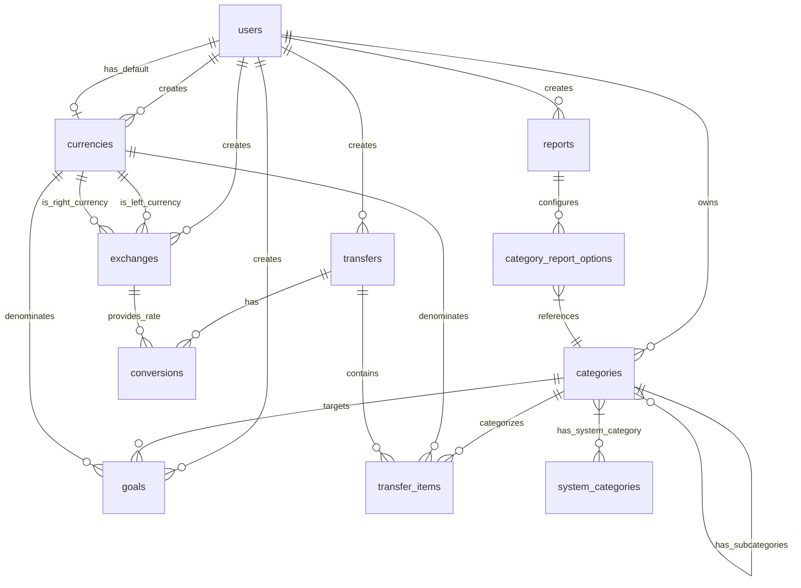

# Database Schema

This document outlines the database schema for the Financial Management System after migration from Ruby on Rails to Spring Boot.

## Overview

The database schema maintains the core functionality of the original Ruby on Rails application while making improvements for better integration with JPA and Spring Data. The schema follows a relational database model with proper foreign key relationships and indexes for optimal performance.

## Entity-Relationship Diagram



## Table Definitions

### users

```sql
CREATE TABLE users (
    id BIGINT AUTO_INCREMENT PRIMARY KEY,
    email VARCHAR(255) NOT NULL UNIQUE,
    password VARCHAR(255) NOT NULL,
    first_name VARCHAR(100),
    last_name VARCHAR(100),
    default_currency_id BIGINT,
    multi_currency_balance_algorithm VARCHAR(50) NOT NULL DEFAULT 'SHOW_ALL_CURRENCIES',
    invert_saldo_for_income BOOLEAN NOT NULL DEFAULT TRUE,
    created_at TIMESTAMP NOT NULL DEFAULT CURRENT_TIMESTAMP,
    updated_at TIMESTAMP NOT NULL DEFAULT CURRENT_TIMESTAMP
);
```

**Indexes:**
- Primary Key: `id`
- Unique Index: `email`

**Description:**
Stores user account information. The `default_currency_id` is a foreign key to the `currencies` table, but is defined after the currencies table to avoid circular references.

### currencies

```sql
CREATE TABLE currencies (
    id BIGINT AUTO_INCREMENT PRIMARY KEY,
    symbol VARCHAR(10) NOT NULL,
    long_symbol VARCHAR(10) NOT NULL,
    name VARCHAR(100) NOT NULL,
    long_name VARCHAR(100) NOT NULL,
    user_id BIGINT,
    created_at TIMESTAMP NOT NULL DEFAULT CURRENT_TIMESTAMP,
    updated_at TIMESTAMP NOT NULL DEFAULT CURRENT_TIMESTAMP,
    FOREIGN KEY (user_id) REFERENCES users(id) ON DELETE CASCADE
);
```

**Indexes:**
- Primary Key: `id`
- Index: `user_id`

**Description:**
Stores currency information. Currencies can be system-defined (null `user_id`) or user-defined.

**Foreign Key Relationships:**
- `user_id` references `users(id)` with CASCADE delete

### categories

```sql
CREATE TABLE categories (
    id BIGINT AUTO_INCREMENT PRIMARY KEY,
    name VARCHAR(255) NOT NULL,
    description VARCHAR(255),
    category_type VARCHAR(50) NOT NULL,
    user_id BIGINT NOT NULL,
    parent_id BIGINT,
    lft INT NOT NULL,
    rgt INT NOT NULL,
    loan_category BOOLEAN DEFAULT FALSE,
    bank_account_number VARCHAR(100),
    created_at TIMESTAMP NOT NULL DEFAULT CURRENT_TIMESTAMP,
    updated_at TIMESTAMP NOT NULL DEFAULT CURRENT_TIMESTAMP,
    FOREIGN KEY (user_id) REFERENCES users(id) ON DELETE CASCADE,
    FOREIGN KEY (parent_id) REFERENCES categories(id)
);
```

**Indexes:**
- Primary Key: `id`
- Index: `user_id`
- Index: `parent_id`
- Index: `(lft, rgt)` - for efficient tree operations
- Index: `(category_type, user_id)` - for filtering categories by type

**Description:**
Stores category information. Uses nested set model (lft, rgt) for efficient tree operations.

**Foreign Key Relationships:**
- `user_id` references `users(id)` with CASCADE delete
- `parent_id` references `categories(id)` (self-referencing)

### categories_system_categories

```sql
CREATE TABLE categories_system_categories (
    category_id BIGINT NOT NULL,
    system_category_id BIGINT NOT NULL,
    PRIMARY KEY (category_id, system_category_id),
    FOREIGN KEY (category_id) REFERENCES categories(id) ON DELETE CASCADE,
    FOREIGN KEY (system_category_id) REFERENCES system_categories(id) ON DELETE CASCADE
);
```

**Indexes:**
- Primary Key: `(category_id, system_category_id)`

**Description:**
Junction table for many-to-many relationship between categories and system categories.

**Foreign Key Relationships:**
- `category_id` references `categories(id)` with CASCADE delete
- `system_category_id` references `system_categories(id)` with CASCADE delete

### system_categories

```sql
CREATE TABLE system_categories (
    id BIGINT AUTO_INCREMENT PRIMARY KEY,
    name VARCHAR(255) NOT NULL,
    description VARCHAR(255),
    category_type VARCHAR(50) NOT NULL,
    parent_id BIGINT,
    lft INT NOT NULL,
    rgt INT NOT NULL,
    level INT NOT NULL,
    name_with_path VARCHAR(255),
    created_at TIMESTAMP NOT NULL DEFAULT CURRENT_TIMESTAMP,
    updated_at TIMESTAMP NOT NULL DEFAULT CURRENT_TIMESTAMP,
    FOREIGN KEY (parent_id) REFERENCES system_categories(id)
);
```

**Indexes:**
- Primary Key: `id`
- Index: `parent_id`
- Index: `lft`, `rgt` - for efficient tree operations

**Description:**
Stores system-defined category templates. Uses nested set model (lft, rgt) for efficient tree operations.

**Foreign Key Relationships:**
- `parent_id` references `system_categories(id)` (self-referencing)

### transfers

```sql
CREATE TABLE transfers (
    id BIGINT AUTO_INCREMENT PRIMARY KEY,
    description TEXT NOT NULL,
    day DATE NOT NULL,
    user_id BIGINT NOT NULL,
    import_guid VARCHAR(255),
    created_at TIMESTAMP NOT NULL DEFAULT CURRENT_TIMESTAMP,
    updated_at TIMESTAMP NOT NULL DEFAULT CURRENT_TIMESTAMP,
    FOREIGN KEY (user_id) REFERENCES users(id) ON DELETE CASCADE
);
```

**Indexes:**
- Primary Key: `id`
- Index: `user_id`
- Index: `day` - for date-based queries
- Index: `(user_id, day)` - for combined filtering

**Description:**
Stores financial transactions. Each transfer consists of multiple transfer items.

**Foreign Key Relationships:**
- `user_id` references `users(id)` with CASCADE delete

### transfer_items

```sql
CREATE TABLE transfer_items (
    id BIGINT AUTO_INCREMENT PRIMARY KEY,
    description TEXT NOT NULL,
    value DECIMAL(12,2) NOT NULL,
    transfer_id BIGINT NOT NULL,
    category_id BIGINT NOT NULL,
    currency_id BIGINT NOT NULL,
    import_guid VARCHAR(255),
    created_at TIMESTAMP NOT NULL DEFAULT CURRENT_TIMESTAMP,
    updated_at TIMESTAMP NOT NULL DEFAULT CURRENT_TIMESTAMP,
    FOREIGN KEY (transfer_id) REFERENCES transfers(id) ON DELETE CASCADE,
    FOREIGN KEY (category_id) REFERENCES categories(id),
    FOREIGN KEY (currency_id) REFERENCES currencies(id)
);
```

**Indexes:**
- Primary Key: `id`
- Index: `transfer_id`
- Index: `category_id`
- Index: `currency_id`

**Description:**
Stores individual parts of a financial transaction. Each transfer must have at least two items that sum to zero.

**Foreign Key Relationships:**
- `transfer_id` references `transfers(id)` with CASCADE delete
- `category_id` references `categories(id)`
- `currency_id` references `currencies(id)`

### exchanges

```sql
CREATE TABLE exchanges (
    id BIGINT AUTO_INCREMENT PRIMARY KEY,
    left_currency_id BIGINT NOT NULL,
    right_currency_id BIGINT NOT NULL,
    left_to_right DECIMAL(12,6) NOT NULL,
    right_to_left DECIMAL(12,6) NOT NULL,
    day DATE,
    user_id BIGINT,
    created_at TIMESTAMP NOT NULL DEFAULT CURRENT_TIMESTAMP,
    updated_at TIMESTAMP NOT NULL DEFAULT CURRENT_TIMESTAMP,
    FOREIGN KEY (left_currency_id) REFERENCES currencies(id),
    FOREIGN KEY (right_currency_id) REFERENCES currencies(id),
    FOREIGN KEY (user_id) REFERENCES users(id) ON DELETE CASCADE,
    UNIQUE KEY (day, left_currency_id, right_currency_id, user_id)
);
```

**Indexes:**
- Primary Key: `id`
- Index: `left_currency_id`
- Index: `right_currency_id`
- Index: `user_id`
- Index: `day`
- Unique Index: `(day, left_currency_id, right_currency_id, user_id)`

**Description:**
Stores currency exchange rates. Exchange rates can be system-defined (null `user_id`) or user-defined.

**Foreign Key Relationships:**
- `left_currency_id` references `currencies(id)`
- `right_currency_id` references `currencies(id)`
- `user_id` references `users(id)` with CASCADE delete

### conversions

```sql
CREATE TABLE conversions (
    id BIGINT AUTO_INCREMENT PRIMARY KEY,
    exchange_id BIGINT NOT NULL,
    transfer_id BIGINT NOT NULL,
    created_at TIMESTAMP NOT NULL DEFAULT CURRENT_TIMESTAMP,
    updated_at TIMESTAMP NOT NULL DEFAULT CURRENT_TIMESTAMP,
    FOREIGN KEY (exchange_id) REFERENCES exchanges(id),
    FOREIGN KEY (transfer_id) REFERENCES transfers(id) ON DELETE CASCADE
);
```

**Indexes:**
- Primary Key: `id`
- Index: `exchange_id`
- Index: `transfer_id`

**Description:**
Junction table connecting transfers to exchange rates used in currency conversions.

**Foreign Key Relationships:**
- `exchange_id` references `exchanges(id)`
- `transfer_id` references `transfers(id)` with CASCADE delete

### goals

```sql
CREATE TABLE goals (
    id BIGINT AUTO_INCREMENT PRIMARY KEY,
    description VARCHAR(255),
    include_subcategories BOOLEAN DEFAULT FALSE,
    period_type VARCHAR(50) NOT NULL,
    goal_type VARCHAR(50) NOT NULL DEFAULT 'VALUE',
    goal_completion_condition VARCHAR(50) NOT NULL DEFAULT 'AT_LEAST',
    value DECIMAL(12,2) NOT NULL,
    category_id BIGINT NOT NULL,
    currency_id BIGINT,
    period_start DATE NOT NULL,
    period_end DATE NOT NULL,
    is_cyclic BOOLEAN NOT NULL DEFAULT FALSE,
    is_finished BOOLEAN NOT NULL DEFAULT FALSE,
    cycle_group BIGINT,
    user_id BIGINT NOT NULL,
    created_at TIMESTAMP NOT NULL DEFAULT CURRENT_TIMESTAMP,
    updated_at TIMESTAMP NOT NULL DEFAULT CURRENT_TIMESTAMP,
    FOREIGN KEY (category_id) REFERENCES categories(id) ON DELETE CASCADE,
    FOREIGN KEY (currency_id) REFERENCES currencies(id),
    FOREIGN KEY (user_id) REFERENCES users(id) ON DELETE CASCADE
);
```

**Indexes:**
- Primary Key: `id`
- Index: `category_id`
- Index: `currency_id`
- Index: `user_id`
- Index: `cycle_group`

**Description:**
Stores financial goals with tracking information and completion criteria.

**Foreign Key Relationships:**
- `category_id` references `categories(id)` with CASCADE delete
- `currency_id` references `currencies(id)`
- `user_id` references `users(id)` with CASCADE delete

### reports

```sql
CREATE TABLE reports (
    id BIGINT AUTO_INCREMENT PRIMARY KEY,
    type VARCHAR(50) NOT NULL,
    name VARCHAR(255) NOT NULL,
    period_type VARCHAR(50) NOT NULL,
    period_start DATE,
    period_end DATE,
    report_view_type VARCHAR(50) NOT NULL,
    user_id BIGINT NOT NULL,
    depth INT DEFAULT 0,
    max_categories_values_count INT DEFAULT 0,
    category_id BIGINT,
    period_division VARCHAR(50) DEFAULT 'MONTHLY',
    temporary BOOLEAN NOT NULL DEFAULT FALSE,
    relative_period BOOLEAN NOT NULL DEFAULT FALSE,
    created_at TIMESTAMP NOT NULL DEFAULT CURRENT_TIMESTAMP,
    updated_at TIMESTAMP NOT NULL DEFAULT CURRENT_TIMESTAMP,
    FOREIGN KEY (user_id) REFERENCES users(id) ON DELETE CASCADE,
    FOREIGN KEY (category_id) REFERENCES categories(id)
);
```

**Indexes:**
- Primary Key: `id`
- Index: `user_id`
- Index: `category_id`
- Index: `type`

**Description:**
Stores report configurations. The `type` column is used for single-table inheritance to distinguish between different report types.

**Foreign Key Relationships:**
- `user_id` references `users(id)` with CASCADE delete
- `category_id` references `categories(id)`

### category_report_options

```sql
CREATE TABLE category_report_options (
    id BIGINT AUTO_INCREMENT PRIMARY KEY,
    inclusion_type INT NOT NULL DEFAULT 0,
    report_id BIGINT NOT NULL,
    category_id BIGINT NOT NULL,
    created_at TIMESTAMP NOT NULL DEFAULT CURRENT_TIMESTAMP,
    updated_at TIMESTAMP NOT NULL DEFAULT CURRENT_TIMESTAMP,
    FOREIGN KEY (report_id) REFERENCES reports(id) ON DELETE CASCADE,
    FOREIGN KEY (category_id) REFERENCES categories(id)
);
```

**Indexes:**
- Primary Key: `id`
- Index: `report_id`
- Index: `category_id`
- Index: `(category_id, report_id)`

**Description:**
Junction table connecting reports to categories with additional options.

**Foreign Key Relationships:**
- `report_id` references `reports(id)` with CASCADE delete
- `category_id` references `categories(id)`

## Default Data

The system is initialized with default data to ensure functionality:

1. **System Currencies**
   - USD (US Dollar)
   - EUR (Euro)
   - GBP (British Pound)
   - And other main world currencies

2. **System Categories**
   - Standard expense categories (Food, Utilities, Rent, etc.)
   - Standard income categories (Salary, Interest, etc.)
   - Standard asset categories (Bank Accounts, Cash, etc.)

## Optimizations

The database schema includes several optimizations:

1. **Hierarchical Data**
   - Nested set model for efficient tree operations on categories

2. **Indexing Strategy**
   - Foreign keys are always indexed
   - Columns commonly used in WHERE clauses are indexed
   - Composite indexes for frequently combined filters

3. **Constraints**
   - Foreign key constraints enforce data integrity
   - Unique constraints prevent duplicate data
   - Default values reduce the need for application logic

## Migration Considerations

When migrating from the Ruby on Rails schema:

1. Preserve all existing IDs to maintain data integrity

2. Ensure data type compatibility:
   - Rails' decimal columns map to SQL DECIMAL
   - Rails' text columns map to SQL TEXT
   - Rails' datetime columns map to SQL TIMESTAMP

3. Implement database migrations that:
   - Create required tables
   - Add constraints and indexes
   - Migrate existing data
   - Verify data integrity