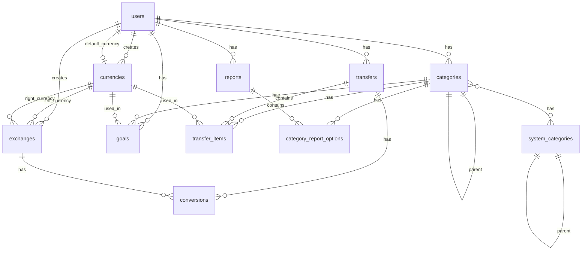

# Database Schema

This document outlines the database schema design for the Spring Boot backend application.

## Overview

The database schema is designed to preserve the functionality of the original Ruby on Rails application while allowing for optimizations where appropriate. The schema uses MySQL/PostgreSQL compatible syntax.

## Entity-Relationship Diagram



## Table Definitions

### users

```sql
CREATE TABLE users (
  id BIGINT AUTO_INCREMENT PRIMARY KEY,
  login VARCHAR(40) UNIQUE,
  name VARCHAR(100) DEFAULT '',
  email VARCHAR(100),
  password VARCHAR(60) NOT NULL,
  created_at TIMESTAMP,
  updated_at TIMESTAMP,
  remember_token VARCHAR(40),
  remember_token_expires_at TIMESTAMP,
  activation_code VARCHAR(40),
  activated_at TIMESTAMP,
  transaction_amount_limit_type_int INT NOT NULL DEFAULT 2,
  transaction_amount_limit_value INT,
  include_transactions_from_subcategories BOOLEAN NOT NULL DEFAULT FALSE,
  multi_currency_balance_calculating_algorithm_int INT NOT NULL DEFAULT 0,
  default_currency_id BIGINT NOT NULL DEFAULT 1,
  invert_saldo_for_income BOOLEAN NOT NULL DEFAULT TRUE,
  
  INDEX idx_users_id (id),
  INDEX idx_users_login (login)
);
```

### categories

```sql
CREATE TABLE categories (
  id BIGINT AUTO_INCREMENT PRIMARY KEY,
  name VARCHAR(255) NOT NULL,
  description VARCHAR(255),
  category_type_int INT,
  user_id BIGINT,
  parent_id BIGINT,
  lft INT,
  rgt INT,
  import_guid VARCHAR(255),
  imported BOOLEAN DEFAULT FALSE,
  email VARCHAR(255),
  bankinfo TEXT,
  bank_account_number VARCHAR(255),
  created_at TIMESTAMP,
  updated_at TIMESTAMP,
  loan_category BOOLEAN,
  
  FOREIGN KEY (user_id) REFERENCES users(id),
  FOREIGN KEY (parent_id) REFERENCES categories(id),
  
  INDEX idx_categories_user_type_id (category_type_int, id, user_id),
  INDEX idx_categories_lft_rgt (lft, rgt),
  INDEX idx_categories_rgt (rgt)
);
```

### system_categories

```sql
CREATE TABLE system_categories (
  id BIGINT AUTO_INCREMENT PRIMARY KEY,
  name VARCHAR(255) NOT NULL,
  parent_id BIGINT,
  lft INT,
  rgt INT,
  created_at TIMESTAMP,
  updated_at TIMESTAMP,
  description VARCHAR(255),
  category_type_int INT,
  cached_level INT,
  name_with_path VARCHAR(255),
  
  FOREIGN KEY (parent_id) REFERENCES system_categories(id),
  
  UNIQUE INDEX idx_system_categories_id (id)
);
```

### categories_system_categories

```sql
CREATE TABLE categories_system_categories (
  category_id BIGINT NOT NULL,
  system_category_id BIGINT NOT NULL,
  
  PRIMARY KEY (category_id, system_category_id),
  FOREIGN KEY (category_id) REFERENCES categories(id),
  FOREIGN KEY (system_category_id) REFERENCES system_categories(id),
  
  INDEX idx_cat_syscat (category_id, system_category_id)
);
```

### currencies

```sql
CREATE TABLE currencies (
  id BIGINT AUTO_INCREMENT PRIMARY KEY,
  symbol VARCHAR(255) NOT NULL,
  long_symbol VARCHAR(255) NOT NULL,
  name VARCHAR(255) NOT NULL,
  long_name VARCHAR(255) NOT NULL,
  user_id BIGINT,
  
  FOREIGN KEY (user_id) REFERENCES users(id),
  
  INDEX idx_currencies_id_user (id, user_id)
);
```

### exchanges

```sql
CREATE TABLE exchanges (
  id BIGINT AUTO_INCREMENT PRIMARY KEY,
  left_currency_id BIGINT NOT NULL,
  right_currency_id BIGINT NOT NULL,
  left_to_right DECIMAL(8, 4) NOT NULL,
  right_to_left DECIMAL(8, 4) NOT NULL,
  day DATE,
  user_id BIGINT,
  
  FOREIGN KEY (left_currency_id) REFERENCES currencies(id),
  FOREIGN KEY (right_currency_id) REFERENCES currencies(id),
  FOREIGN KEY (user_id) REFERENCES users(id),
  
  INDEX idx_exchanges_day_curr_user (day, left_currency_id, right_currency_id, user_id),
  INDEX idx_exchanges_day (day)
);
```

### transfers

```sql
CREATE TABLE transfers (
  id BIGINT AUTO_INCREMENT PRIMARY KEY,
  description TEXT NOT NULL,
  day DATE NOT NULL,
  user_id BIGINT NOT NULL,
  import_guid VARCHAR(255),
  
  FOREIGN KEY (user_id) REFERENCES users(id),
  
  INDEX idx_transfers_day (day),
  INDEX idx_transfers_id_user (id, user_id),
  INDEX idx_transfers_user (user_id)
);
```

### transfer_items

```sql
CREATE TABLE transfer_items (
  id BIGINT AUTO_INCREMENT PRIMARY KEY,
  description TEXT NOT NULL,
  value DECIMAL(12, 2) NOT NULL,
  transfer_id BIGINT NOT NULL,
  category_id BIGINT NOT NULL,
  currency_id BIGINT NOT NULL DEFAULT 3,
  import_guid VARCHAR(255),
  
  FOREIGN KEY (transfer_id) REFERENCES transfers(id),
  FOREIGN KEY (category_id) REFERENCES categories(id),
  FOREIGN KEY (currency_id) REFERENCES currencies(id),
  
  INDEX idx_transfer_items_category (category_id),
  INDEX idx_transfer_items_currency (currency_id),
  INDEX idx_transfer_items_id (id),
  INDEX idx_transfer_items_transfer (transfer_id)
);
```

### conversions

```sql
CREATE TABLE conversions (
  id BIGINT AUTO_INCREMENT PRIMARY KEY,
  exchange_id BIGINT NOT NULL,
  transfer_id BIGINT NOT NULL,
  created_at TIMESTAMP,
  updated_at TIMESTAMP,
  
  FOREIGN KEY (exchange_id) REFERENCES exchanges(id),
  FOREIGN KEY (transfer_id) REFERENCES transfers(id),
  
  INDEX idx_conversions_exchange_transfer (exchange_id, transfer_id),
  INDEX idx_conversions_id (id)
);
```

### goals

```sql
CREATE TABLE goals (
  id BIGINT AUTO_INCREMENT PRIMARY KEY,
  description VARCHAR(255),
  include_subcategories BOOLEAN,
  period_type_int INT,
  goal_type_int INT DEFAULT 0,
  goal_completion_condition_int INT DEFAULT 0,
  value FLOAT,
  category_id BIGINT NOT NULL,
  created_at TIMESTAMP,
  updated_at TIMESTAMP,
  currency_id BIGINT,
  period_start DATE,
  period_end DATE,
  is_cyclic BOOLEAN NOT NULL DEFAULT FALSE,
  is_finished BOOLEAN NOT NULL DEFAULT FALSE,
  cycle_group INT,
  user_id BIGINT NOT NULL,
  
  FOREIGN KEY (category_id) REFERENCES categories(id),
  FOREIGN KEY (currency_id) REFERENCES currencies(id),
  FOREIGN KEY (user_id) REFERENCES users(id),
  
  INDEX idx_goals_category (category_id),
  INDEX idx_goals_id (id)
);
```

### reports

```sql
CREATE TABLE reports (
  id BIGINT AUTO_INCREMENT PRIMARY KEY,
  type VARCHAR(255),
  name VARCHAR(255) NOT NULL,
  period_type_int INT NOT NULL,
  period_start DATE,
  period_end DATE,
  report_view_type_int INT NOT NULL,
  user_id BIGINT,
  created_at TIMESTAMP,
  updated_at TIMESTAMP,
  depth INT DEFAULT 0,
  max_categories_values_count INT DEFAULT 0,
  category_id BIGINT,
  period_division_int INT DEFAULT 5,
  temporary BOOLEAN NOT NULL DEFAULT FALSE,
  relative_period BOOLEAN NOT NULL DEFAULT FALSE,
  
  FOREIGN KEY (user_id) REFERENCES users(id),
  FOREIGN KEY (category_id) REFERENCES categories(id),
  
  INDEX idx_reports_category (category_id),
  INDEX idx_reports_id (id),
  INDEX idx_reports_user (user_id)
);
```

### category_report_options

```sql
CREATE TABLE category_report_options (
  id BIGINT AUTO_INCREMENT PRIMARY KEY,
  inclusion_type_int INT NOT NULL DEFAULT 0,
  report_id BIGINT NOT NULL,
  category_id BIGINT NOT NULL,
  created_at TIMESTAMP,
  updated_at TIMESTAMP,
  
  FOREIGN KEY (report_id) REFERENCES reports(id),
  FOREIGN KEY (category_id) REFERENCES categories(id),
  
  INDEX idx_category_report_options_cat_rep (category_id, report_id)
);
```

### sessions

```sql
CREATE TABLE sessions (
  id BIGINT AUTO_INCREMENT PRIMARY KEY,
  session_id VARCHAR(255),
  data TEXT,
  updated_at TIMESTAMP,
  
  INDEX idx_sessions_session (session_id),
  INDEX idx_sessions_updated (updated_at)
);
```

### schema_migrations

```sql
CREATE TABLE schema_migrations (
  version VARCHAR(255) NOT NULL,
  
  INDEX idx_schema_migrations_version (version)
);
```

## Enumerations

The application uses several enumerations which are stored as integer values in the database:

### Category Types
```java
public enum CategoryType {
    ASSET,
    INCOME,
    EXPENSE,
    LOAN,
    BALANCE
}
```

### Transaction Amount Limit Types
```java
public enum TransactionAmountLimitType {
    TRANSACTION_COUNT,
    WEEK_COUNT,
    THIS_MONTH,
    THIS_AND_LAST_MONTH
}
```

### Multi-Currency Balance Calculating Algorithm
```java
public enum BalanceAlgorithm {
    SHOW_ALL_CURRENCIES,
    CALCULATE_WITH_NEWEST_EXCHANGES,
    CALCULATE_WITH_EXCHANGES_CLOSEST_TO_TRANSACTION,
    CALCULATE_WITH_NEWEST_EXCHANGES_BUT,
    CALCULATE_WITH_EXCHANGES_CLOSEST_TO_TRANSACTION_BUT
}
```

### Report View Type
```java
public enum ReportViewType {
    PIE,
    BAR,
    LINEAR,
    TEXT
}
```

### Report Period Type
```java
public enum PeriodType {
    SELECTED,
    THIS_MONTH,
    LAST_MONTH,
    THIS_YEAR,
    LAST_YEAR,
    ALL,
    TODAY
}
```

### Goal Type
```java
public enum GoalType {
    PERCENT,
    VALUE
}
```

### Goal Completion Condition
```java
public enum GoalCompletionCondition {
    AT_LEAST,
    AT_MOST
}
```

### Category Report Option Inclusion Type
```java
public enum InclusionType {
    CATEGORY_ONLY,
    CATEGORY_AND_SUBCATEGORIES,
    BOTH,
    NONE
}
```

## Database Initialization

The database will be initialized with:

1. System currencies (USD, EUR, PLN)
2. System categories based on common financial categories
3. Default reports for new users

## Migration Strategy

The migration from Ruby on Rails to Spring Boot will preserve all existing data. The database migration will be performed in multiple steps:

1. Create a backup of the existing database
2. Update table structures as needed, preserving all data
3. Create Spring Boot entities to map to the database tables
4. Verify data integrity before final migration

## Performance Considerations

The schema includes the following performance optimizations:

1. Appropriate indexes on frequently queried columns
2. Use of nested set model for efficient tree traversal of categories
3. Foreign key constraints for data integrity