# Database Schema Documentation

This document provides a comprehensive overview of the database schema for the financial management application, detailing tables, fields, relationships, and indexes.

## Core Tables

### Users

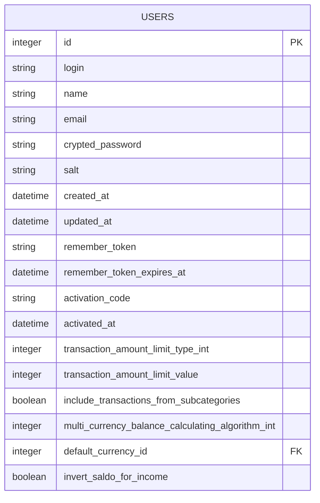

The Users table stores user account information, preferences, and authentication details.

### Categories

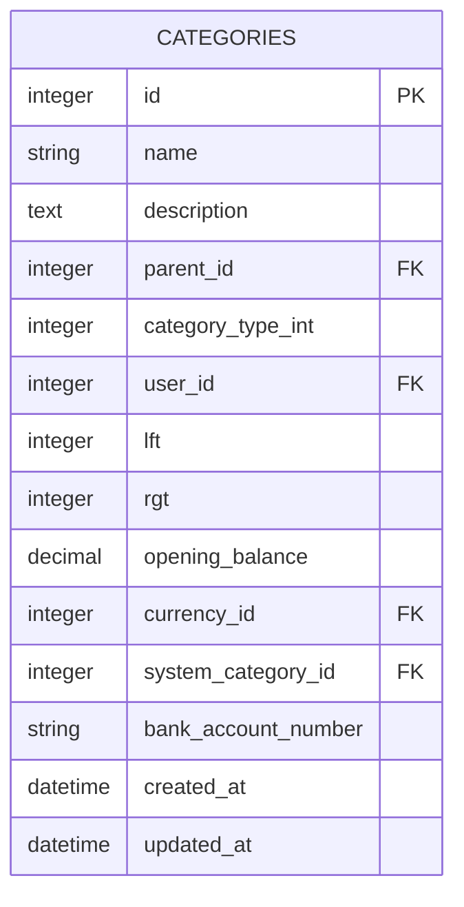

Categories form a hierarchical tree structure using nested set model (lft/rgt columns) for efficient tree operations.

### Transfers

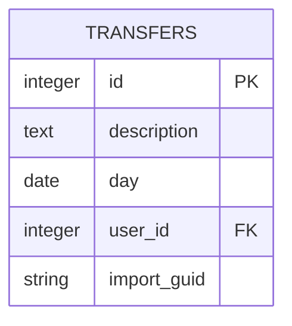

Transfers represent financial transactions with at least two sides (debit and credit).

### Transfer_Items

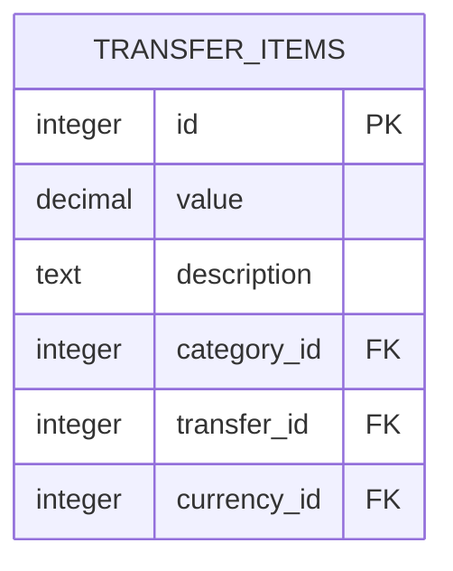

Transfer items are the individual entries that make up a transfer (transaction).

### Currencies

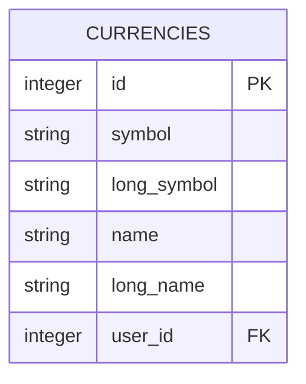

Currencies represent monetary units used in the system.

### Exchanges

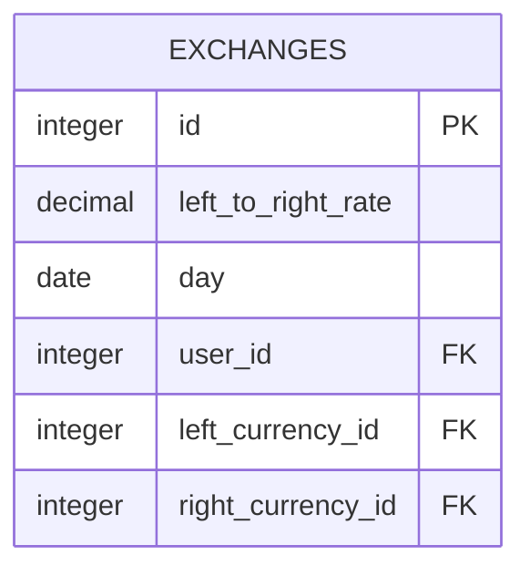

Exchanges store currency exchange rates.

### Conversions

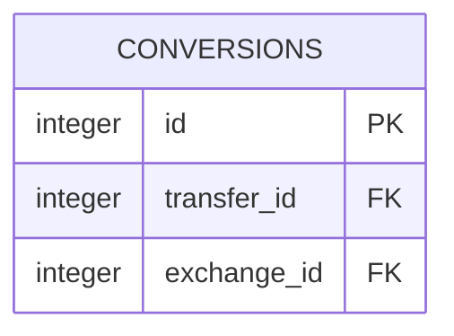

Conversions link transfers with the exchange rates used for currency conversion.

### Reports

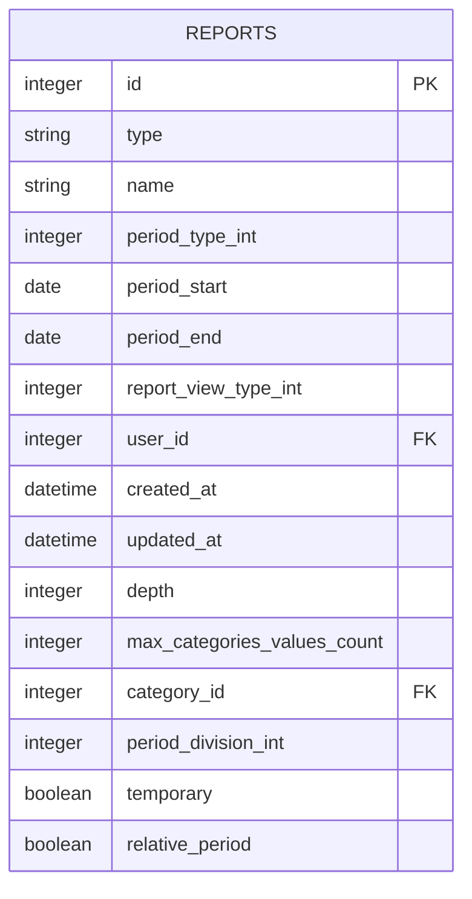

Reports store configurations for financial reports.

### Category_Report_Options

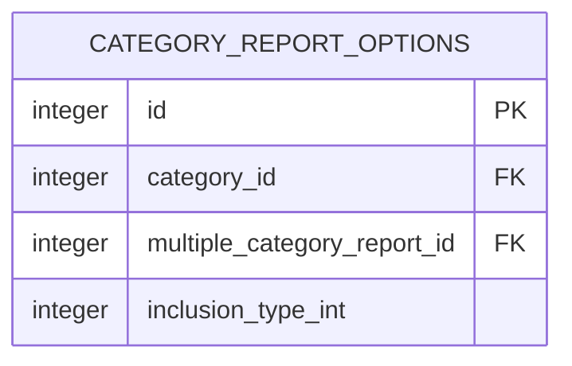

Links categories with reports and specifies how they should be included.

### Goals

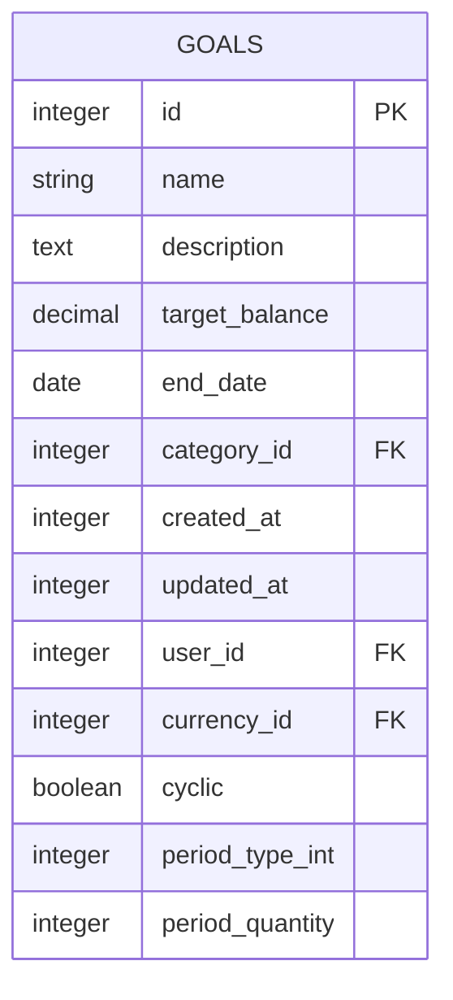

Goals track financial objectives with target balances.

### System_Categories

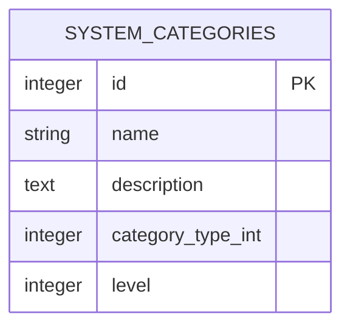

System-defined categories that serve as templates.

## Table Relationships

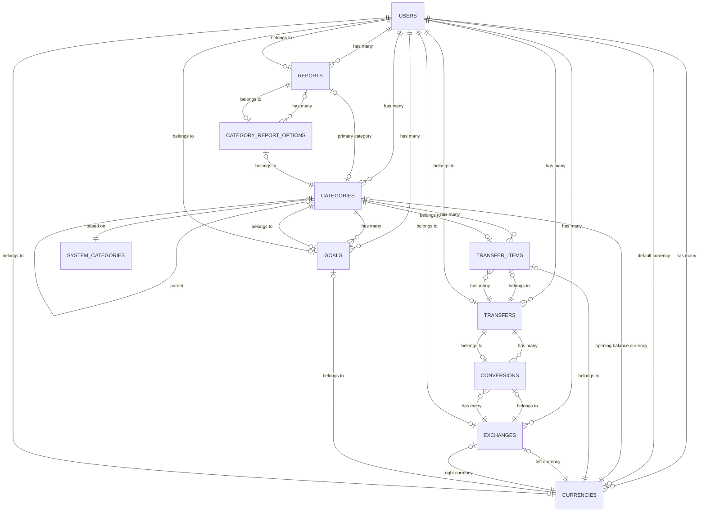

## Key Indexes

- **categories**: user_id, lft, rgt, parent_id
- **transfers**: user_id, day
- **transfer_items**: transfer_id, category_id, currency_id
- **currencies**: user_id
- **exchanges**: user_id, left_currency_id, right_currency_id, day
- **reports**: user_id, type
- **goals**: user_id, category_id

## Database Constraints

- User deletion cascades to all user-owned data
- Category deletion prevented if it has transfers
- Currency deletion prevented if it's used in transfers
- Transfer balance must be zero (sum of items equals zero)
- Exchange rates must be positive
- Categories must maintain a valid nested set structure

This schema documentation provides a comprehensive overview of the database structure, which will serve as a reference for the reengineering effort to convert the application to an Angular and Node.js stack.