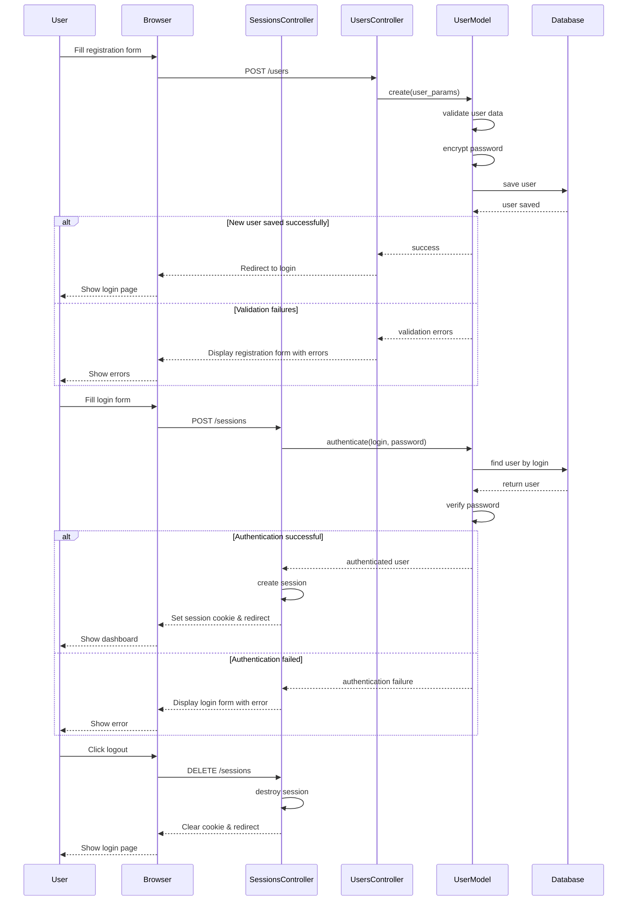
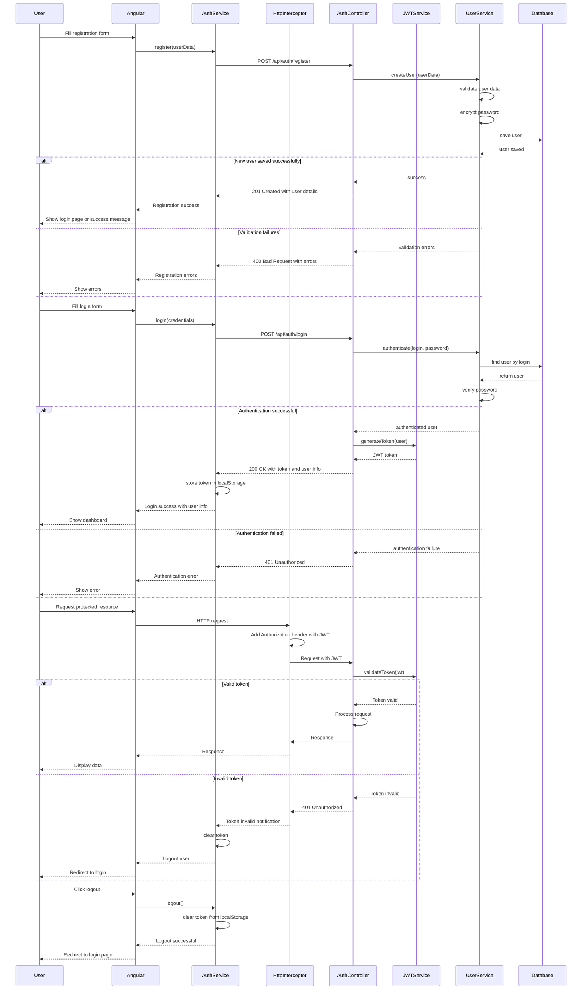

# Authentication Sequence Diagram

## Ruby on Rails Authentication Flow

## Angular/Spring Boot Authentication Flow

These sequence diagrams illustrate the differences in authentication flows between the Ruby on Rails application and the new Angular/Spring Boot architecture. The key differences are:

1. Token-based authentication (JWT) in Angular/Spring Boot vs session-based in Rails
2. Client-side token storage in Angular vs server-side session in Rails
3. HTTP interceptors for adding authentication headers automatically in Angular
4. More explicit error handling in the Angular/Spring Boot flow