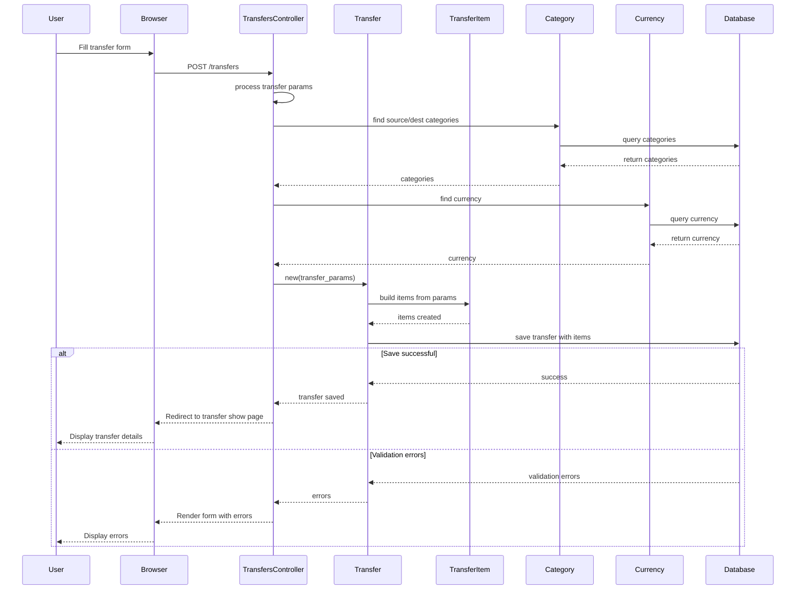
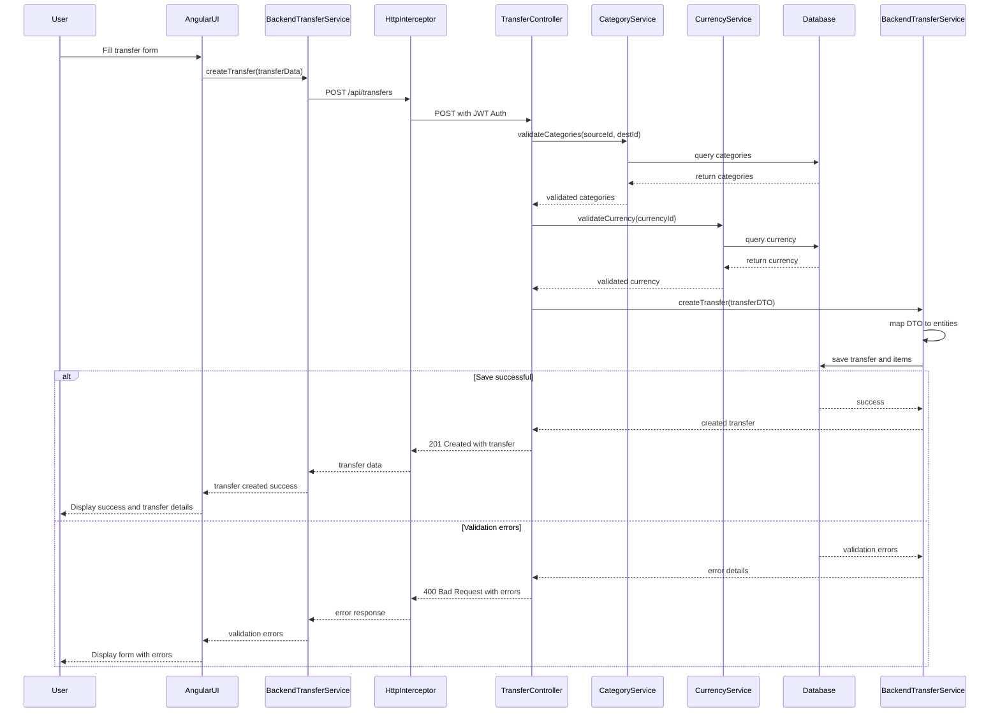
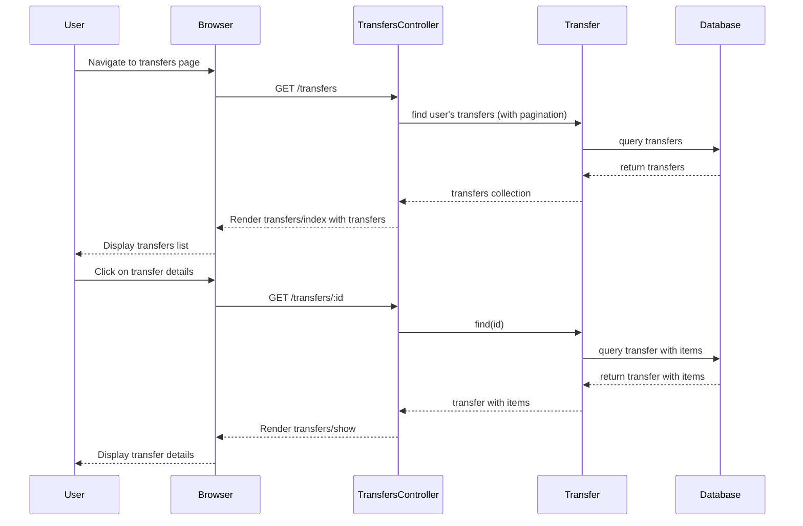
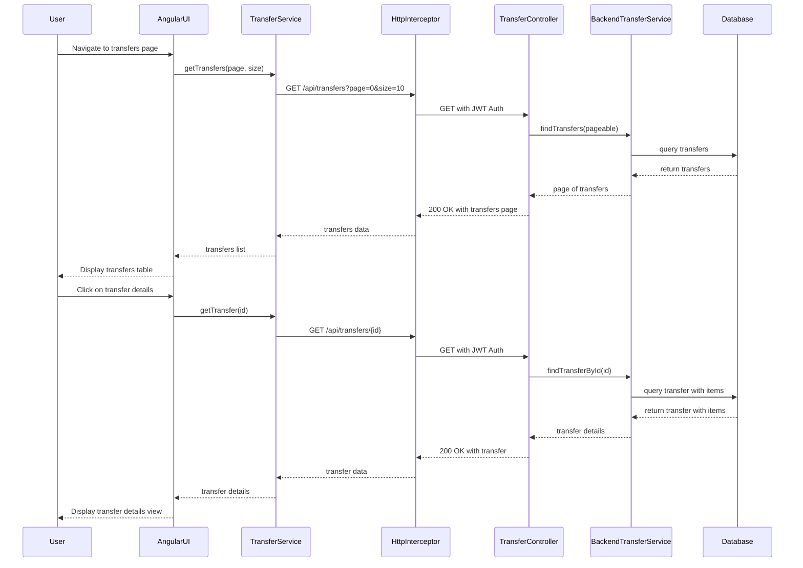

# Transfer Sequence Diagrams

## Ruby on Rails Transfer Creation Flow

## Angular/Spring Boot Transfer Creation Flow

## Ruby on Rails Transfer Listing Flow

## Angular/Spring Boot Transfer Listing Flow

These sequence diagrams illustrate the differences between how transfers are created and retrieved in the Ruby on Rails application versus the new Angular/Spring Boot architecture. The key differences include:

1. Clear separation between frontend (Angular) and backend (Spring Boot) in the new architecture
2. RESTful API communication with HTTP verbs and status codes in the Angular/Spring Boot version
3. JWT authentication through HTTP interceptors in the Angular/Spring Boot flow
4. More explicit error handling in the Angular/Spring Boot architecture
5. Clearer separation of concerns with dedicated services in the Spring Boot backend