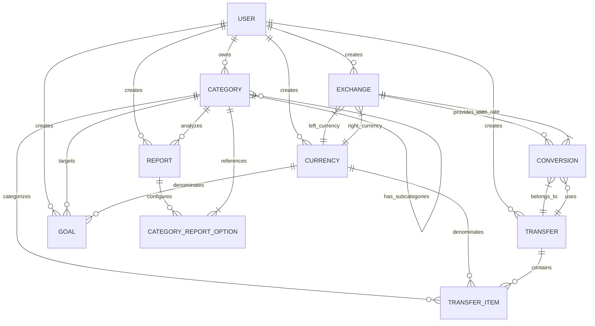

# Entity-Relationship Diagram

This document outlines the core entities of the Financial Management System and their relationships.

## Core Entities

### User
- Central entity representing a system user
- Manages authentication and authorization
- Owns all other entities in the system
- Has configuration preferences for display and calculation

### Category
- Represents a financial category (expense, income, asset, loan)
- Organized in a hierarchical structure (tree)
- Categories can have subcategories
- Each category belongs to a user

### Currency
- Represents a monetary currency (USD, EUR, etc.)
- Contains symbol and name information
- Can be system-defined or user-defined

### Exchange
- Represents an exchange rate between two currencies
- Contains conversion rates for both directions
- Valid for a specific date
- Owned by a user or system-defined

### Transfer
- Represents a financial transaction
- Contains description and date
- Consists of multiple transfer items
- Owned by a user

### TransferItem
- Represents a part of a financial transaction
- Belongs to a specific category
- Has a monetary value in a specific currency
- Is part of a transfer transaction

### Goal
- Represents a financial goal (saving, spending limit, etc.)
- Associated with a specific category
- Has target value and completion criteria
- Can be cyclic or one-time
- Owned by a user

### Report
- Represents a configured financial report
- Different report types: Flow, Share, Value
- Can be customized with category options
- Owned by a user

## Entity Relationships

## Key Constraints

1. A User owns all entities created by that user
2. A Category can have parent-child relationships forming a tree structure
3. An Exchange requires two distinct Currency entities
4. A Transfer must have at least two TransferItem entities (balanced transaction)
5. A TransferItem must belong to both a Transfer and a Category
6. Goals are tied to specific Categories and optional Currencies
7. Reports can analyze multiple Categories based on configuration

## Additional Notes

- The system supports nested categories with an unlimited hierarchy depth
- Transfers represent double-entry bookkeeping principles
- Currency conversions are tracked to maintain data integrity
- Goals can be configured for various time periods and can be recurring