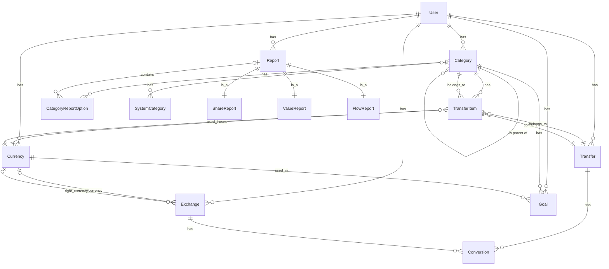

# Entity Relationship Diagram

This document shows the relationships between the main entities in the application.

## Main Entities Description

### User
- Represents users of the application
- Has authentication details (login, password, etc.)
- Associated with their own categories, transfers, currencies, etc.

### Category
- Organizes financial data in a nested tree structure
- Has different types: ASSET, INCOME, EXPENSE, LOAN, BALANCE
- Can have parent-child relationships
- Can be associated with SystemCategory for standardization

### Transfer
- Represents a financial transaction
- Contains multiple TransferItems
- Each Transfer must balance (income = outcome)

### TransferItem
- Individual line items within a Transfer
- Has a value, can be positive (income) or negative (expense)
- Associated with a Category and Currency

### Currency
- Represents monetary units used in the system
- Can be system-defined or user-defined
- Has symbol, name, etc.

### Exchange
- Defines exchange rates between two currencies
- Has conversion rates in both directions
- Can be linked to Transfers through Conversions

### Goal
- Financial planning tool
- Associated with a Category and target amount/percentage
- Can be recurring/cyclic

### Report
- Financial reporting tool
- Different types: ShareReport, ValueReport, FlowReport
- Configurable parameters for visualization