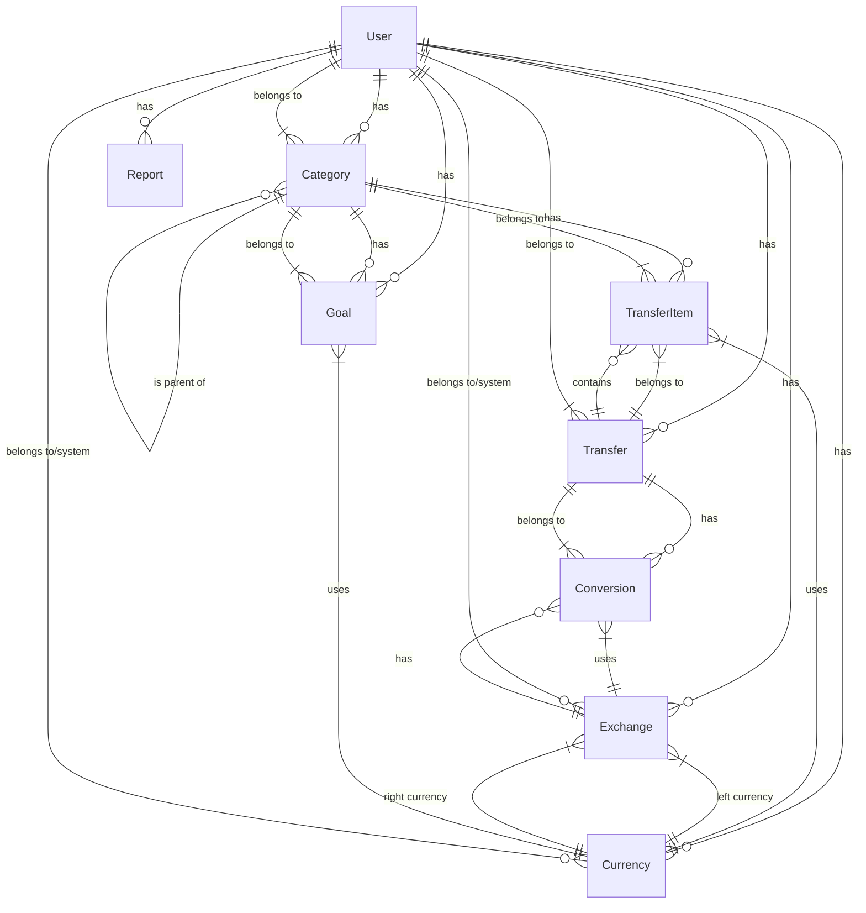

# Entity Relationship Diagram

The following diagram represents the core relationships between entities in the financial management system.

## Key Entities

### User
- Core entity representing system users
- Stores authentication info, preferences and settings

### Category
- Hierarchical structure for organizing finances
- Types include Income, Expense, Asset, Loan, Balance
- Uses nested set pattern for tree operations

### Transfer
- Represents a financial transaction
- Contains multiple transfer items (at least 2)
- Belongs to a user

### TransferItem
- Component of a transfer
- Links to a category and has a monetary value
- Associated with a specific currency

### Currency
- Represents monetary units
- Can be system-defined or user-defined

### Exchange
- Represents exchange rates between two currencies
- Stores conversion rates in both directions
- Can be dated (for historical rates)

### Conversion
- Links a transfer to specific exchange rates
- Enables multi-currency transactions

### Goal
- Financial target associated with a category
- Has target amount in specific currency