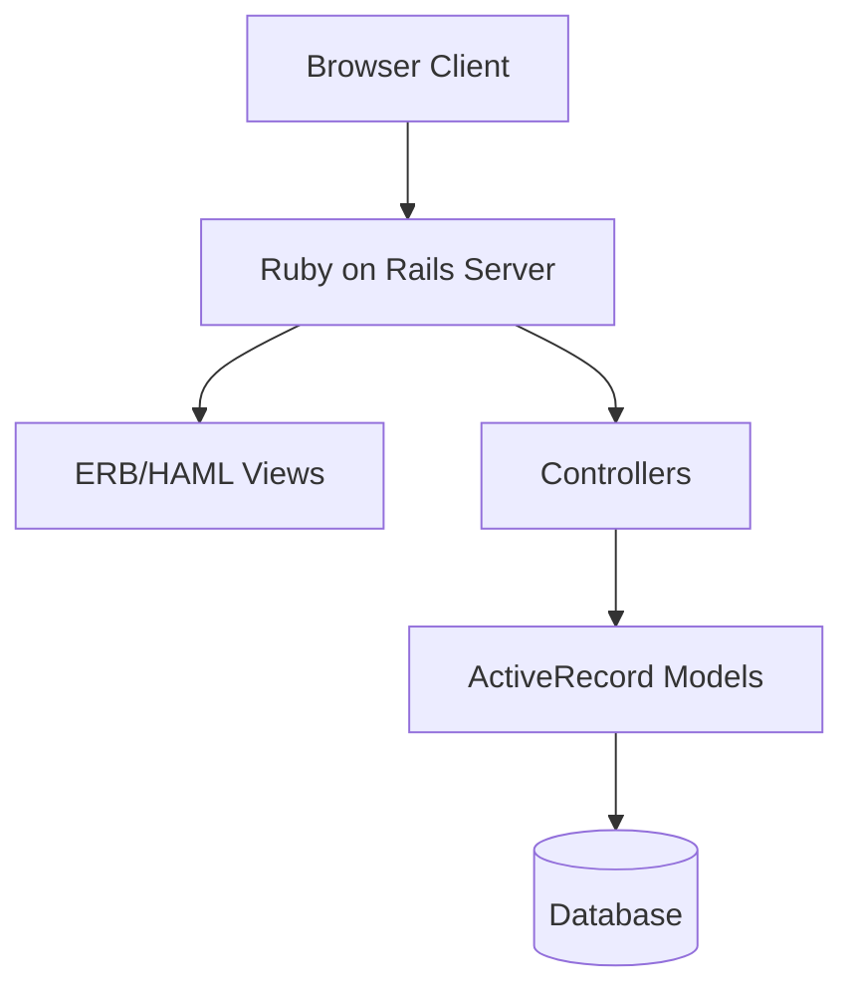
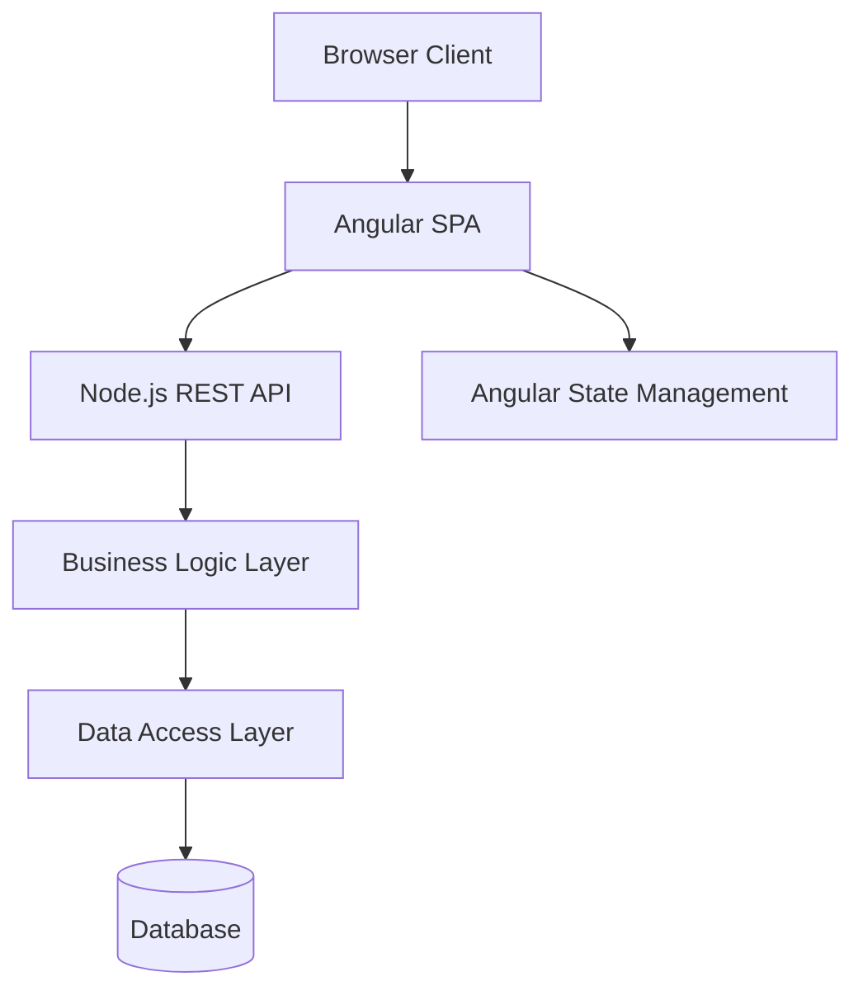
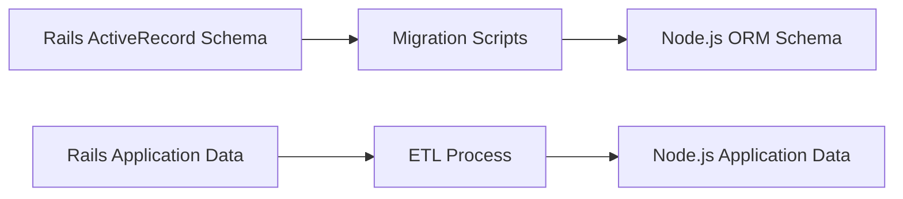

# Migration Strategy: Rails to Angular/Node.js

This document outlines the strategy and considerations for migrating the Ruby on Rails personal finance application to an Angular frontend with Node.js backend.

## Architecture Migration

### Current Architecture (Rails)

### Target Architecture (Angular/Node.js)

## Migration Phases

### Phase 1: Analysis and Planning

1. **Document the current system** (completed)
   - Data model and relationships
   - Business logic
   - UI workflows
   - Authentication mechanism

2. **Design target architecture**
   - REST API endpoints
   - Angular components structure
   - State management strategy
   - Authentication approach (JWT vs session)
   - Database access strategy

3. **Define testing strategy**
   - Unit tests for business logic
   - API tests
   - UI component tests
   - End-to-end tests

### Phase 2: Backend Development (Node.js)

1. **Setup Node.js environment**
   - Choose framework (Express.js, NestJS, etc.)
   - Setup TypeScript
   - Configure linting and formatting
   - Setup testing framework

2. **Database integration**
   - ORM selection (Sequelize, TypeORM, Prisma)
   - Migration scripts for schema
   - Data migration plans

3. **Core API development**
   - User authentication
   - Categories management
   - Transfers and accounting logic
   - Currencies and exchange rates

4. **Advanced features**
   - Reporting API
   - Goals API
   - Multi-currency support

5. **API testing and documentation**
   - Automated API tests
   - Swagger/OpenAPI documentation

### Phase 3: Frontend Development (Angular)

1. **Setup Angular environment**
   - Configure Angular CLI
   - Setup state management (NgRx, NGXS, or Akita)
   - Configure routing
   - Setup component library

2. **Core UI components**
   - Authentication screens
   - Dashboard layout
   - Category management
   - Transfer creation and management

3. **Advanced UI features**
   - Reporting and charts
   - Goals visualization
   - Multi-currency support
   - Mobile responsiveness

4. **Testing**
   - Component tests
   - Integration tests
   - End-to-end tests

### Phase 4: Integration and Deployment

1. **Environment setup**
   - Development
   - Staging
   - Production

2. **CI/CD pipeline**
   - Automated builds
   - Test execution
   - Deployment strategy

3. **Data migration execution**
   - Test migration in staging
   - Production migration plan
   - Rollback strategy

4. **Cutover strategy**
   - Gradual feature migration vs. complete replacement
   - User communication plan
   - Support plan

## Technical Challenges and Considerations

### 1. Authentication and Authorization

**Current approach:**
- Custom authentication system
- Cookie-based sessions
- Activation through email links

**Target approach:**
- JWT-based authentication
- Role-based authorization
- Modern password hashing (bcrypt/Argon2)
- OAuth integration (optional)

### 2. Nested Categories Structure

**Current approach:**
- Nested set model in SQL
- Tree operations through ActiveRecord

**Target approach:**
- Materialized path or closure table pattern
- Recursive queries or specialized libraries
- Optimized tree operations

### 3. Multi-Currency Support

**Current approach:**
- Direct database relationships
- Complex conversion logic in Ruby

**Target approach:**
- Currency service abstraction
- Immutable money value objects
- Clear separation of exchange rate logic

### 4. Reporting Engine

**Current approach:**
- Server-side generation using Ruby
- Single table inheritance for report types

**Target approach:**
- API endpoints for report data
- Client-side chart generation
- Caching strategy for expensive report calculations

### 5. Form Complexity

**Current approach:**
- Server-rendered forms
- Complex nested forms (transfers with multiple items)

**Target approach:**
- Reactive forms in Angular
- Dynamic form components
- Client-side validation plus API validation

## Data Migration Considerations

### Database Schema Evolution

### Critical Data Concerns

1. **User credentials**
   - Password rehashing may be required
   - Preserving activation status

2. **Financial integrity**
   - Ensuring balanced transfers remain balanced
   - Preserving audit history

3. **Hierarchical data**
   - Converting nested set to new representation
   - Maintaining hierarchical relationships

4. **Historical exchange rates**
   - Preserving all historical currency data
   - Ensuring calculations remain consistent

## Risk Management

| Risk | Probability | Impact | Mitigation |
|------|------------|--------|------------|
| Data loss during migration | Low | High | Complete backup, dry-run migrations, comprehensive tests |
| Calculation inconsistencies | Medium | High | Side-by-side validation, dual-run period |
| Performance issues | Medium | Medium | Performance testing, optimization sprints |
| User adoption resistance | Medium | High | Improved UX, training materials, phased rollout |
| Authentication security issues | Low | High | Security audit, penetration testing |

## Success Criteria

The migration will be considered successful when:

1. All existing functionality is available in the new system
2. Financial calculations produce identical results to the old system
3. Performance meets or exceeds the Rails application
4. User feedback is positive regarding the new interface
5. No critical security issues are present
6. Maintenance costs are reduced