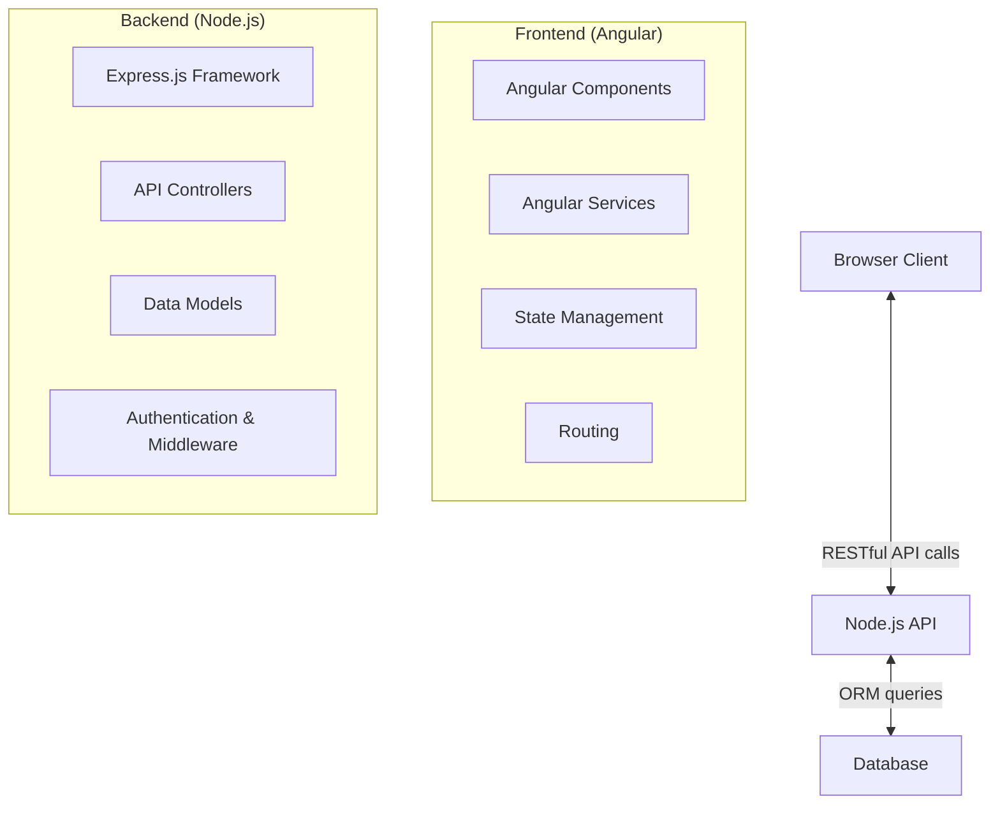
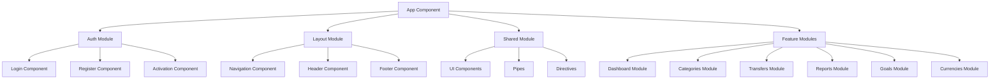
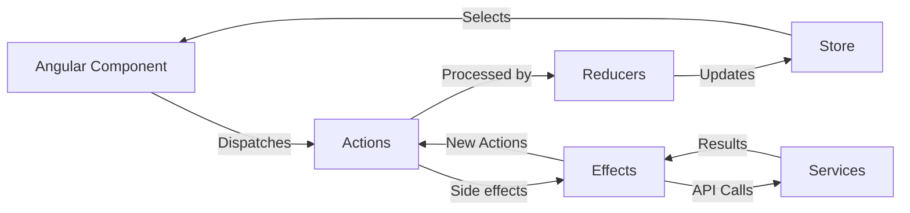
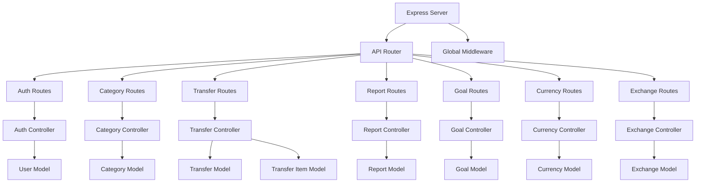

# Reengineering Architecture Document

This document outlines the architecture for reengineering the Ruby on Rails application to an Angular and Node.js stack. It covers the proposed architecture, component structure, data models, API endpoints, and migration strategy.

## Overview

The reengineering process will convert the current monolithic Ruby on Rails application into a modern client-server architecture with:

1. A front-end Angular application
2. A back-end Node.js API service
3. A shared database structure

## Architectural Patterns



## Front-End Architecture

### Angular Component Structure



### Key Angular Modules

1. **Core Module**
   - Authentication service
   - HTTP interceptors
   - Global error handling
   - Application-wide singleton services

2. **Shared Module**
   - Common components (buttons, modals, forms)
   - Common directives
   - Common pipes

3. **Feature Modules**
   - Dashboard
   - Categories
   - Transfers
   - Reports
   - Goals
   - Currencies & Exchange Rates

### State Management

The application will use NgRx for state management:



## Back-End Architecture

### Node.js API Structure



### Key API Modules

1. **Authentication & Authorization**
   - User registration
   - Login/logout
   - Password recovery
   - JWT token management
   - Role-based permissions

2. **Data Access Layer**
   - ORM models
   - Database migrations
   - Query optimization
   - Data validation

3. **Business Logic Layer**
   - Financial calculations
   - Report generation
   - Category structure management

4. **API Layer**
   - RESTful endpoints
   - Request validation
   - Response formatting
   - Error handling

## API Endpoints

### Authentication Endpoints

```
POST   /api/auth/register      - Register new user
POST   /api/auth/login         - User login
POST   /api/auth/activate      - Activate account
POST   /api/auth/forgot        - Request password reset
POST   /api/auth/reset         - Reset password
GET    /api/auth/profile       - Get user profile
PUT    /api/auth/profile       - Update profile
```

### Categories Endpoints

```
GET    /api/categories                    - List categories
POST   /api/categories                    - Create category
GET    /api/categories/:id                - Get category details
PUT    /api/categories/:id                - Update category
DELETE /api/categories/:id                - Delete category
GET    /api/categories/:id/transfers      - List category transfers
GET    /api/categories/:id/balance        - Get category balance
POST   /api/categories/:id/subcategories  - Add subcategory
```

### Transfers Endpoints

```
GET    /api/transfers                - List transfers
POST   /api/transfers                - Create transfer
GET    /api/transfers/:id            - Get transfer details
PUT    /api/transfers/:id            - Update transfer
DELETE /api/transfers/:id            - Delete transfer
POST   /api/transfers/quick          - Create quick transfer
GET    /api/transfers/search         - Search transfers
```

### Reports Endpoints

```
GET    /api/reports                  - List reports
POST   /api/reports                  - Create report
GET    /api/reports/:id              - Get report details
PUT    /api/reports/:id              - Update report
DELETE /api/reports/:id              - Delete report
GET    /api/reports/:id/generate     - Generate report data
```

### Goals Endpoints

```
GET    /api/goals                    - List goals
POST   /api/goals                    - Create goal
GET    /api/goals/:id                - Get goal details
PUT    /api/goals/:id                - Update goal
DELETE /api/goals/:id                - Delete goal
GET    /api/goals/:id/progress       - Get goal progress
```

### Currencies & Exchanges Endpoints

```
GET    /api/currencies               - List currencies
POST   /api/currencies               - Create currency
GET    /api/currencies/:id           - Get currency details
PUT    /api/currencies/:id           - Update currency
DELETE /api/currencies/:id           - Delete currency

GET    /api/exchanges                - List exchange rates
POST   /api/exchanges                - Create exchange rate
GET    /api/exchanges/:id            - Get exchange rate details
PUT    /api/exchanges/:id            - Update exchange rate
DELETE /api/exchanges/:id            - Delete exchange rate
GET    /api/exchanges/convert        - Convert currency amount
```

## Data Models

The data models will closely mirror the existing database schema, with refined relationships to optimize for the Node.js environment.

### Key Changes from Rails Models

1. **Authentication**: 
   - Replace Rails authentication with JWT
   - Modernize password hashing

2. **Associations**:
   - Replace ActiveRecord associations with Sequelize/Mongoose relationships
   - Optimize eager loading patterns

3. **Validation**:
   - Move validations to both front-end and back-end
   - Implement comprehensive API validation middleware

4. **Business Logic**:
   - Move complex calculations from models to services
   - Create specialized calculation services

## Security Considerations

1. **Authentication**: JWT-based authentication with refresh tokens
2. **Authorization**: Role-based access control
3. **Data Validation**: Input sanitization on all endpoints
4. **HTTPS**: Enforce SSL/TLS for all communications
5. **CORS**: Properly configured cross-origin resource sharing
6. **Rate Limiting**: Prevent abuse through API rate limiting
7. **Environment Variables**: Secure storage of sensitive configuration

## Migration Strategy

### Phase 1: Analysis & Planning

- Document existing Rails application (models, controllers, views)
- Define Angular component structure
- Define Node.js API structure
- Create detailed migration plan

### Phase 2: Back-End Development

- Set up Node.js project structure
- Implement database models and migrations
- Develop API endpoints
- Implement authentication system
- Build business logic services
- Create comprehensive tests

### Phase 3: Front-End Development

- Set up Angular project structure
- Implement core UI components
- Develop feature modules
- Connect to API services
- Implement state management
- Create UI tests

### Phase 4: Integration & Testing

- Integrate front-end and back-end
- Perform system testing
- Load testing and optimization
- Security review and testing

### Phase 5: Deployment & Transition

- Set up production deployment
- Migrate existing data
- Implement monitoring and logging
- Provide documentation
- User training
- Go-live and support

## Technology Stack

### Front-End

- **Framework**: Angular 17+
- **State Management**: NgRx
- **UI Components**: Angular Material
- **Styling**: SCSS
- **Charting**: ngx-charts or Chart.js
- **Testing**: Jasmine, Karma, Protractor

### Back-End

- **Runtime**: Node.js 18+
- **Framework**: Express.js
- **ORM**: Sequelize (SQL) or Mongoose (MongoDB)
- **Authentication**: Passport.js with JWT
- **Validation**: Joi or express-validator
- **Testing**: Jest, Supertest

### DevOps

- **Version Control**: Git
- **CI/CD**: GitHub Actions or Jenkins
- **Containerization**: Docker
- **Deployment**: Kubernetes or Cloud services
- **Monitoring**: ELK Stack or Prometheus

This architecture document provides a comprehensive blueprint for reengineering the Ruby on Rails application to an Angular and Node.js stack while preserving the core functionality and user experience.