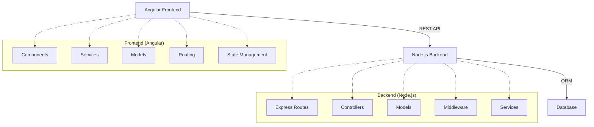
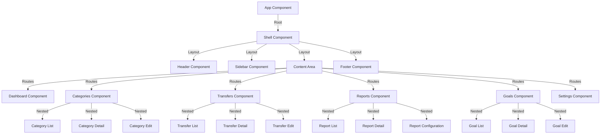
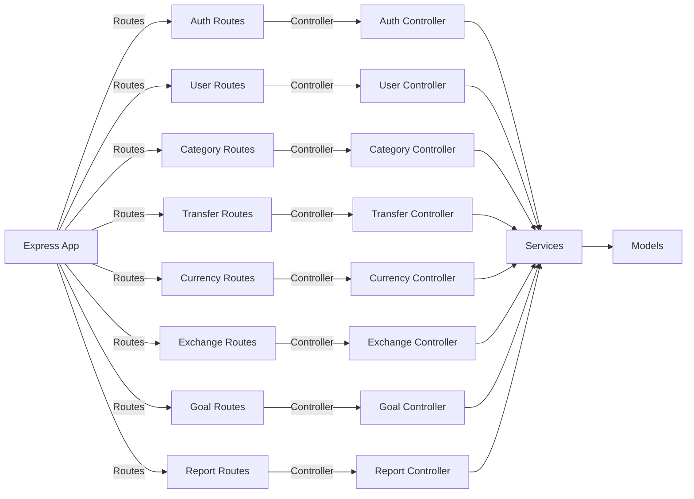
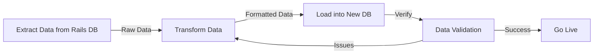
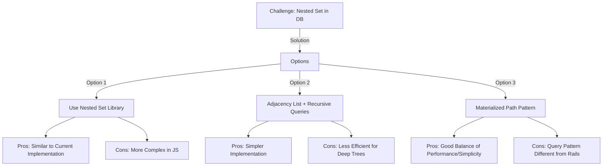
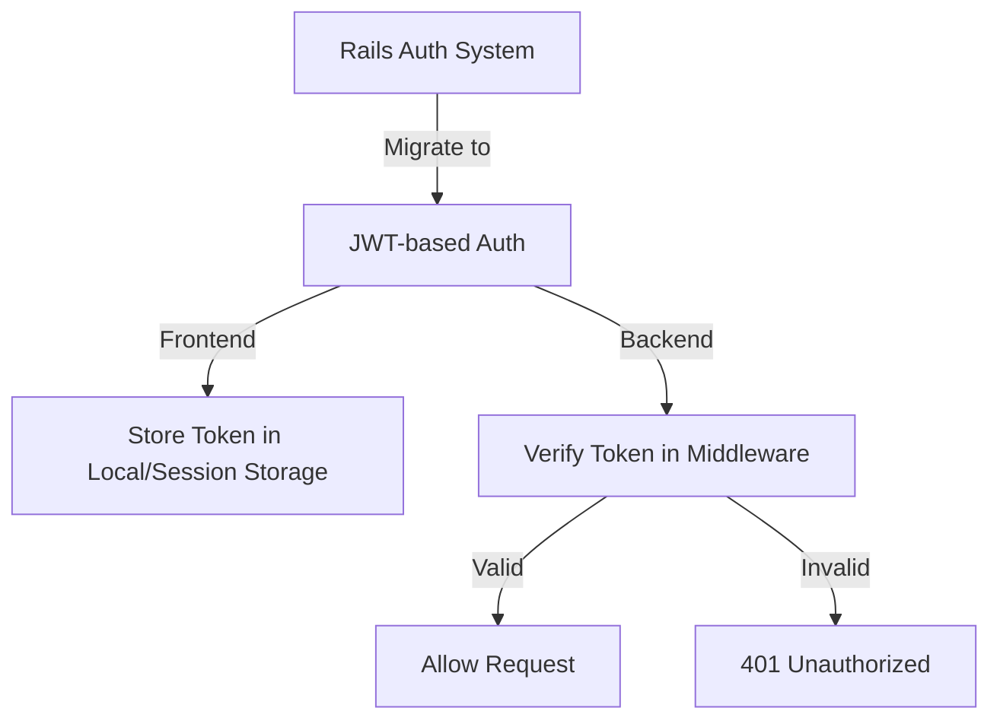
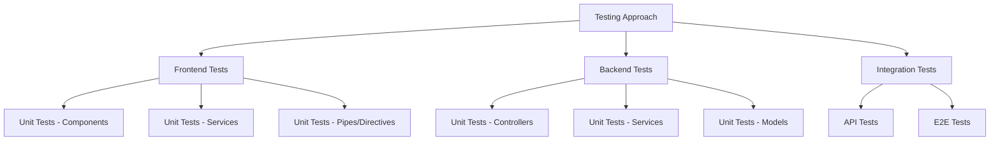
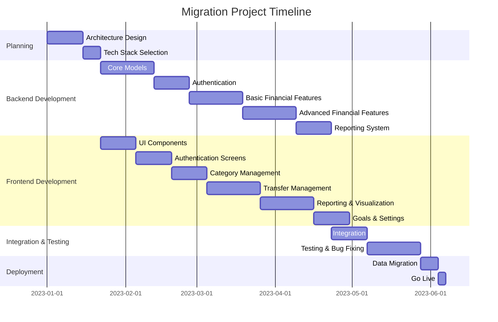

# Reengineering Recommendations

## Overview

This document provides recommendations for reengineering the Ruby on Rails financial management application to an Angular and Node.js stack. It outlines the key considerations, challenges, and approach for migrating the application while preserving its functionality and user experience.

## Architecture Recommendations

### Proposed Architecture

## Frontend (Angular)

### Components Structure

### Key Angular Features to Utilize

1. **Angular Modules** - Feature-based modules for categories, transfers, reports, etc.
2. **Reactive Forms** - For complex form handling (transfers, reports)
3. **Route Guards** - For authentication and authorization
4. **Lazy Loading** - For better performance
5. **NgRx** - For state management, especially for complex data like transfers and categories
6. **RxJS** - For reactive programming approach
7. **Angular Material** - For UI components that match current functionality
8. **Custom Form Controls** - For specialized inputs (currency, category selector)

## Backend (Node.js)

### API Structure

### Key Node.js Technologies to Utilize

1. **Express.js** - Web framework
2. **Sequelize** or **TypeORM** - ORM for database operations
3. **Passport.js** - Authentication middleware
4. **JWT** - Token-based authentication
5. **Jest** - Testing framework
6. **Winston** - Logging
7. **Joi** or **express-validator** - Request validation
8. **Swagger/OpenAPI** - API documentation

## Data Migration Strategy

1. **Database Schema Translation** - Map the Rails schema to the new database
2. **Data ETL Process** - Extract, transform, load data
3. **Data Validation** - Ensure integrity of migrated data
4. **Incremental Migration** - Migrate data in logical chunks

## Feature Migration Path

Recommended order of feature migration:

1. **Core Data Models** - Users, Categories, Currencies
2. **Authentication System** - Login, registration, password reset
3. **Basic Financial Tracking** - Simple transfers and categories
4. **Expanded Financial Features** - Multi-currency support, complex transfers
5. **Reporting System** - Various reports and visualizations
6. **Goal Tracking** - Financial goals feature
7. **Advanced Features** - Any remaining specialized functionality

## Key Challenges and Solutions

### Nested Set Pattern for Categories

### Multi-Currency Support

The complex multi-currency calculations need careful implementation:

1. **Currency Model** - Similar to Rails implementation
2. **Exchange Rates** - Maintain current functionality
3. **Conversion Logic** - Move business logic to services
4. **Money Pattern** - Implement equivalent in TypeScript

### Authentication & Authorization

## Testing Strategy

## Project Timeline and Phasing

## Conclusion

Migrating from Ruby on Rails to an Angular and Node.js stack is a substantial undertaking, but with a structured approach focusing on core functionality first and incrementally building out features, it can be accomplished successfully. The key is to maintain the existing business logic and user experience while leveraging the strengths of the new technology stack.

The proposed architecture provides a clean separation of concerns, with a robust backend API serving a responsive and modern frontend application. By following the recommendations in this document, the development team can ensure a smooth transition to the new technology stack while preserving the valuable functionality of the current application.