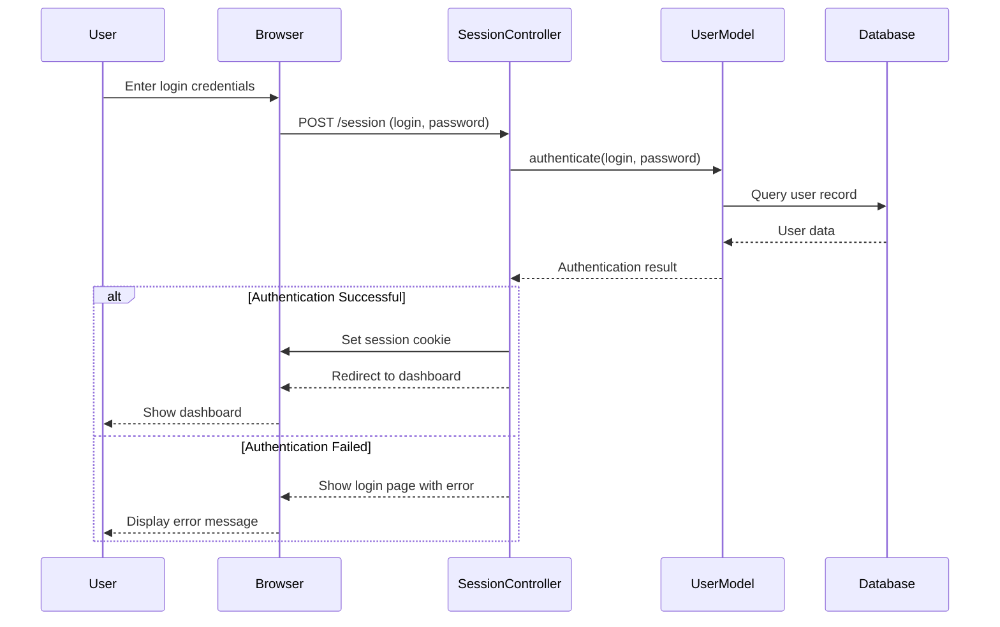
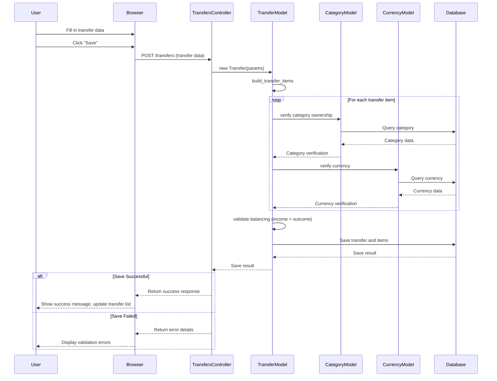
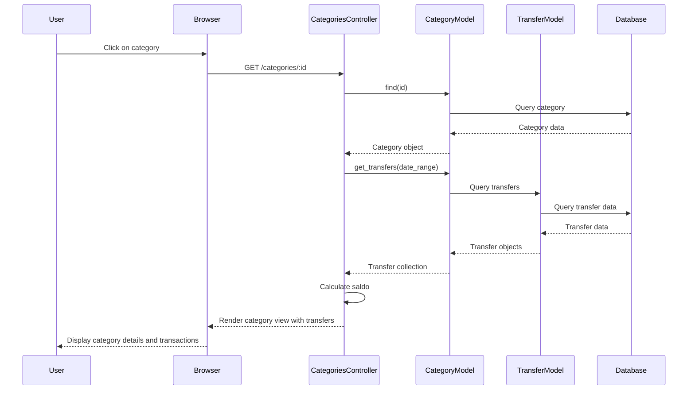
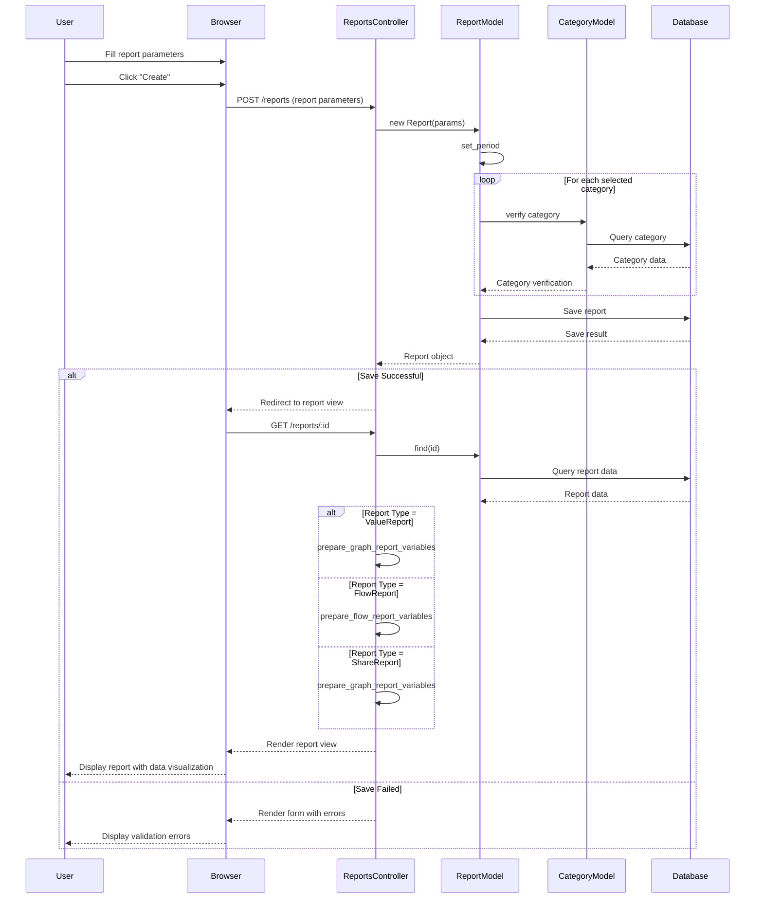
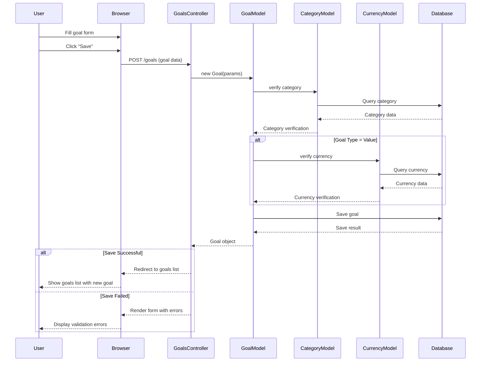
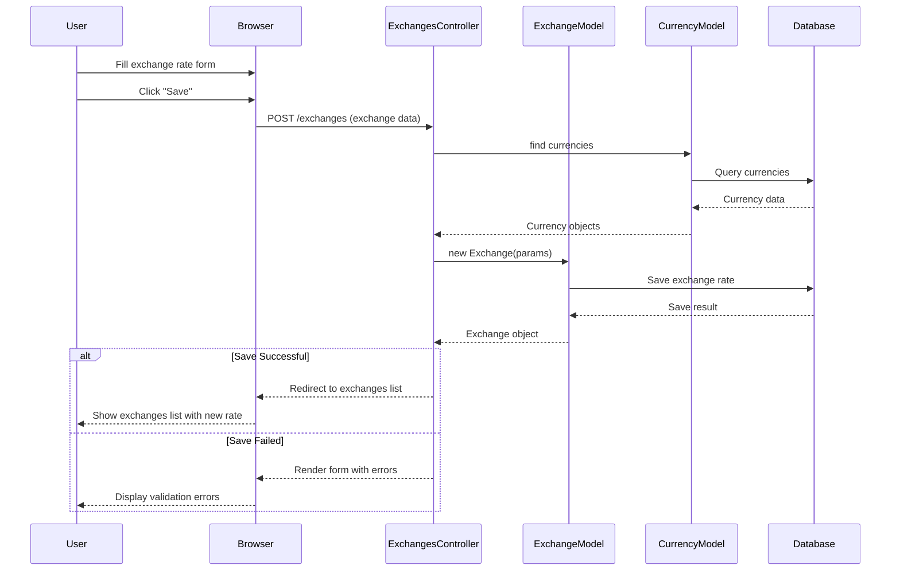
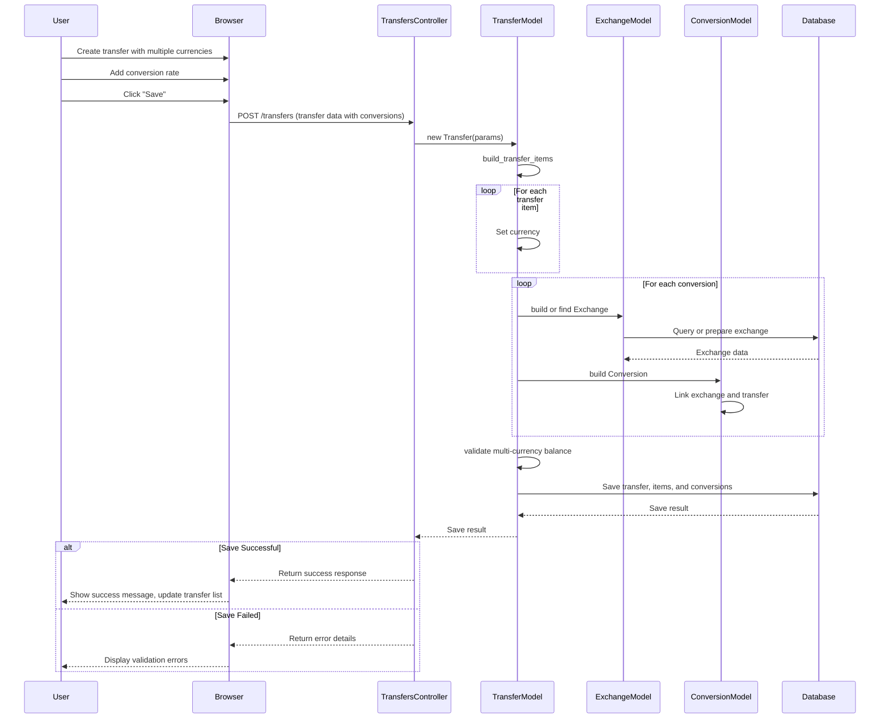

# Sequence Diagrams

This document contains sequence diagrams for the main workflows in the application.

## User Authentication

## Creating a New Transfer

## Viewing Category Transactions

## Creating a Report

## Adding a Goal

## Currency Exchange Workflow

## Multi-Currency Transfer

