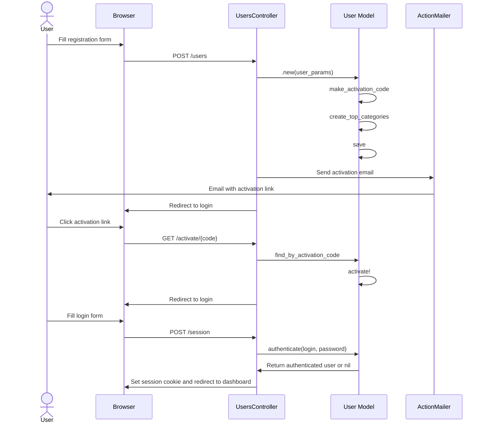
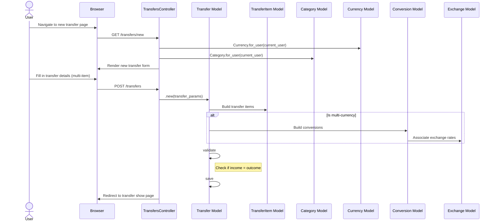
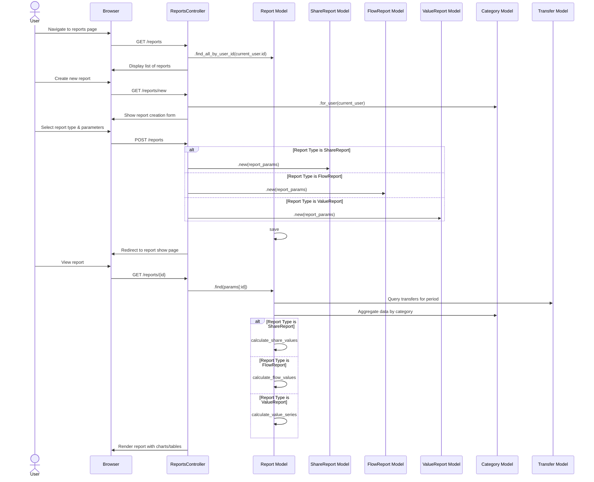
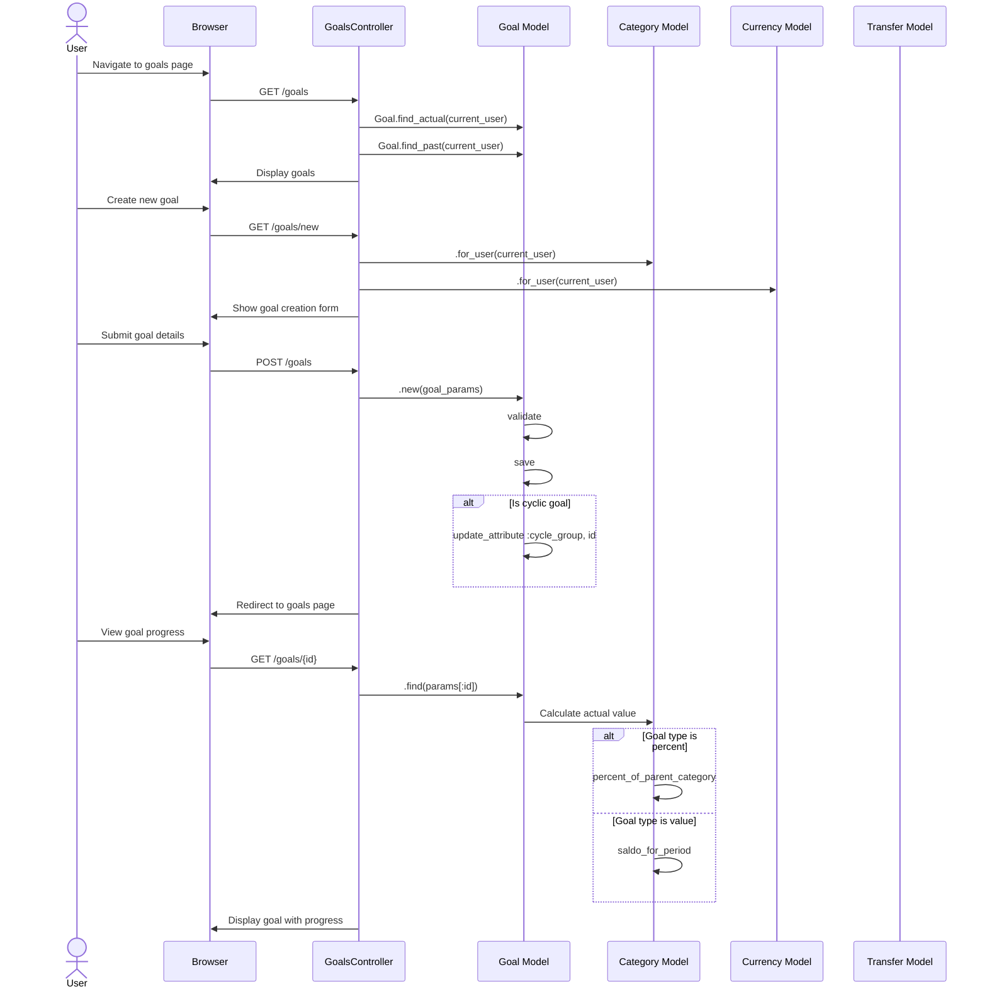
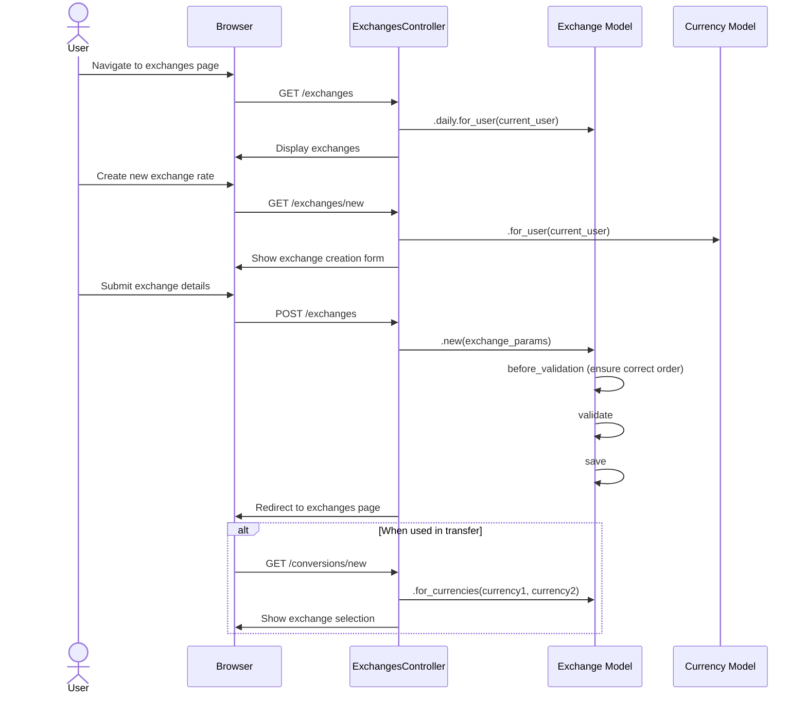
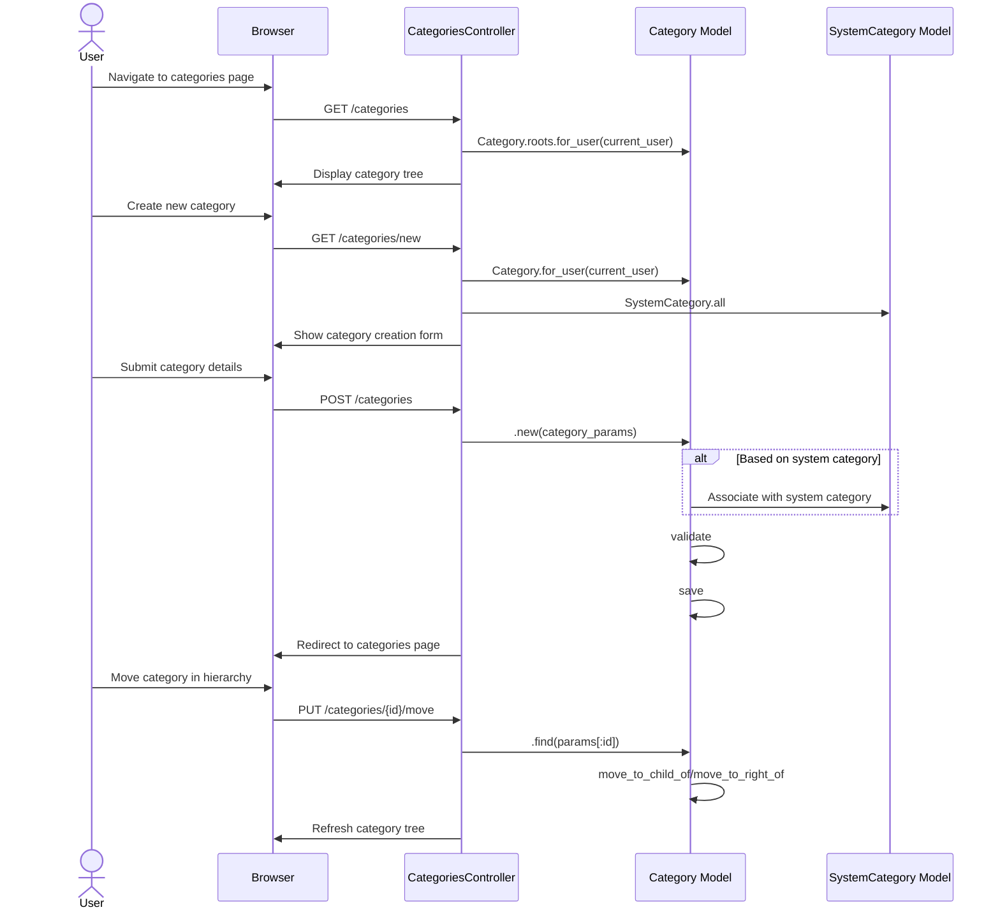

# Sequence Diagrams

This document contains sequence diagrams for key workflows in the application.

## User Registration and Authentication

## Creating a New Transfer

## Generating a Financial Report

## Setting and Tracking Financial Goals

## Currency Exchange Management

## Category Management

