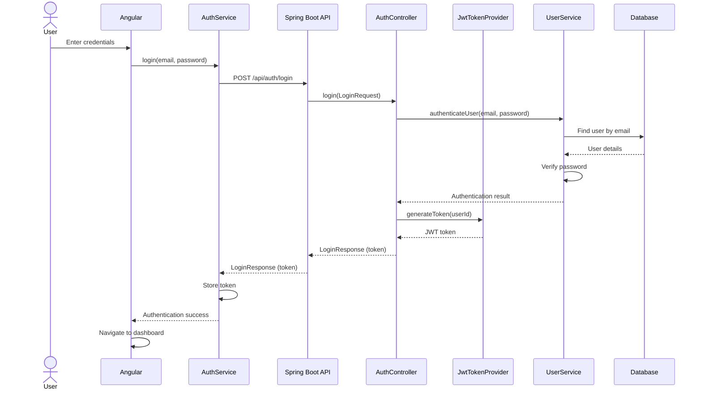
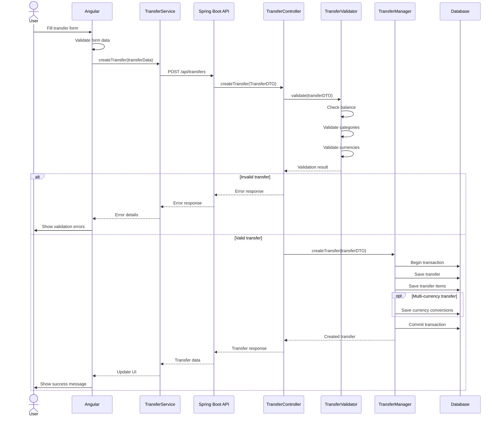
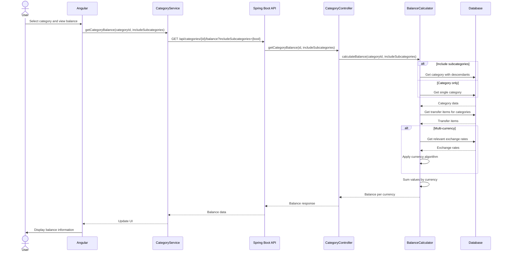
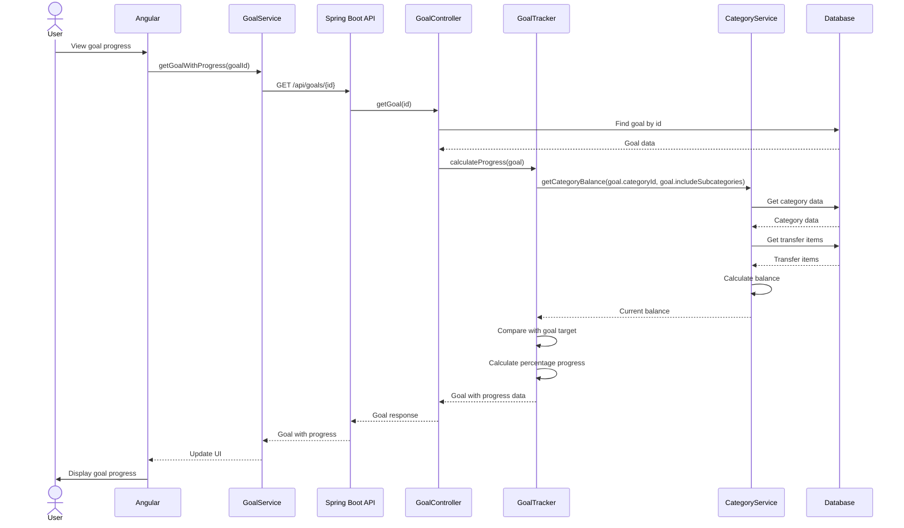
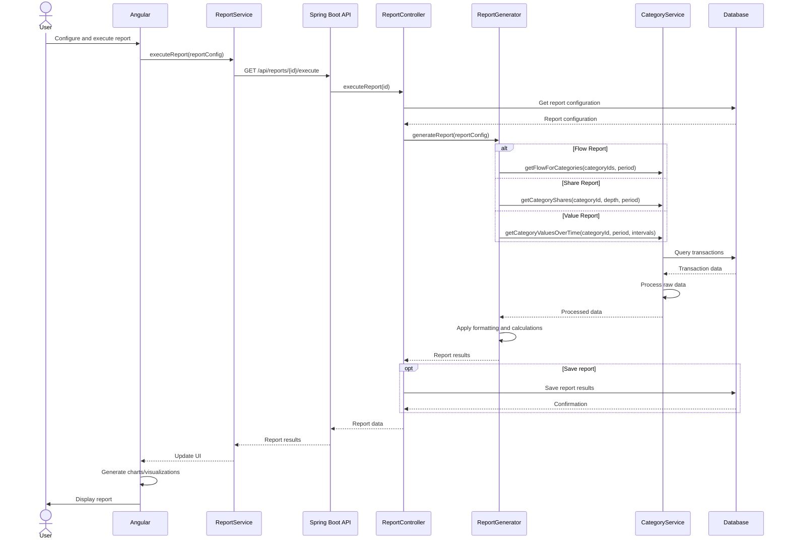
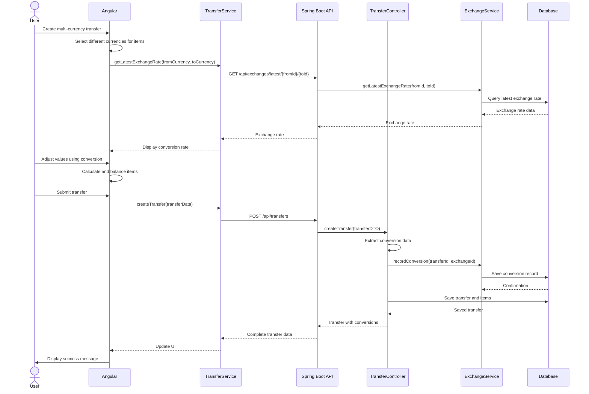
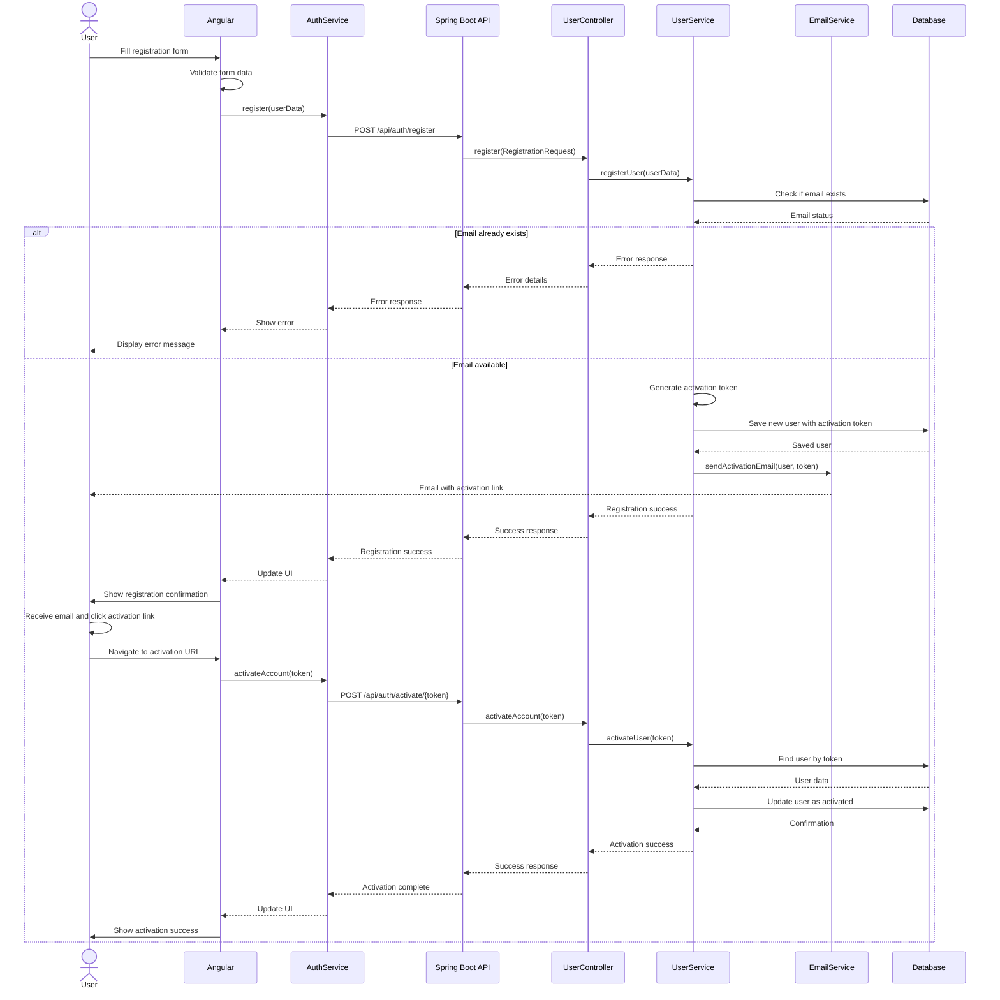
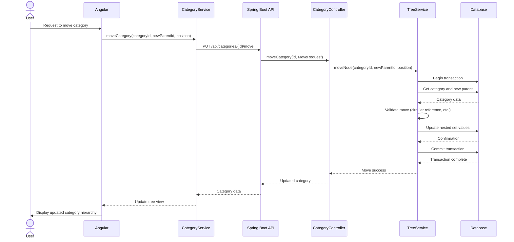
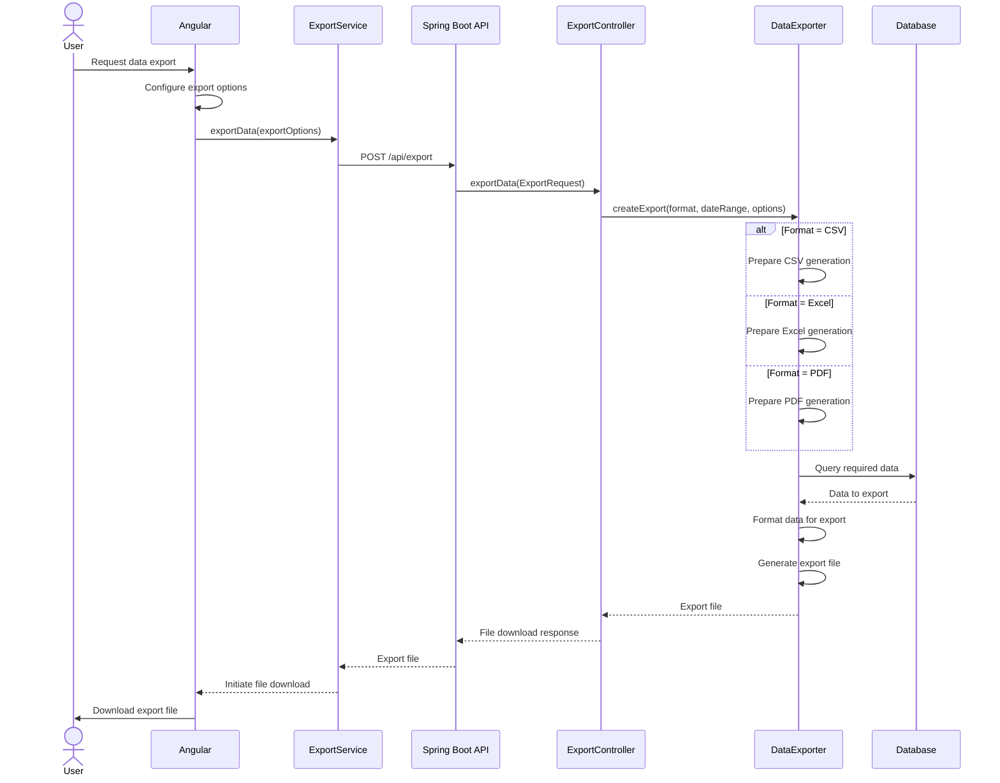

# Sequence Diagrams

This document contains sequence diagrams illustrating the key flows in the Financial Management System.

## User Authentication Flow

## Create Transfer Flow

## Category Balance Calculation Flow

## Goals Progress Tracking Flow

## Report Generation Flow

## Multi-Currency Transfer with Conversion Flow

## User Registration and Account Activation Flow

## Category Tree Management Flow

## Export Data Flow

