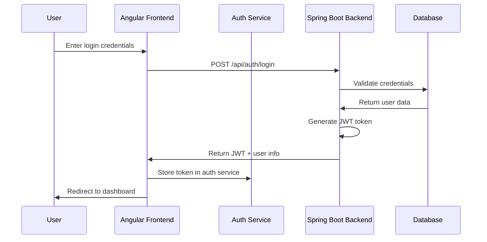
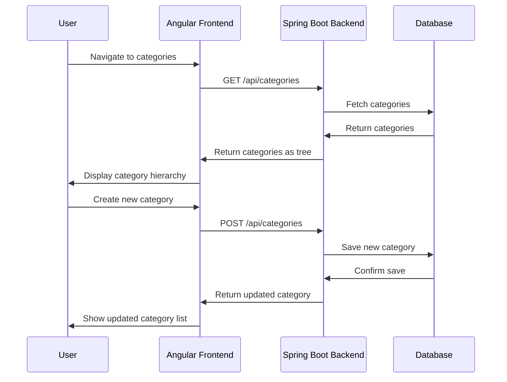
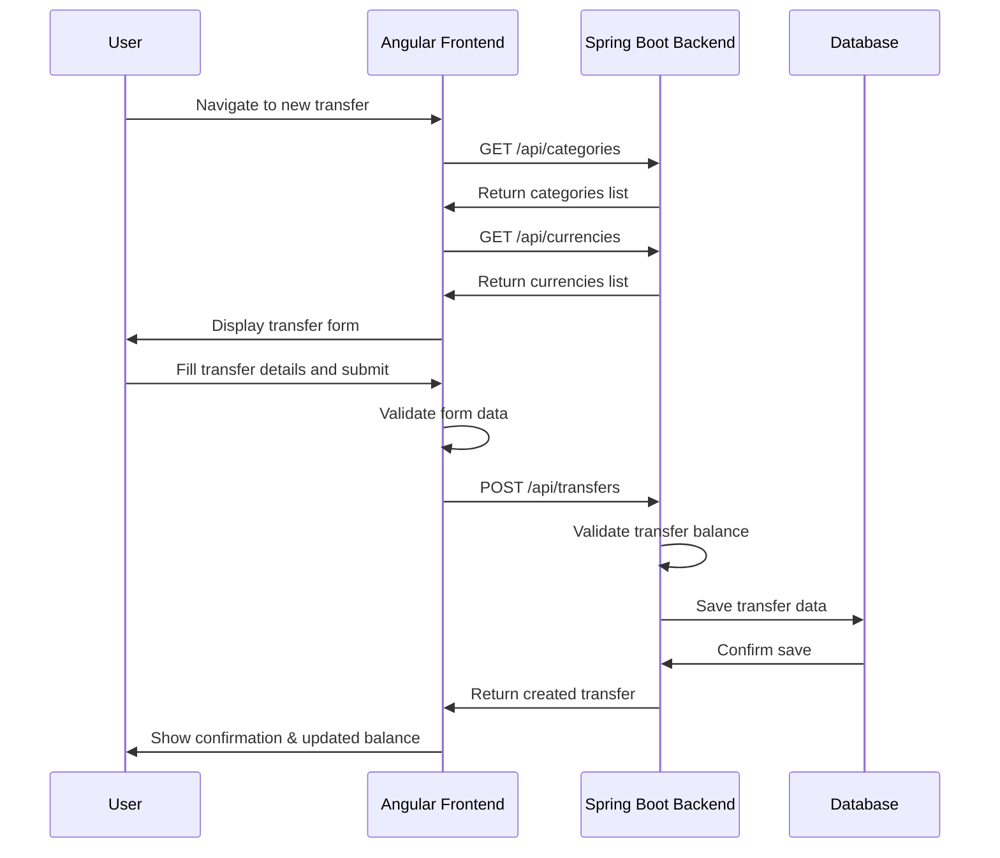
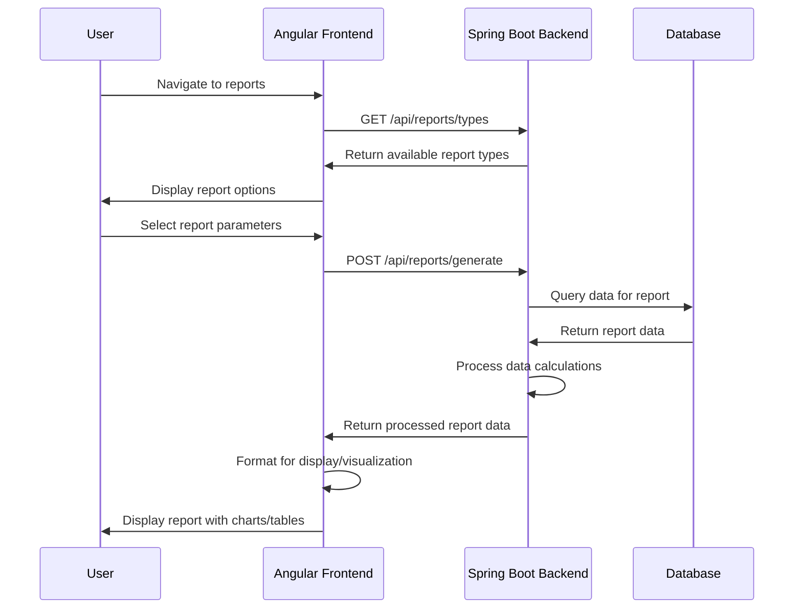
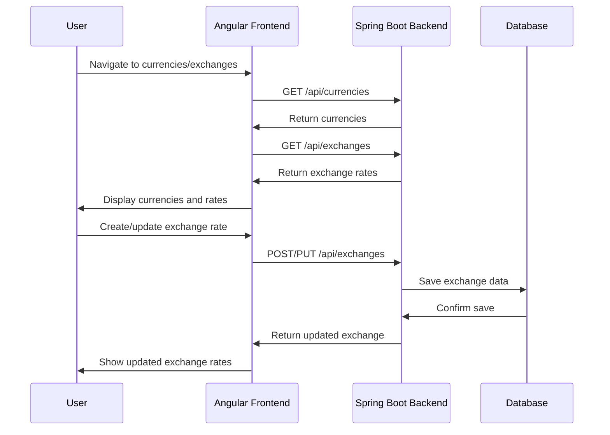

# Sequence Diagrams

This document contains sequence diagrams for the major workflows in the financial management system.

## User Authentication Flow

## Category Management Flow

## Transfer Creation Flow

## Report Generation Flow

## Currency Exchange Management Flow

