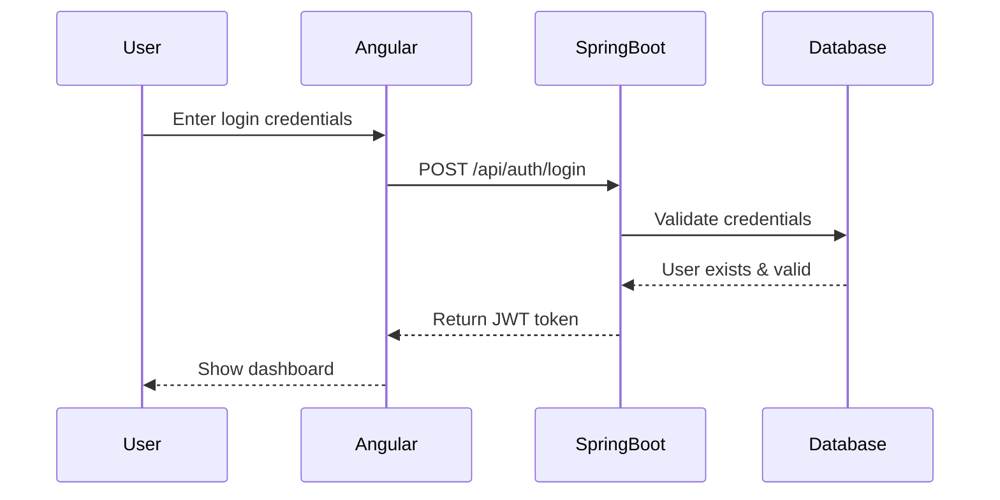
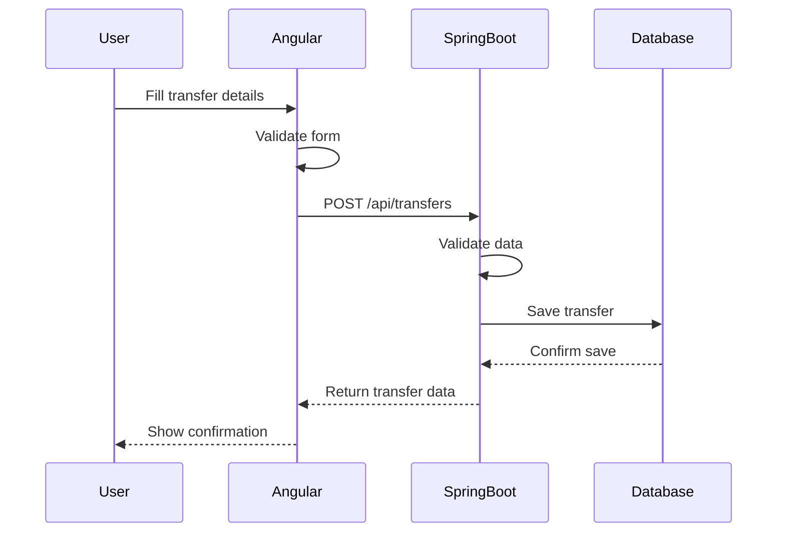
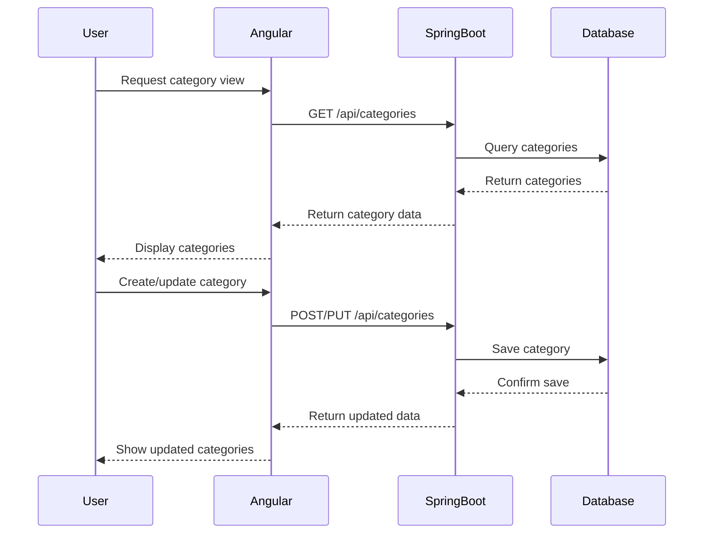

# System Overview

This document provides an overview of the application architecture as we migrate from Ruby on Rails to Angular + Spring Boot.

## System Purpose

The application appears to be a personal finance management system that allows users to:
1. Track income and expenses
2. Categorize transactions
3. Handle multiple currencies
4. Generate reports
5. Set financial goals

## Key Entities

1. **User** - A registered user of the system
2. **Category** - Hierarchical classification for transactions (Income, Expense, Asset, Loan, Balance)
3. **Transfer** - A financial transaction containing multiple items
4. **TransferItem** - Individual transaction components linked to categories
5. **Currency** - Monetary units used in transactions
6. **Exchange** - Currency conversion rates

## System Flow

The main workflow involves users creating transfers (transactions) which contain transfer items that are categorized appropriately. The system supports multiple currencies and tracks balances across categories.

## Architecture Overview

### Current Architecture (Ruby on Rails)
- Monolithic application with server-side rendering
- MVC pattern with ActiveRecord models
- Authentication using custom solution

### Target Architecture (Angular + Spring Boot)
- Single Page Application (SPA) with Angular frontend
- RESTful API using Spring Boot
- JWT authentication
- Clear separation of concerns between frontend and backend

## Data Flow Diagrams

### User Authentication Flow

### Transaction Creation Flow

### Category Management Flow
