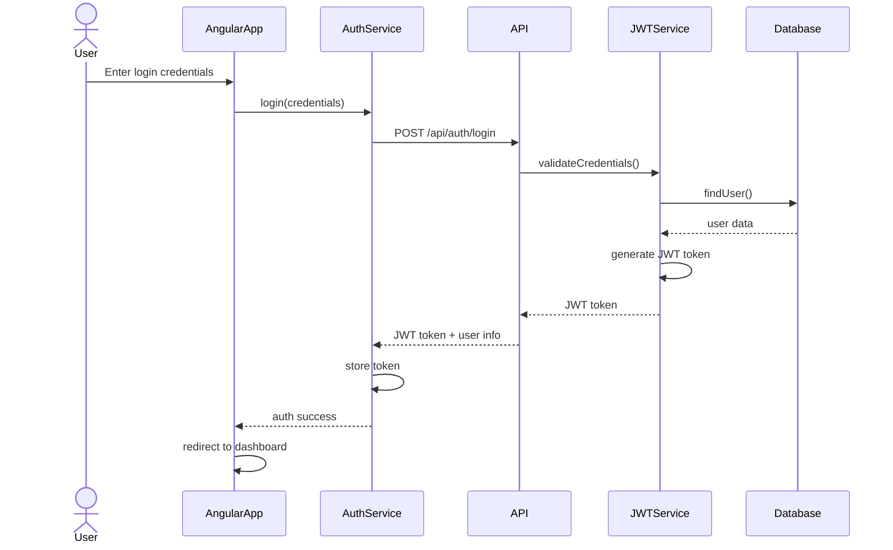
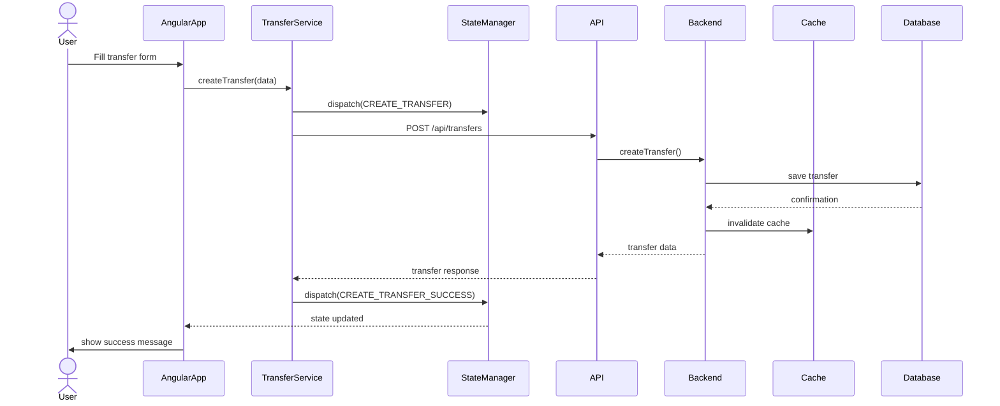
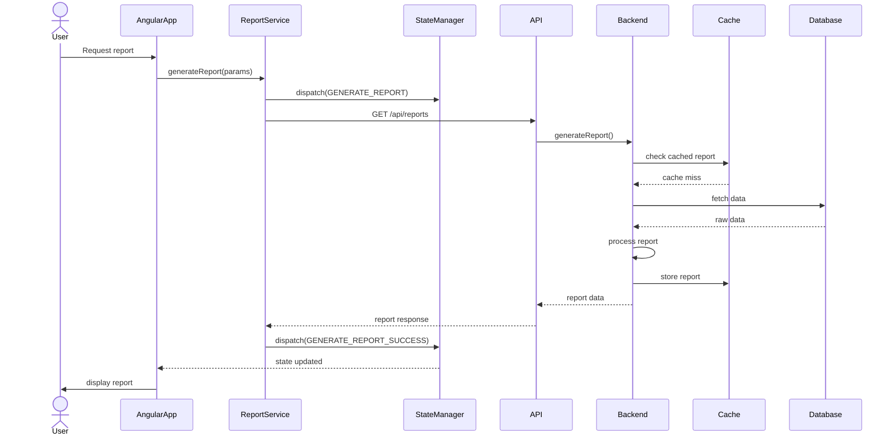
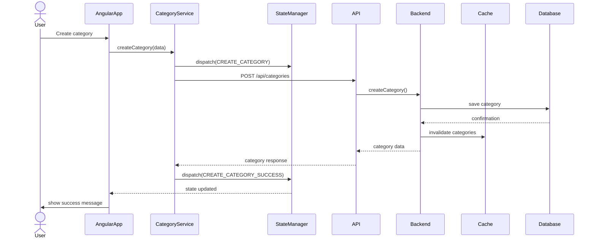
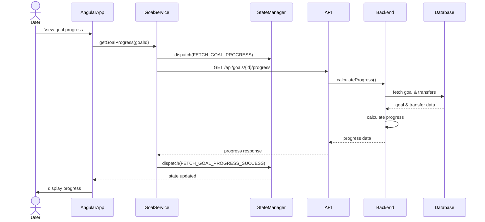
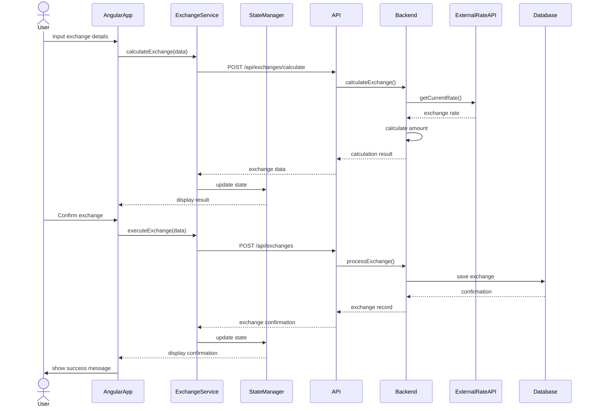

# Target State Sequence Diagrams

This document outlines the key interactions in the target state architecture with Angular frontend and Spring Boot backend.

## Authentication Flow

## Transfer Creation Flow

## Report Generation Flow

## Category Management Flow

## Goal Progress Tracking Flow

## Currency Exchange Flow

These sequence diagrams illustrate the main interactions between the frontend and backend components in the modernized architecture. They show how the system handles:

1. User authentication with JWT
2. Transfer management with state updates
3. Report generation with caching
4. Category management
5. Goal progress tracking
6. Currency exchange operations

Key improvements in the new architecture:
- Client-side state management
- Caching strategy
- Real-time updates
- Improved error handling
- Better separation of concerns
- Enhanced security with JWT
- Optimized data flow