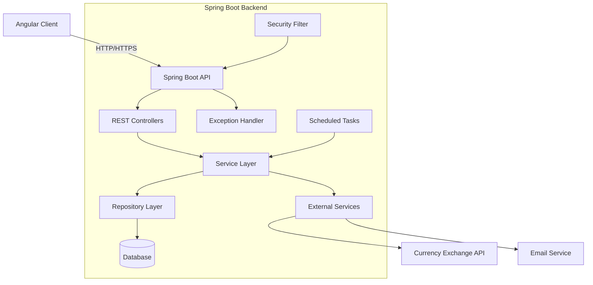
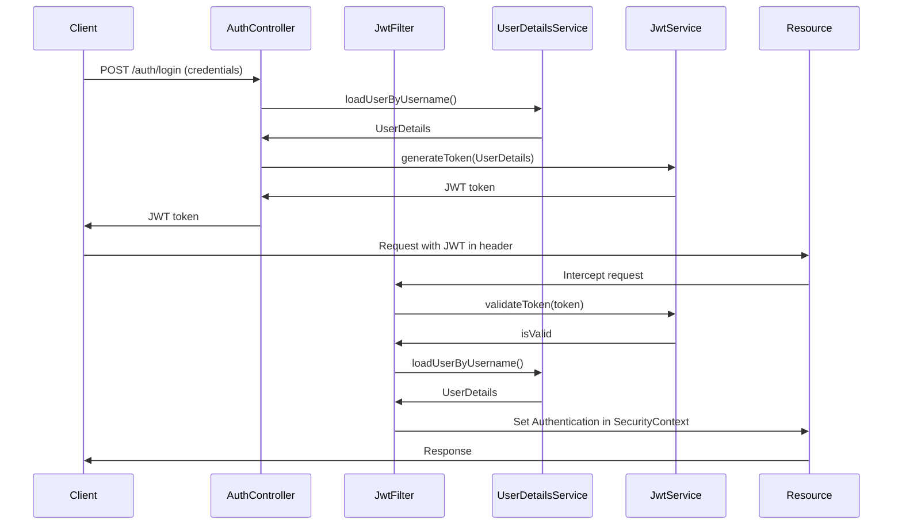

# Target State Architecture - Backend (Spring Boot)

## Overview

The new backend will be built using Spring Boot, providing a robust, scalable, and maintainable API for the personal finance application. This document outlines the architectural design for the Spring Boot backend that will replace the current Ruby on Rails backend.

## Technology Stack

- **Framework**: Spring Boot
- **Language**: Java
- **Build Tool**: Maven
- **Database Access**: Spring Data JPA
- **Database Migration**: Flyway
- **API Documentation**: SpringDoc OpenAPI (Swagger)
- **Security**: Spring Security with JWT authentication
- **Testing**: JUnit 5, Mockito, Spring Boot Test
- **Logging**: SLF4J with Logback
- **Scheduling**: Spring Scheduler
- **Validation**: Bean Validation (JSR-380)
- **Monitoring**: Spring Actuator

## Architecture Diagram



## Application Structure

The backend will follow a layered architecture with clear separation of concerns:

### Controller Layer

Responsible for handling HTTP requests and responses:

- **REST Controllers**: Define API endpoints
- **Request/Response DTOs**: Data transfer objects for API communication
- **Input Validation**: Validate incoming requests
- **Response Formatting**: Structure API responses

### Service Layer

Contains business logic and orchestrates operations:

- **Business Services**: Implement application logic
- **Transaction Management**: Ensure data consistency
- **Integration Services**: Communicate with external systems

### Repository Layer

Manages data access and persistence:

- **JPA Repositories**: Interface with the database
- **Query Methods**: Define data retrieval patterns
- **Custom Queries**: Complex database operations

### Domain Layer

Contains the domain model and business entities:

- **Entities**: JPA annotated domain objects
- **Value Objects**: Immutable objects representing domain concepts
- **Enumerations**: Type-safe constants

## Package Structure

```
com.financeapp
├── config/               # Configuration classes
├── controller/           # REST controllers
│   ├── dto/              # Data Transfer Objects
│   └── mapper/           # DTO-Entity mappers
├── domain/               # Domain entities
│   ├── entity/           # JPA entities
│   ├── enumeration/      # Enum types
│   └── valueobject/      # Value objects
├── exception/            # Custom exceptions and handlers
├── repository/           # Data access repositories
├── security/             # Authentication and authorization
├── service/              # Business logic services
│   ├── impl/             # Service implementations
│   └── integration/      # External service integrations
└── util/                 # Utility classes
```

## Database Design

The database schema will maintain the same entity relationships as the current application, with improvements for performance and maintainability:

- **Proper Indexing**: Optimize query performance
- **Normalization**: Ensure data integrity
- **Constraints**: Enforce data rules at the database level
- **Audit Fields**: Track creation and modification timestamps

## API Design

The API will follow RESTful principles:

- **Resource-Based URLs**: Clear and consistent URL structure
- **HTTP Methods**: Proper use of GET, POST, PUT, DELETE
- **HTTP Status Codes**: Appropriate status codes for different scenarios
- **Pagination**: For large collections
- **Sorting and Filtering**: Flexible data retrieval
- **HATEOAS**: Hypermedia links for navigation (where appropriate)

## Security Architecture



Security features include:

- **JWT Authentication**: Stateless authentication
- **Role-Based Access Control**: Restrict access based on user roles
- **Method Security**: Fine-grained access control
- **Password Encryption**: Secure password storage
- **CORS Configuration**: Control cross-origin requests
- **CSRF Protection**: Prevent cross-site request forgery
- **Rate Limiting**: Protect against abuse

## Exception Handling

A centralized exception handling strategy:

- **Global Exception Handler**: Consistent error responses
- **Custom Exceptions**: Domain-specific exception types
- **Useful Error Messages**: Clear feedback for debugging
- **Appropriate Status Codes**: Correct HTTP status for each error type

## Validation

Input validation at multiple levels:

- **Bean Validation**: Annotate DTOs with constraints
- **Custom Validators**: For complex validation rules
- **Service-Level Validation**: Business rule validation

## Async Processing

Handle long-running tasks asynchronously:

- **@Async Methods**: Non-blocking operations
- **Scheduled Tasks**: Periodic jobs (like exchange rate updates)
- **Event-Driven Architecture**: For loosely coupled components

## Caching Strategy

Improve performance with strategic caching:

- **Spring Cache Abstraction**: Declarative caching
- **Cache Management**: TTL and invalidation policies
- **Distributed Caching**: For scalability (Redis/Hazelcast)

## Monitoring and Observability

Built-in monitoring capabilities:

- **Health Checks**: Verify application health
- **Metrics**: Track performance indicators
- **Audit Logging**: Record important activities
- **Distributed Tracing**: Track requests across components

## Testing Strategy

Comprehensive testing approach:

- **Unit Tests**: For individual components
- **Integration Tests**: For component interactions
- **API Tests**: Verify endpoint behavior
- **Database Tests**: Test repository layer
- **Security Tests**: Verify authentication and authorization

## Deployment Model

Flexible deployment options:

- **Containerization**: Docker for consistent environments
- **Configuration Externalization**: Environment-specific settings
- **Graceful Shutdown**: Handle termination properly
- **Health Probes**: For container orchestration