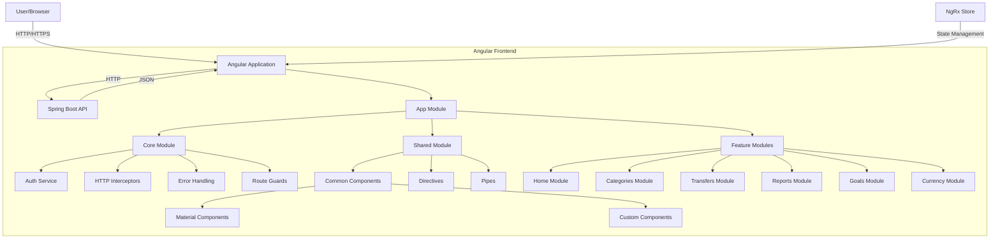
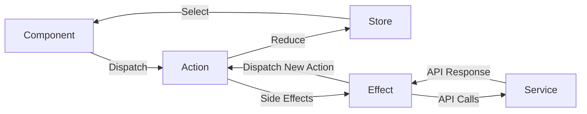

# Target State Architecture - Frontend (Angular)

## Overview

The new frontend will be built using Angular framework, providing a modern, responsive, and interactive user interface for the personal finance application. This document outlines the architectural design for the Angular frontend that will replace the current Ruby on Rails views.

## Technology Stack

- **Framework**: Angular (latest stable version)
- **Language**: TypeScript
- **State Management**: NgRx Store
- **UI Components**: Angular Material
- **CSS**: SCSS with style encapsulation
- **Charting**: NgxCharts or Chart.js
- **HTTP**: Angular HttpClient
- **Testing**: Jasmine, Karma, Protractor
- **Build Tool**: Angular CLI
- **Package Management**: npm

## Architecture Diagram



## Module Structure

### App Module

The root module that bootstraps the application and orchestrates the other modules.

### Core Module

Contains singleton services and components that are used only once in the application:

- **Authentication Service**: Manages user authentication
- **HTTP Interceptors**: Handle authentication tokens, error responses
- **Global Error Handler**: Centralized error handling
- **Route Guards**: Protect routes based on authentication/authorization

### Shared Module

Contains reusable components, directives, and pipes used across multiple feature modules:

- **Layout Components**: Header, footer, navigation
- **UI Components**: Buttons, form controls, dialogs
- **Directives**: Custom directives for common behaviors
- **Pipes**: Formatting, filtering, and transformative pipes

### Feature Modules

Separate modules for each major feature area:

1. **Home Module**: Dashboard and overview
2. **Categories Module**: Category management
3. **Transfers Module**: Financial transaction management
4. **Reports Module**: Financial reporting and analysis
5. **Goals Module**: Financial goal planning and tracking
6. **Currency Module**: Currency and exchange rate management
7. **User Module**: User profile and settings

## State Management

The application will use NgRx Store for state management, following a unidirectional data flow:



Each feature module will have its own state slice with:

- **Actions**: Descriptive events
- **Reducers**: Pure functions for state changes
- **Selectors**: State queries
- **Effects**: Side effects like API calls

## Component Architecture

Components will follow a presentational/container pattern:

- **Container Components**: Connect to the store, handle business logic
- **Presentational Components**: Receive data via inputs, emit events via outputs

```mermaid
graph TD
    Container[Container Component] --> |@Input| Presentation1[Presentational Component 1]
    Container --> |@Input| Presentation2[Presentational Component 2]
    Presentation1 --> |@Output| Container
    Presentation2 --> |@Output| Container
    Container <--> |Store| State[NgRx Store]
```

## Routing Structure

The application will use Angular's router with a hierarchical structure:

```
/
├── home
├── categories
│   ├── :id (view)
│   ├── new
│   └── edit/:id
├── transfers
│   ├── :id (view)
│   ├── new
│   └── edit/:id
├── reports
│   ├── :id (view)
│   ├── new
│   └── edit/:id
├── goals
│   ├── :id (view)
│   ├── new
│   └── edit/:id
├── currencies
│   ├── :id (view)
│   ├── new
│   └── edit/:id
├── exchanges
│   ├── :id (view)
│   ├── new
│   └── edit/:id
├── profile
└── settings
```

## API Communication

The frontend will communicate with the Spring Boot backend using RESTful API calls:

- **HttpClient**: Angular's built-in HTTP client
- **Interceptors**: Add authentication tokens, handle errors
- **Services**: Encapsulate API calls and provide data to components via observables

## Authentication & Security

- **JWT Authentication**: Token-based authentication
- **Route Guards**: Protect routes requiring authentication
- **HTTPS**: Secure communication
- **XSS Protection**: Content Security Policy, sanitization
- **CSRF Protection**: Anti-forgery tokens

## UI/UX Design Principles

- **Responsive Design**: Mobile-first approach
- **Material Design**: Consistent look and feel
- **Accessibility**: WCAG compliance
- **Lazy Loading**: Improve initial load time
- **Progressive Enhancement**: Basic functionality without JavaScript
- **Offline Support**: Progressive Web App capabilities

## Forms Strategy

- **Reactive Forms**: For complex forms with dynamic validation
- **Form Models**: Strong typing for form data
- **Validation**: Client-side validation with server confirmation
- **Dynamic Forms**: For configurable or complex forms

## Error Handling

- **Global Error Handler**: Catch and process uncaught exceptions
- **Form Validation Errors**: Inline user feedback
- **API Errors**: Consistent error messages
- **Logging**: Client-side error logging

## Testing Strategy

- **Unit Tests**: For services, pipes, components
- **Integration Tests**: For component interactions
- **E2E Tests**: For critical user flows

## Build & Deployment

- **Development**: Angular CLI dev server
- **Production**: Optimized build with ahead-of-time compilation
- **CI/CD**: Automated build and deployment pipeline
- **Containerization**: Docker container for consistent environments