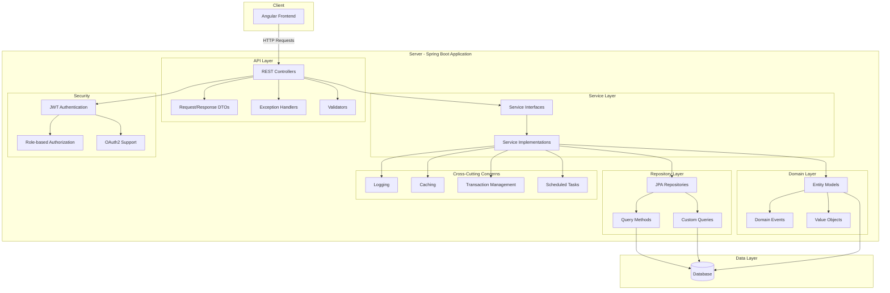

# Target State Architecture for Spring Boot Backend

## Overview

The backend will be reimplemented using Spring Boot to provide a modern, robust, and scalable RESTful API service. This architecture will leverage Spring's features for security, data access, and business logic implementation.

## Architecture Overview

## Components and Structure

### API Layer
- **REST Controllers**: Expose REST endpoints for client communication
- **Request/Response DTOs**: Data Transfer Objects for API input/output
- **Exception Handlers**: Global and specific exception handling
- **Validators**: Input validation and error response formatting

### Service Layer
- **Service Interfaces**: Define business operations
- **Service Implementations**: Implement business logic and orchestrate operations
- **Mappers**: Convert between DTOs and domain objects

### Repository Layer
- **JPA Repositories**: Spring Data JPA interfaces for database access
- **Query Methods**: Method-name-based query generation
- **Custom Queries**: Complex queries using JPQL or native SQL
- **Specifications**: Dynamic query building

### Domain Layer
- **Entity Models**: JPA entities representing database tables
- **Domain Events**: Business events for domain-driven design
- **Value Objects**: Immutable objects for domain concepts

### Security
- **JWT Authentication**: Token-based authentication
- **Role-based Authorization**: Secure endpoints based on user roles
- **OAuth2 Support**: Optional integration with external auth providers

### Cross-Cutting Concerns
- **Logging**: Centralized logging with MDC context
- **Caching**: Performance optimization for frequently accessed data
- **Transaction Management**: ACID operations
- **Scheduled Tasks**: Background jobs and recurring operations

## Key Features Implementation

### Authentication and User Management
- User registration, login, and profile management
- Password hashing and security
- Token-based authentication with JWT
- Session management

### Financial Categories
- Hierarchical category structure using JPA entity relationships
- Efficient tree operations with materialized paths or nested sets
- Category type enforcement and validation

### Transfers and Transfer Items
- Transaction management for atomic operations
- Multi-item transfer processing
- Validation for balanced debits and credits

### Multi-currency Support
- Currency management
- Exchange rate tracking
- Currency conversion for reports and calculations

### Reporting
- Report generation services
- Data aggregation for different report types
- Background processing for complex reports

### Goals
- Goal tracking and progress calculation
- Recurring goals management
- Notifications for goal-related events

## Technology Stack

- **Core Framework**: Spring Boot 2.7+ / 3.x
- **API Development**: Spring MVC, Spring RestDocs
- **Data Access**: Spring Data JPA, Hibernate
- **Database**: PostgreSQL or MySQL
- **Security**: Spring Security, JWT
- **Testing**: JUnit 5, Mockito, TestContainers
- **Build Tool**: Maven or Gradle
- **Documentation**: OpenAPI (Springdoc or Springfox)

## API Design Principles

1. **RESTful Resources**: Design API around business domain resources
2. **HATEOAS**: Provide hypermedia links for resource discovery
3. **Versioning**: API versioning strategy (URI, header, or content negotiation)
4. **Pagination**: Consistent pagination for list resources
5. **Error Handling**: Standardized error responses with codes and messages
6. **Validation**: Input validation with clear error feedback
7. **Content Negotiation**: Support for different content types (JSON, XML)

## Database Schema Migration

- Database migration using Flyway or Liquibase
- Scripts to convert from existing schema to new schema
- Data migration utilities

## Performance Considerations

- Connection pooling with HikariCP
- Caching with Spring Cache abstraction
- Query optimization
- Pagination for large data sets
- Lazy loading for entity relationships

## Security Measures

- HTTPS-only communication
- CSRF protection
- XSS prevention
- Input sanitization
- Password policy enforcement
- Rate limiting for API endpoints
- SQL injection prevention with parameterized queries

## Testing Strategy

- Unit tests for service and utility classes
- Integration tests with TestContainers
- API tests with RestAssured
- Security tests
- Performance testing
- Code coverage metrics

## Monitoring and Operations

- Actuator endpoints for application health and metrics
- Micrometer integration for metrics collection
- Logging with SLF4J and Logback
- Application events for audit trail
- Graceful shutdown handling