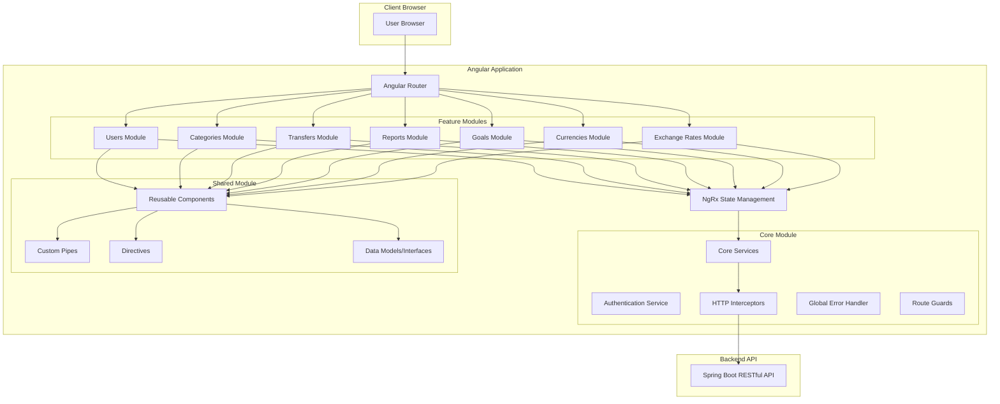

# Target State Architecture for Angular Frontend

## Overview

The frontend will be rebuilt using Angular, a modern TypeScript-based framework for building single-page applications (SPAs). This approach will provide a more responsive user experience, improved maintainability, and better separation of concerns.

## Architecture Overview

## Components and Structure

### Core Module
- **Authentication Service**: Handles user login, registration, and session management
- **HTTP Interceptors**: Add authentication tokens to requests, handle errors, and manage API responses
- **Error Handler**: Global error handling and logging
- **Route Guards**: Protect routes based on authentication status and user roles
- **Core Services**: Base API service, current user service, etc.

### Shared Module
- **Reusable Components**: 
  - UI components (buttons, cards, forms, tables)
  - Navigation components (sidebar, header)
  - Custom form controls
  - Modal dialogs
  - Alert/notification component
- **Custom Pipes**: Formatting, filtering, and transformation pipes
- **Directives**: Custom DOM manipulations and behaviors
- **Models/Interfaces**: TypeScript interfaces for backend models

### Feature Modules

#### Users Module
- User registration
- Login/logout functionality
- User profile management
- Account settings and preferences

#### Categories Module
- Category list and tree view
- Category creation/editing forms
- Category selection components
- Hierarchical display components

#### Transfers Module
- Transfer list with filtering and pagination
- Transfer creation and editing forms
- Quick transfer component
- Transfer items management interface
- Transfer search functionality

#### Reports Module
- Report list
- Report generation forms
- Different report type components:
  - Share reports
  - Value reports
  - Flow reports
- Interactive chart components
- Report filters and parameters

#### Goals Module
- Goal list
- Goal creation and editing forms
- Goal progress visualization
- Goal filters and sorting

#### Currencies Module
- Currency list
- Currency creation/editing
- Default currency selection

#### Exchange Rates Module
- Exchange rate table
- Exchange rate history
- Exchange rate creation/update forms

### NgRx State Management
- **Store**: Central state container
- **Actions**: User-triggered events
- **Reducers**: State transition functions
- **Effects**: Side effect handling for API calls
- **Selectors**: State queries
- **Entity**: Normalized data storage

## Design Principles

1. **Component-Based Architecture**: Breaking UI into small, reusable components
2. **Smart/Presentation Components**: Separating container (smart) components from presentation components
3. **Reactive Programming**: Using RxJS for handling asynchronous operations
4. **State Management**: Centralizing application state with NgRx
5. **Lazy Loading**: Loading feature modules on demand to improve initial load time
6. **Responsive Design**: Using CSS frameworks (Angular Material) to ensure mobile compatibility
7. **Accessibility (a11y)**: Ensuring the application is usable by people with disabilities

## Technologies and Libraries

- **Angular**: Core framework
- **TypeScript**: Programming language
- **RxJS**: Reactive extensions for handling asynchronous operations
- **NgRx**: State management
- **Angular Material**: UI component library
- **Chart.js** or **ngx-charts**: For graphical reports
- **Moment.js**: Date manipulation
- **ng-bootstrap**: Bootstrap components for Angular
- **ngx-translate**: Internationalization

## API Communication

- RESTful API calls to Spring Boot backend
- HTTP Interceptors for authentication headers
- Error handling and retry logic
- Caching strategies for frequently used data
- Optimistic updates for improved user experience

## Security Considerations

- CSRF protection
- XSS prevention
- JWT token storage in HttpOnly cookies
- Route guards for protected routes
- Input validation and sanitization
- Secure handling of sensitive data

## Testing Strategy

- Unit tests with Jasmine and Karma
- Component tests with Angular Testing Library
- End-to-end tests with Cypress or Protractor
- Mock HTTP responses using HttpClientTestingModule
- Test coverage reporting