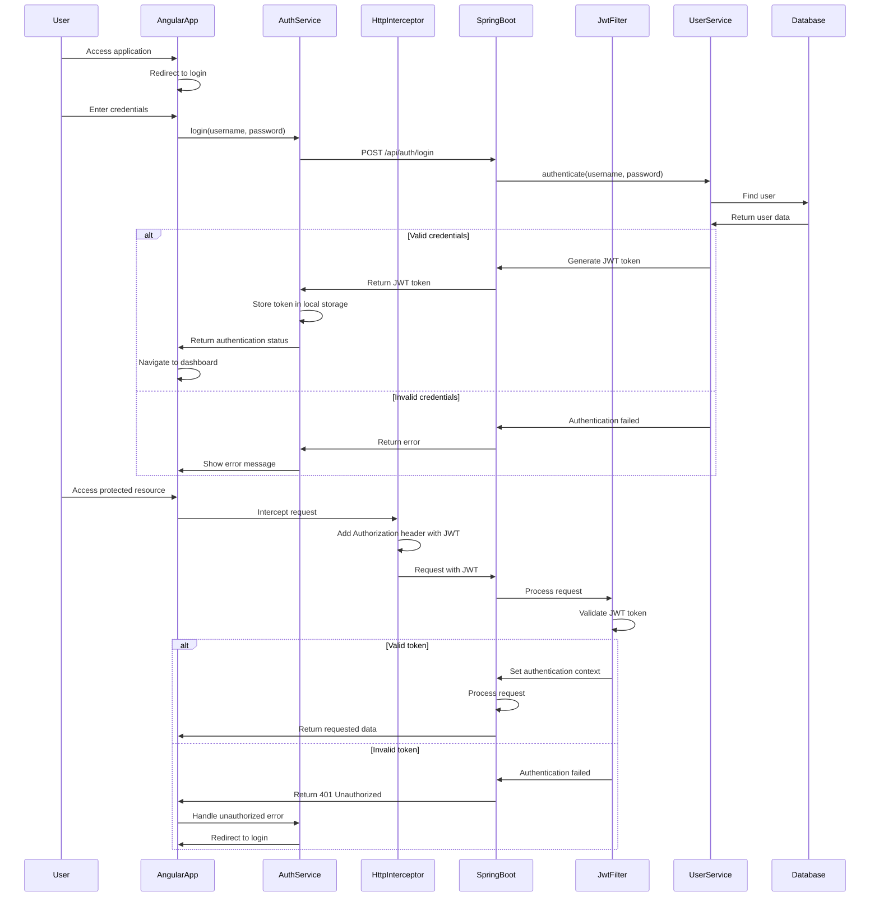
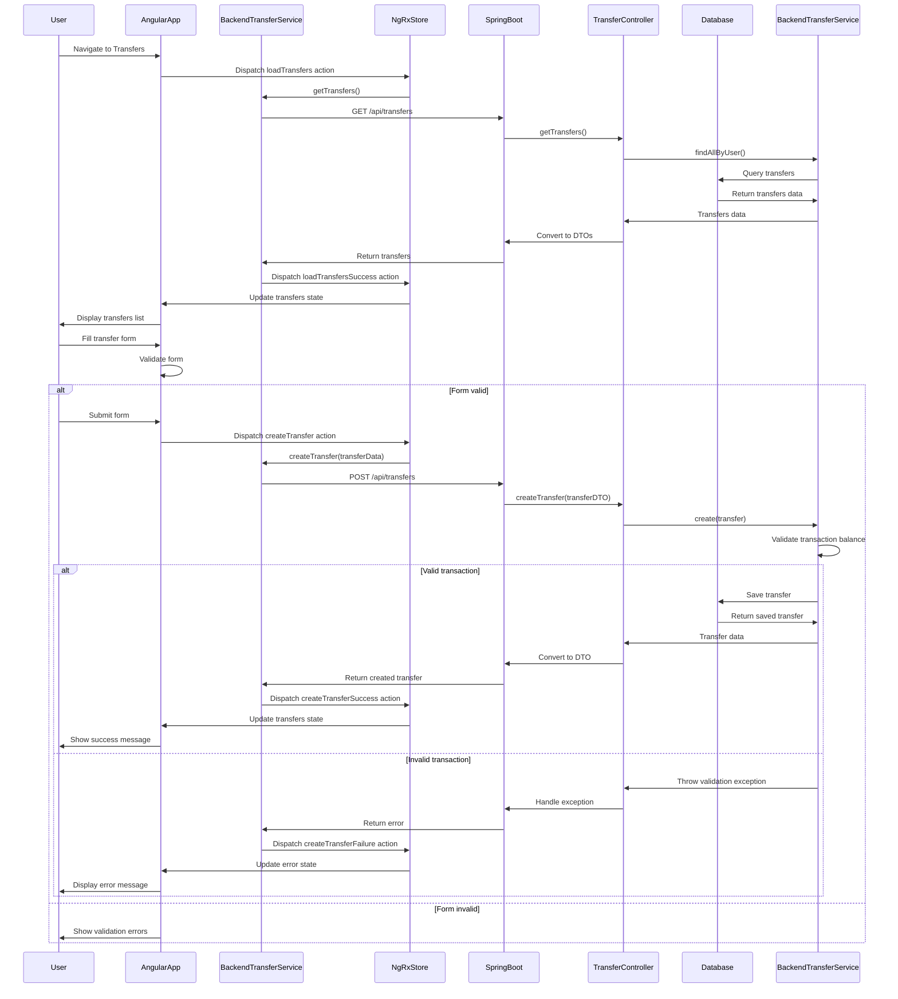
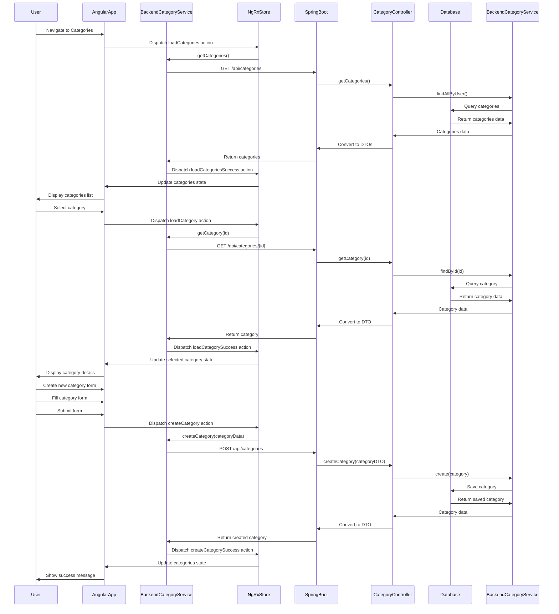
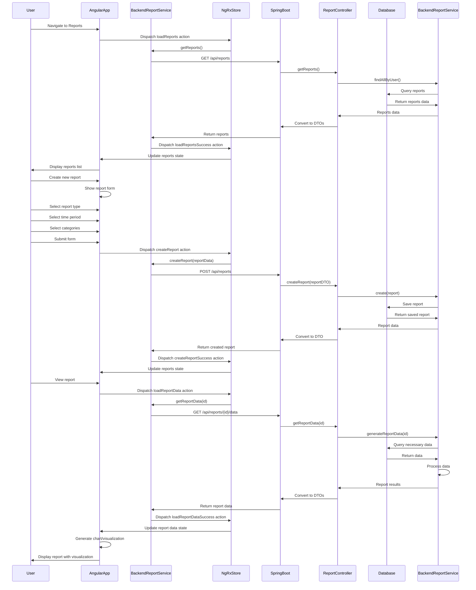
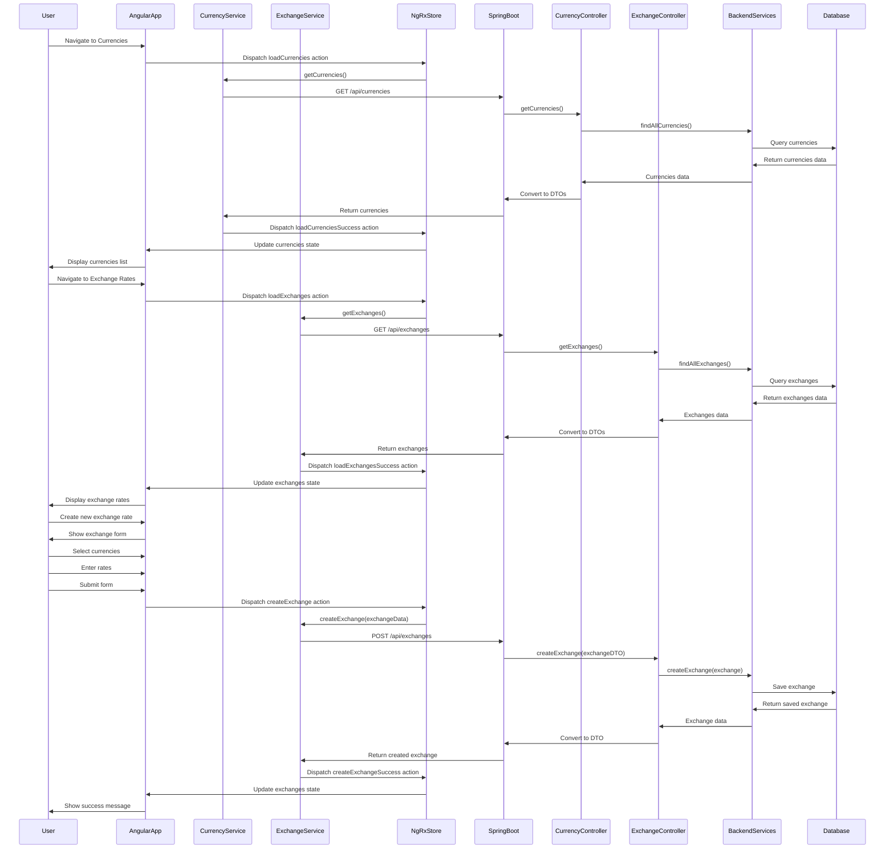
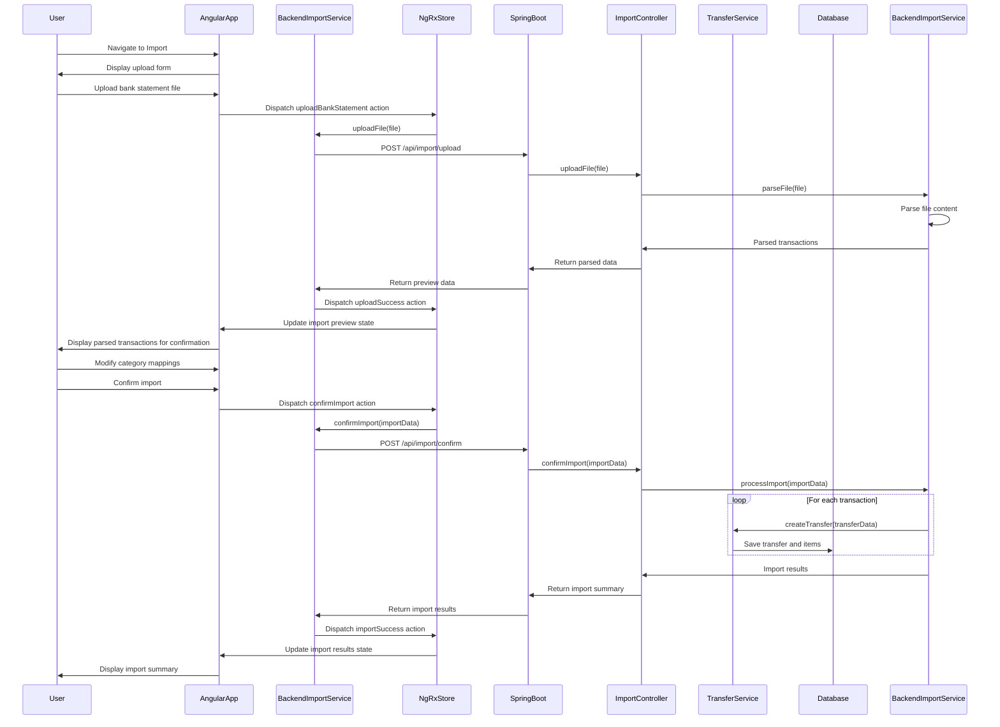

# Target State Sequence Diagram

This document illustrates the key sequences and flows in the target Angular frontend and Spring Boot backend architecture.

## Authentication Flow

## Transfer Creation Flow

## Category Management Flow

## Report Generation Flow

## Currency Exchange Management Flow

## Import Bank Statement Flow

These sequence diagrams illustrate the primary flows in the target architecture, highlighting the interactions between the Angular frontend, NgRx state management, Spring Boot backend, and database. They demonstrate how the modernized application will handle key user interactions while maintaining a clean separation of concerns between frontend and backend components.