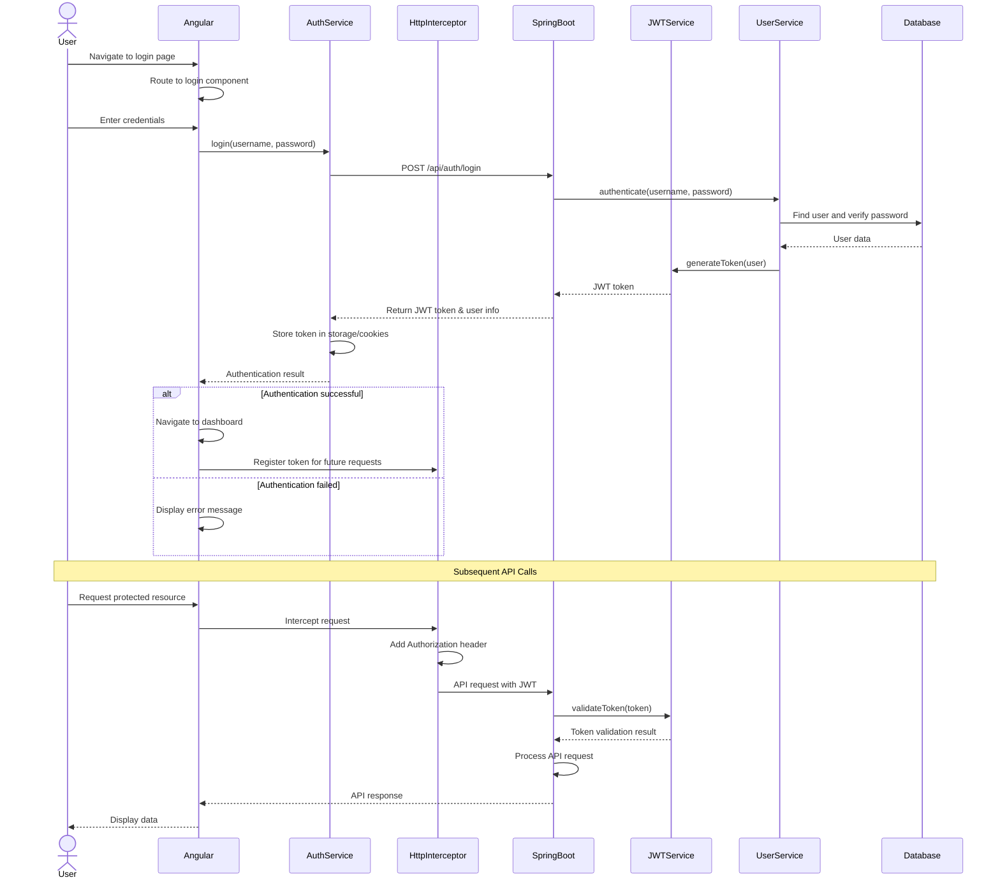
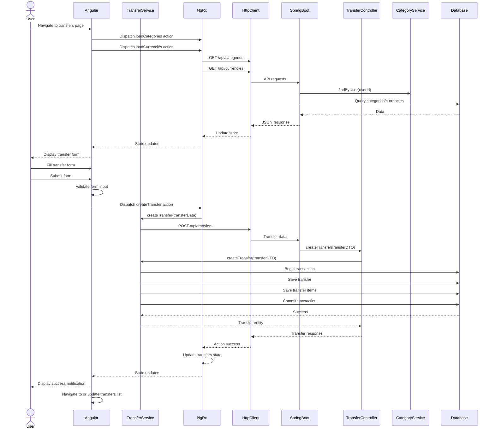
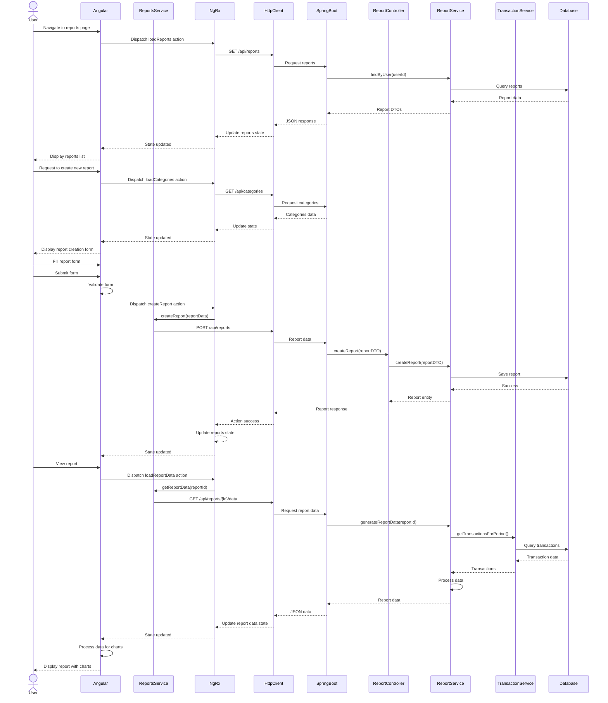
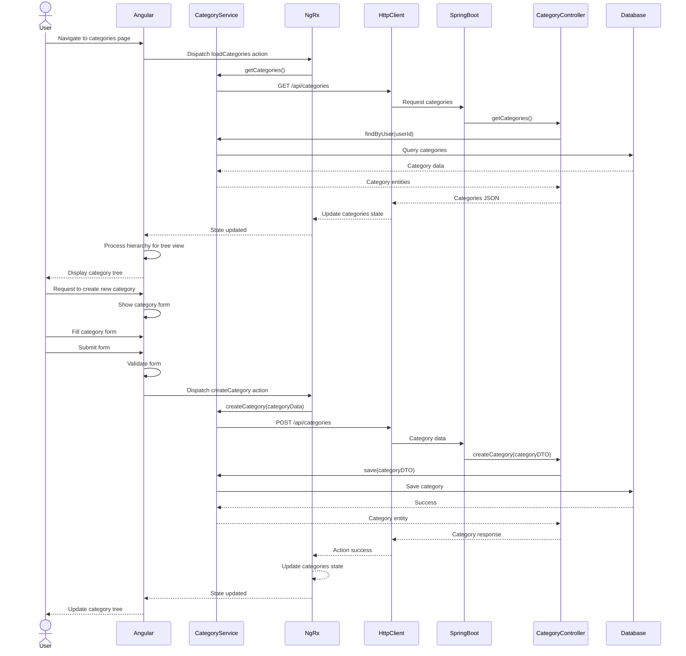
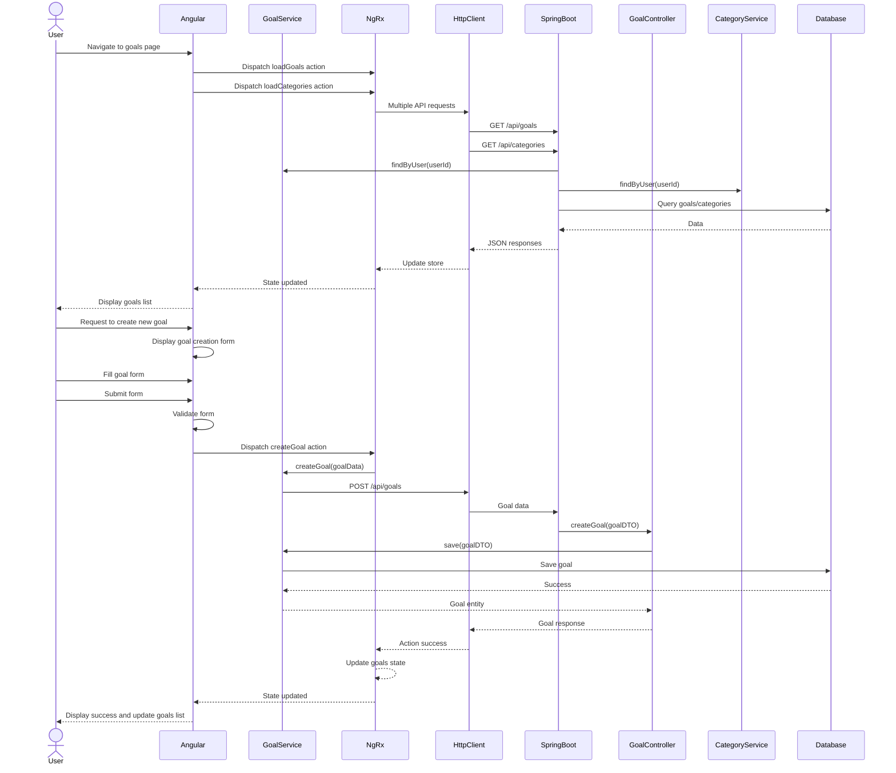

# Target State Sequence Diagram

## Key User Flows in the Modernized Application

This document illustrates the primary interaction flows in the target Angular/Spring Boot application.

### 1. User Authentication Flow

### 2. Transfer Creation Flow

### 3. Report Generation Flow

### 4. Category Management Flow

### 5. Goal Setting Flow

These sequence diagrams illustrate the key user flows in the target Angular/Spring Boot application, showing the interactions between the user, frontend, state management, API layer, services, and database.