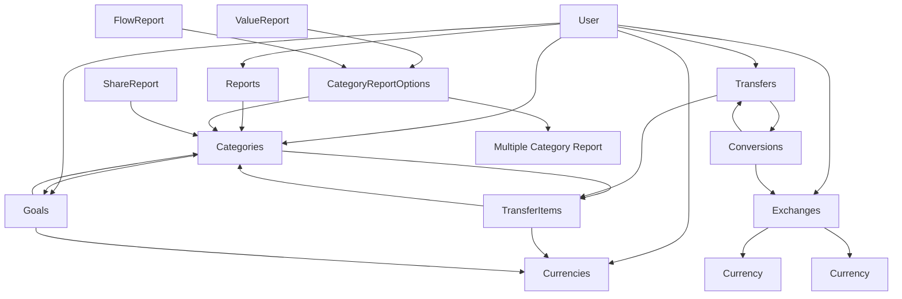
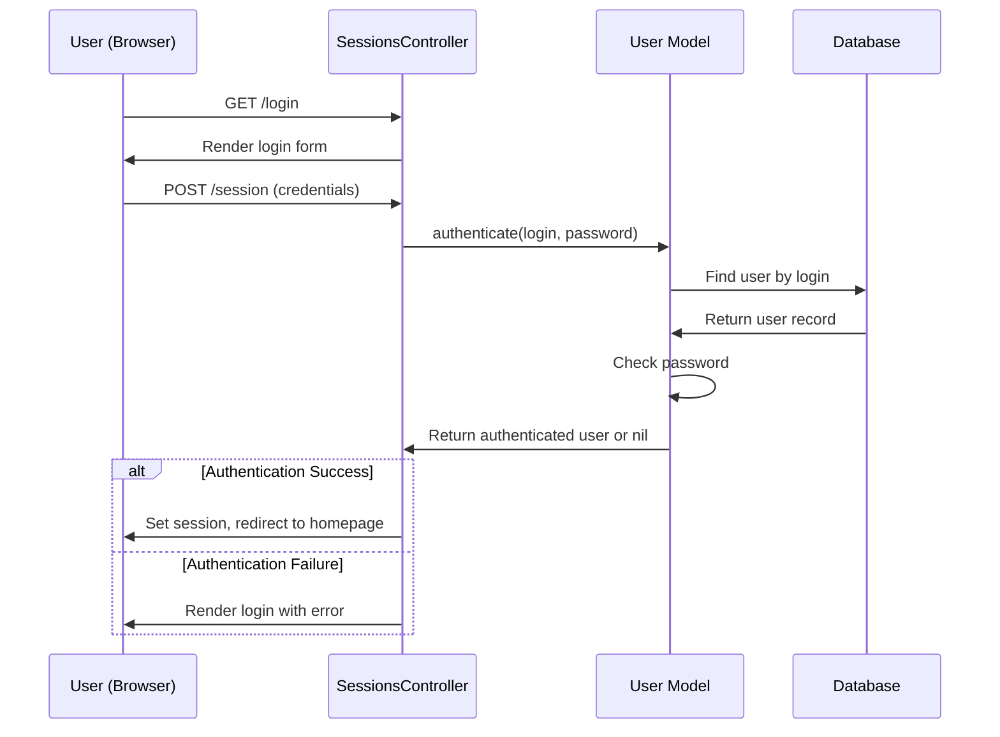
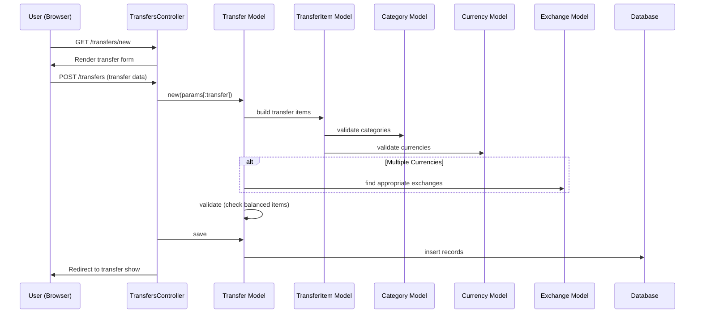
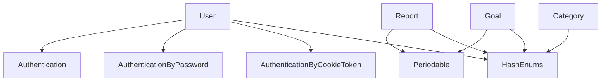
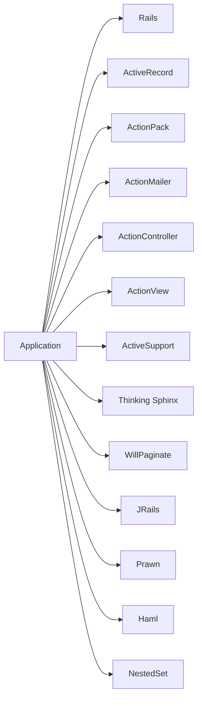

# Technical Dependencies

This document outlines the technical dependencies between components in the Ruby on Rails application.

## Database Dependencies

## Controller Dependencies

```mermaid
graph TD
    ApplicationController --> User
    
    CategoriesController --> Categories
    CategoriesController --> ApplicationController
    
    CreditorsController --> Categories
    CreditorsController --> ApplicationController
    
    CurrenciesController --> Currencies
    CurrenciesController --> ApplicationController
    
    ExchangesController --> Exchanges
    ExchangesController --> Currencies
    ExchangesController --> ApplicationController
    
    GoalsController --> Goals
    GoalsController --> Categories
    GoalsController --> Currencies
    GoalsController --> ApplicationController
    
    ReportsController --> Reports
    ReportsController --> Categories
    ReportsController --> ApplicationController
    
    TransfersController --> Transfers
    TransfersController --> TransferItems
    TransfersController --> Categories
    TransfersController --> Currencies
    TransfersController --> Exchanges
    TransfersController --> ApplicationController
    
    UsersController --> User
    UsersController --> ApplicationController
    
    SessionsController --> User
    SessionsController --> ApplicationController
    
    AutocompleteController --> Transfers
    AutocompleteController --> ApplicationController
```

## Key Process Flows

### User Authentication Flow

### Transfer Creation Flow

## Module Dependencies

## External Dependencies (Gems)

