# User Workflows Documentation

This document outlines the key user workflows and interactions within the financial management application. Understanding these workflows is crucial for reengineering the application to an Angular and Node.js stack while preserving the existing functionality.

## Authentication Flows

### User Registration and Activation

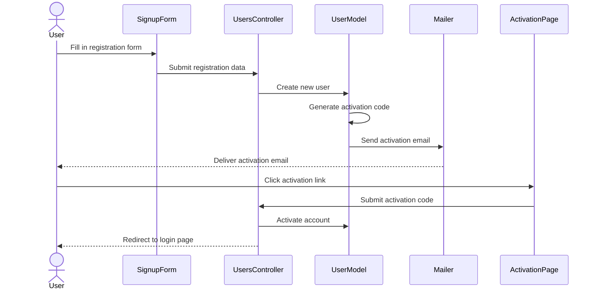

### User Login

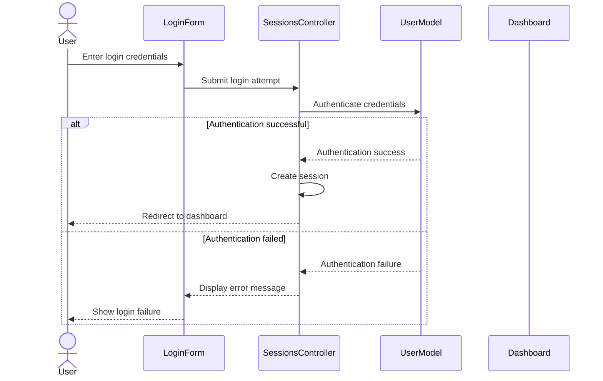

## Core Financial Workflows

### Managing Categories

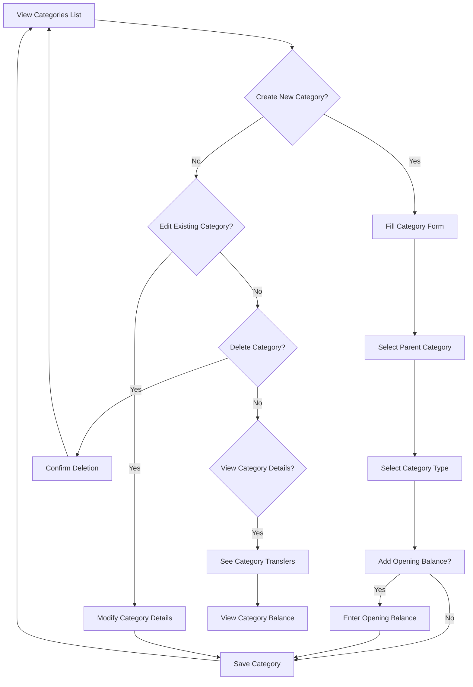

### Creating Transfers (Transactions)

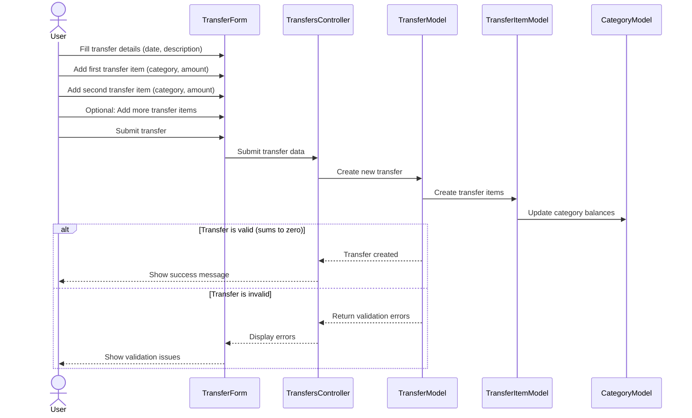

### Quick Transfer Workflow

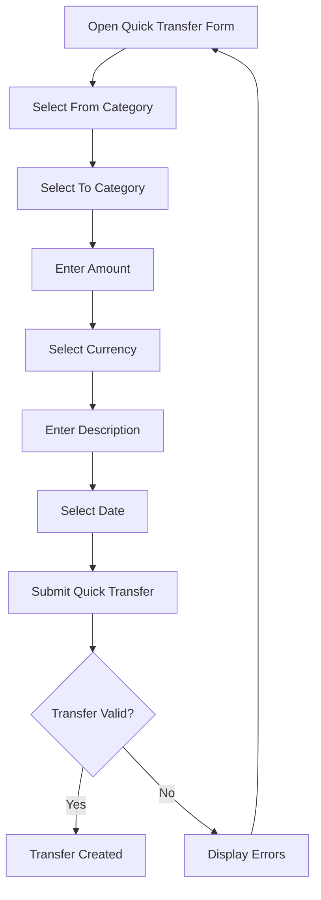

### Multi-Currency Transfer

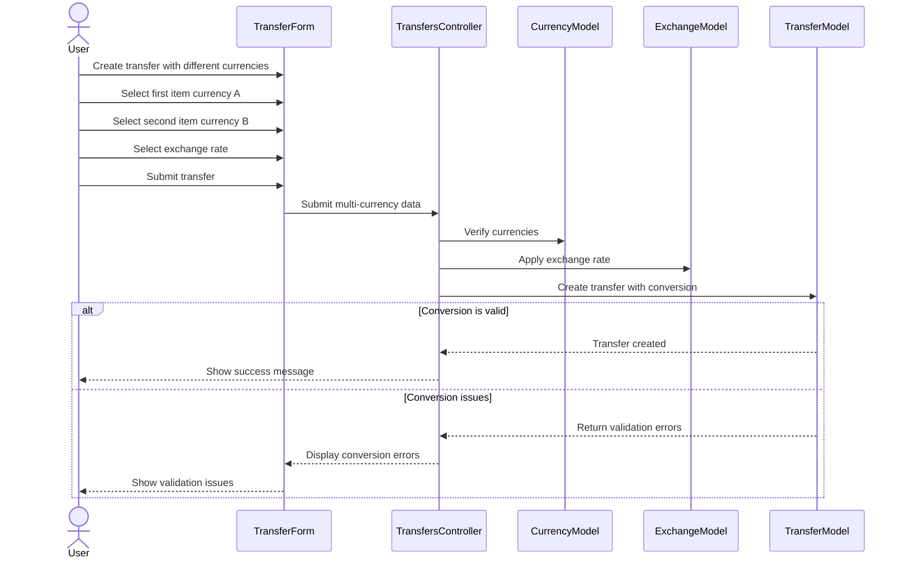

## Reporting Workflows

### Creating and Viewing Reports

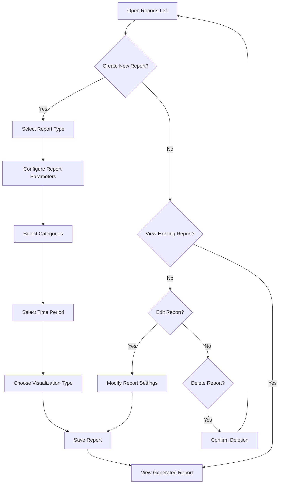

### Report Types and Visualization Flows

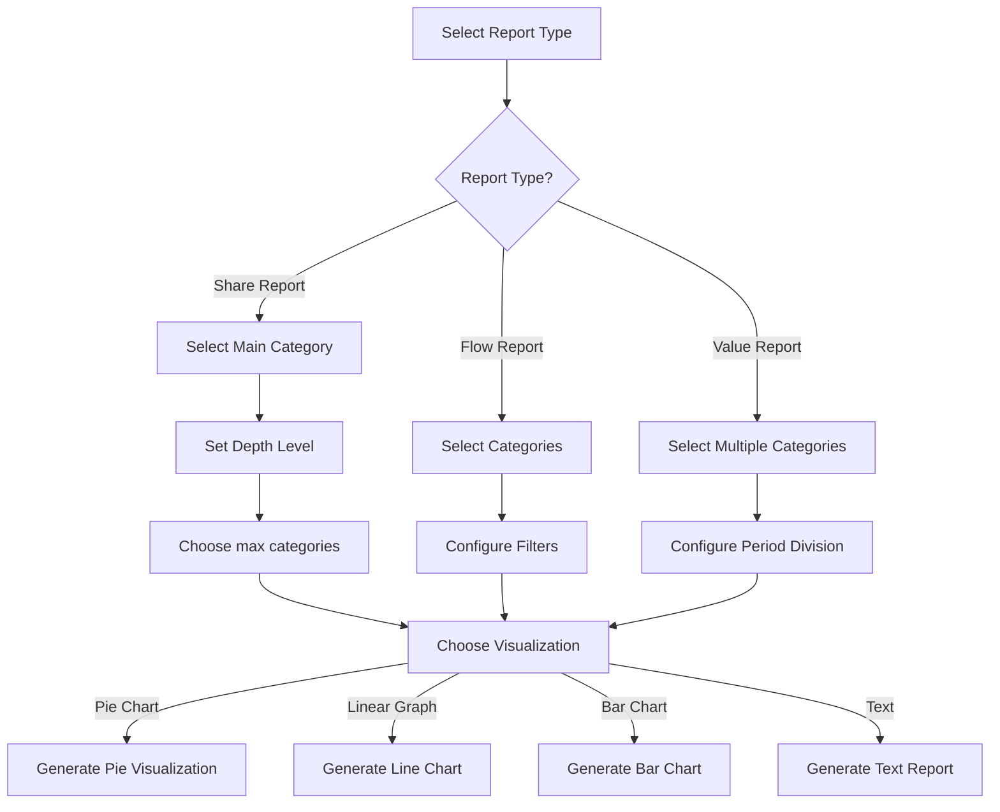

## Goal Management Workflows

### Creating and Tracking Goals

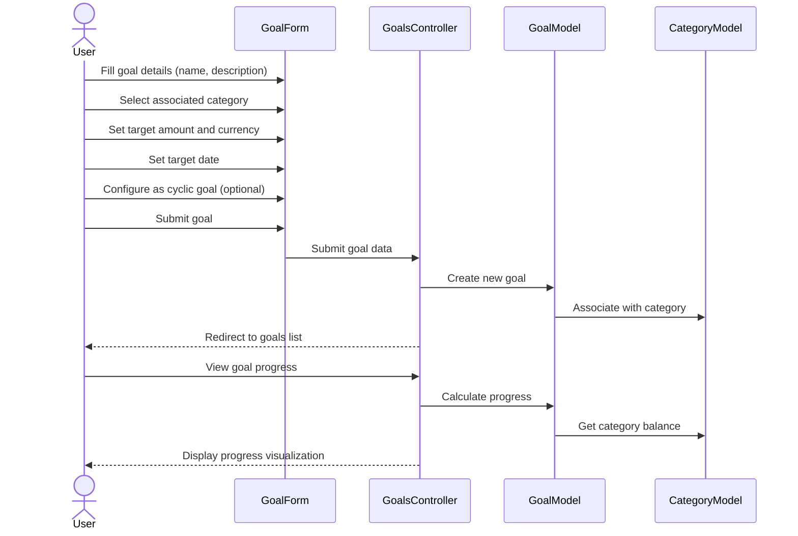

## Currency and Exchange Rate Management

### Managing Currencies

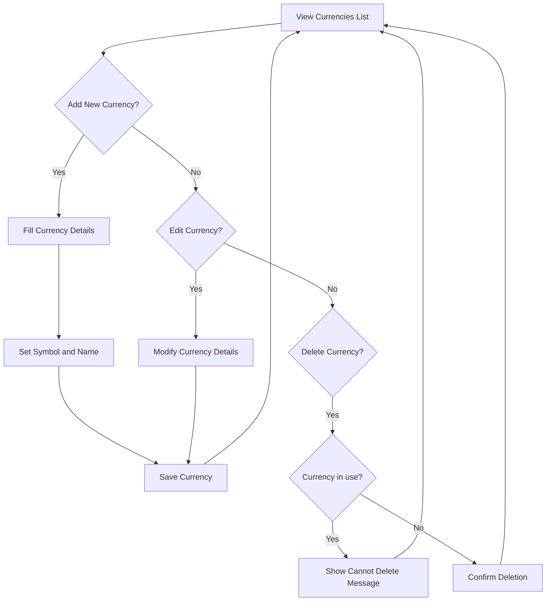

### Managing Exchange Rates

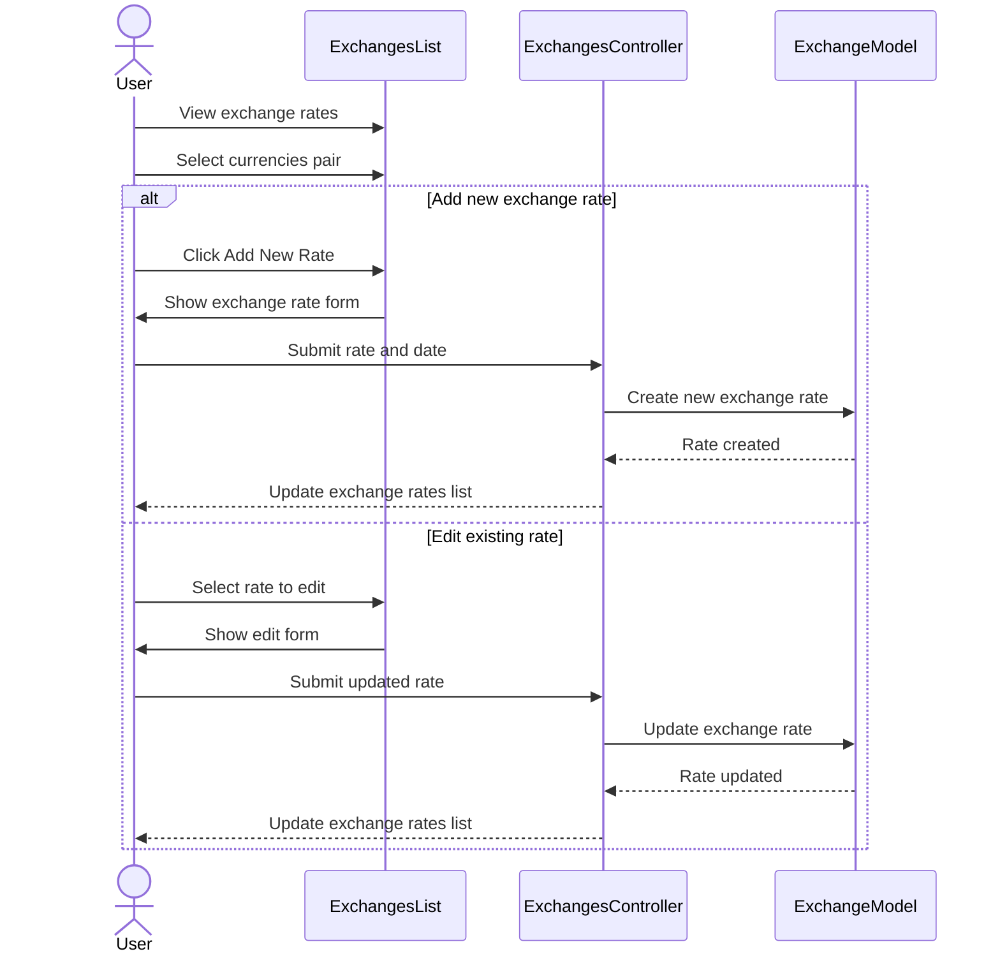

## Import/Export Workflows

### Importing Transactions

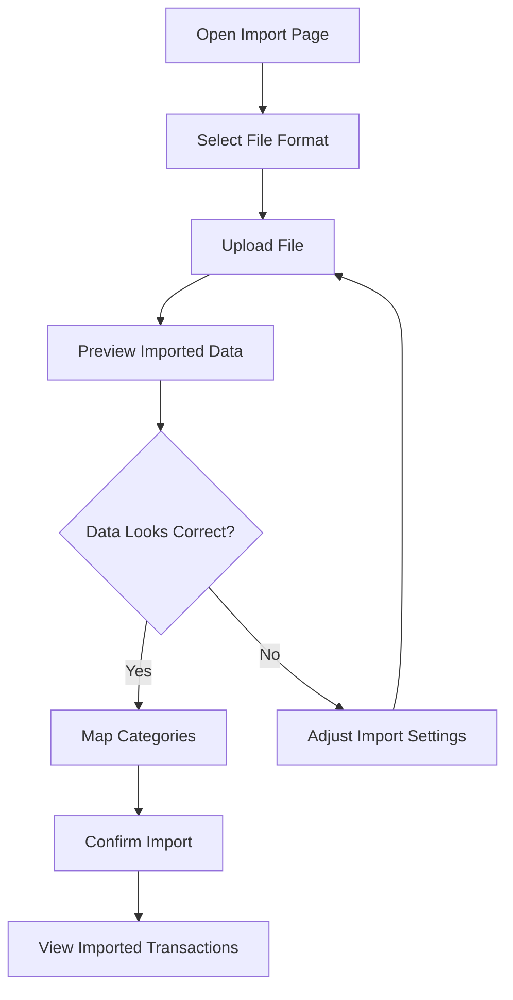

## User Experience and Navigation

### Main Application Navigation

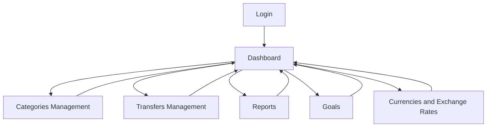

This documentation captures the essential user workflows and interactions within the application, providing a blueprint for recreating these flows in the new Angular and Node.js architecture.